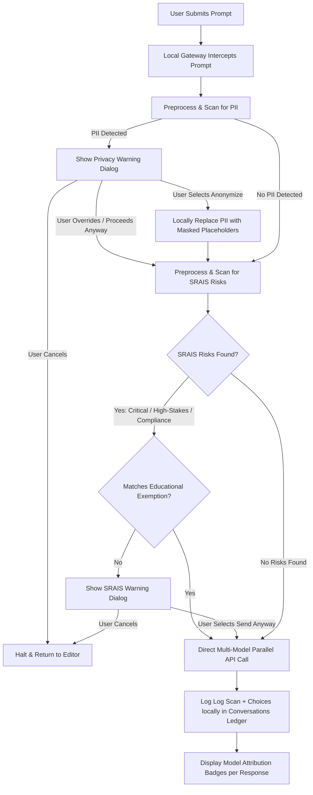

# Human-in-the-Loop (HIL) Guardrails & Gating Architecture

**Document Version:** 1.0.0  
**Last Updated:** July 20, 2026  
**Scope:** Human primaccy, decision gating, PII/SRAIS scanning flow, and business augmentation safety framework for Atticus.

---

## 1. Executive Summary

Atticus is built on the foundational principle of **Human Primacy** as defined in [SRAI.md](SRAI.md). AI is a powerful force multiplier for legal information retrieval and business consultation, but it does not, must not, and cannot act as a replacement for human judgment.

To enforce this standard, Atticus employs **Human-in-the-Loop (HIL)** gating. The system never transmits user data or receives responses without dynamic local validation gates. Under this architecture, **PII Scanning** and **SRAIS Safety Compliance** do not operate as background blocks; rather, they serve as interactive decision gates that educate the user, flag severe risks, and ensure that human legal/business professionals maintain absolute agency over the AI transaction lifecycle.

---

## 2. The HIL Gating Flow

When a user submits a prompt, Atticus intercepts the message locally before any external API calls are made. Below is the precise interaction blueprint demonstrating the PII and SRAIS Human Gating logic.

### 2.1 Prompt Submission Flowchart

---

## 3. Core HIL Pillars

### 3.1 PII Scanning (Confidentiality Gate)
The **Personally Identifiable Information (PII) Scanner** is a mandatory, OS-level, non-nullable local gate that cannot be bypassed or disabled.
* **Proximity Anchoring**: The scanner matches credentials (credit cards, tax registrations, IDs) while minimizing false positives by looking for nearby semantic anchors (e.g. checking within $\pm 15$ characters for descriptive nouns like `card` or `visa` to avoid flagging random serial lists).
* **Local Anonymization**: If PII is found, the user is presented with the option to mask it (e.g. converting `123-29-9134` to `XXX-XX-9134`) on their local machine, ensuring sensitive client identifiers never exit the sandbox.

### 3.2 SRAIS Heuristics (Ethics & Legal Conformity Gate)
The **Safe and Responsible AI Implementation Scanner (SRAIS)** acts as our safety classification guardrail. It prevents the system from being used to facilitate illegal operations, obstruction of justice, or unethical corporate behavior.
* **Risk Stratification**: Queries are actively classified into three risk levels:
  1. **Critical Risk**: Evidence tampering, active bribes, corruption, or violent prompts. The warning modal transitions to a severe Crimson-Red styling, advising the user to immediately consult designated corporate auditors.
  2. **High-Stakes Risk**: Active litigation strategies, patent litigation, or commercial breach calculations. Recommends involving licensed, specialized legal attorneys.
  3. **Compliance Risk**: Corporate tax filing formats, general regulatory filings, or standard compliance procedures. Educates the user to verify recommendations against actual regulatory databases (such as the SEC or CRA).
* **Adversarial De-obfuscation Pipeline**: SRAIS pre-scans inputs across auto-decryption matrices (decoding Hex, Base64, URL codes, or ROT13 letter-shifts) to intercept adversarial bypass tricks.
* **Intent-Aware Educational Exemptions**: Legitimate legal consultations often discuss complex risk scenarios. SRAIS automatically exempts queries that are explicitly educational or request draft templates (e.g., `"Can you write a standard generic guideline disclosing potential corporate breach liability"`), bypassing false alarms.

---

## 4. HIL Augmentation in Business (Educate & Elevate)

HIL does not exist simply to restrict; it exists to **augment corporate capabilities** by guiding internal personnel on safe, reliable, and compliant behaviors while utilizing AI-powered decision support.

| Business Vertical | Potential Risk | Atticus AI Action | SRAI HIL Recommendation | Augmented Human Value |
|---|---|---|---|---|
| **Human Resources (HR)** | Drafting an employment agreement using personal employee records. | Intercepts SIN/SSN, private address, and compensation details. | Warns user of PII exposure. Encourages one-click anonymization. | HR secures employee data while producing compliant, localized contracts. |
| **Corporate Finance** | Calculating exposure ratios during active tax audits or disputes. | Detects regulatory risks and matching tax-evasion keywords. | Warns about compliance risk; advises cross-referencing IRS/CRA codes. | Finance executes rigorous financial reasoning under verified regulatory procedures. |
| **Operations Management** | Preparing logistics updates containing sensitive server IPs or supplier locations. | Triggers PII warning on IP addresses/location metrics. | Masks server addresses with safe placeholders before transmission. | Operations retains structural integrity of supply chain records without digital leakage. |
| **Product & Engineering** | Reviewing intellectual property patterns or source code with built-in API keys. | Flags embedded API secrets or access tokens. | Warns of Critical credential leak; halts input until API token is scrubbed. | Engineering keeps API authorization structures secure while verifying custom patent scopes. |

### 5. Educational Guidance for Corporate Teams

When interacting with Atticus, teams should follow the **Verify-Then-Commit (VTC)** protocol:

1. **Verify Local Scans**: Always review warnings displayed in the SRAIS/PII popups. These alerts represent local corporate firewall criteria.
2. **Anonymize First**: Use dummy indices or the built-in Anonymization button. AI models do not require real customer names to evaluate structural contracts.
3. **Compare Models**: Submit high-priority proposals simultaneously to multiple top-tier models (Grok, Claude, GPT, Gemini) to spot structural variance.
4. **Independent Counsel Review**: For High-Stakes or Critical findings, treat Atticus outputs as structured background research. Present these findings to certified legal counsel to draft the final, binding filing.

---

## Appendix: Related Documentation

* **[SRAI.md](SRAI.md)** — Fully delineates Safe and Responsible AI Charter commitments.
* **[PRIVACY.md](PRIVACY.md)** — Local storage architecture and data auditing documentation.
* **[RISK.md](RISK.md)** — Detailed assessment of legal hallucinations and liability limits.
