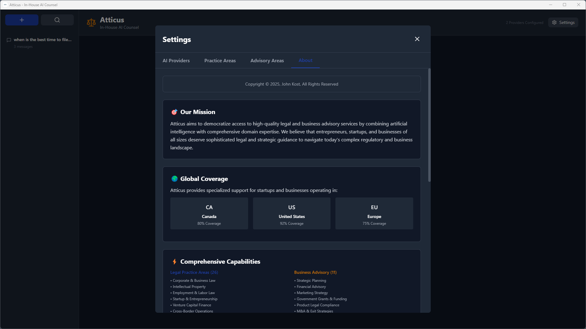

# Atticus - In-House AI Counsel

A powerful desktop application that provides entrepreneurs with AI-powered legal assistance and business advisory through multiple AI models, specialized practice area detection, intelligent multi-jurisdictional analysis, and comprehensive business consulting capabilities. The time & cost savings are a force multiplier ..



## 🚀 Quick Start

1. **Clone and install**:

   ```bash
   git clone <repository>
   cd atticus
   npm install
   ```

2. **Run in development**:

   ```bash
   npm run electron:dev
   ```

3. **Configure providers** - Get API keys and set up in Settings

📖 **[Full Documentation](docs/README.md)** | 🎯 **[Quick Start Guide](docs/QUICKSTART.md)**

---

## ✨ Key Features

### 🤖 Multi-Provider AI Support

Access **9 leading AI providers** with one unified interface:

- **OpenAI** (GPT-4 Turbo, GPT-4, GPT-3.5) - Industry standard
- **Anthropic** (Claude 3.5 Sonnet, Opus, Haiku) - Advanced reasoning
- **Google** (Gemini 1.5 Pro, Flash) - Large context windows
- **Azure OpenAI** - Enterprise deployment
- **xAI** (Grok 2, Grok Vision) - Real-time knowledge
- **Mistral AI** (Large, Medium, Mixtral) - EU-based, open models
- **Cohere** (Command R+, Command) - Enterprise RAG-optimized
- **Perplexity** (Sonar Large/Small) - Web search with citations
- **Groq** (Llama 3.1, Mixtral, Gemma 2) - Ultra-fast inference (500+ tokens/sec)

### 🔀 Multi-Model Selection

**Query multiple AI models simultaneously** to reduce hallucinations and get diverse perspectives:

- Select 1-9+ models per conversation
- Parallel API execution for fast responses
- Model attribution badges on each response
- Compare answers across different AI systems
- Cross-validate legal analysis

### 🌍 Multi-Jurisdictional Analysis

**Focus legal analysis on specific jurisdictions** or get comparative analysis:

- **🇨🇦 Canada** - Canadian federal and provincial law
- **🇺🇸 United States** - U.S. federal and state law
- **🇪🇺 European Union** - EU regulations and member state law

**Intelligent Prompt Modification**:

- Single jurisdiction → Focused analysis
- Multiple jurisdictions → Structured comparative analysis
- No selection → Global legal perspective

### ⚖️ Legal Practice Area Detection

Automatically detects **26 specialized legal practice areas** and applies expert-level AI prompts:

| Core Practice Areas | Specialized Domains        | International & Regulatory | Startup & Entrepreneurship        |
| ------------------- | -------------------------- | -------------------------- | --------------------------------- |
| Corporate Law       | Intellectual Property      | International Law          | Startup & Entrepreneurship Law    |
| Litigation          | Real Estate Law            | Environmental Law          | Venture Capital & Startup Finance |
| Contract Law        | Employment Law             | Healthcare Law             | Cross-Border Startup Operations   |
| Criminal Law        | Tax Law                    | Government & Public Law    |                                   |
| Family Law          | Bankruptcy & Restructuring | Cybersecurity Law          |                                   |
| Immigration Law     | Administrative Law         | Patent Law                 |                                   |
| Personal Injury     | Estate Planning & Probate  | Defense & Military Law     |                                   |
| Civil Rights        | Commercial Transactions    | Labor Law                  |                                   |

**Startup-Focused Coverage (90% Optimization)**:

- 🎯 **Founder agreements** and equity splits
- 💰 **Fundraising** (SAFE notes, convertible debt, Series A-C)
- 📊 **Cap table management** and vesting schedules
- 🌍 **Multi-jurisdiction** operations (Canada, US, EU)
- 💼 **Exit strategies** (M&A, IPO, acqui-hires)
- 🏛️ **Government grants** (SR&ED, SBIR/STTR, Horizon Europe)

Each area includes:

- ✅ **Specialized system prompts** - Expert-level guidance
- ✅ **Keyword detection** - Automatic area identification (2,000+ keywords)
- ✅ **Confidence scoring** - Know when detection is uncertain
- ✅ **Alternative suggestions** - See other potential matches
- ✅ **Expandable keywords** - View all trigger keywords per area

### 💼 Business Advisory Areas

Automatically detects **11 specialized business advisory areas** for comprehensive strategic guidance:

| Strategic & Planning          | Operations & Finance                         | Technology & Innovation                |
| ----------------------------- | -------------------------------------------- | -------------------------------------- |
| Strategic Planning & Strategy | Financial Advisory & Corporate Finance       | Digital Transformation & Tech Strategy |
| Marketing & Brand Development | Operations Management & Process Optimization | Product Development & Legal Compliance |
| Risk Management & Resilience  | Human Capital & Organizational Development   | Government Grants & Innovation Funding |
| Sustainability & ESG Strategy | M&A Advisory & Corporate Development         |                                        |

**Advisory Coverage (1,200+ keywords)**:

- 📈 **Strategic planning** and competitive positioning
- 💵 **Capital raising** and financial modeling
- 🎨 **Go-to-market strategy** and brand development
- ⚙️ **Lean/Six Sigma** and process optimization
- 👥 **Talent strategy** and organizational design
- 🤖 **AI/ML adoption** and digital transformation
- 🛡️ **Enterprise risk** and business resilience
- 🌱 **ESG reporting** and sustainability strategy

Each advisory area includes:

- ✅ **Business frameworks** - McKinsey, BCG, Porter's Five Forces
- ✅ **Industry best practices** - Proven methodologies
- ✅ **Strategic templates** - Business model canvas, OKRs
- ✅ **Implementation guidance** - Actionable recommendations

### ⚙️ Unified Settings & Configuration

**Comprehensive settings** organized in four intuitive tabs:

- 🔌 **Providers Tab** - Configure AI models and API keys
- ⚖️ **Practice Areas Tab** - View all 26 legal practice areas with expandable keywords
- 💼 **Advisory Areas Tab** - Explore all 11 business advisory areas
- ℹ️ **About Tab** - Mission, coverage statistics, capabilities overview

**Key Features**:

- **Expandable keywords** - Click "+X more" to see all detection keywords
- **Color-coded areas** - Legal (blue) vs Advisory (gold) distinction
- **Geographic coverage** - 🇨🇦 80% Canada, 🇺🇸 92% US, 🇪🇺 75% EU
- **Copyright & disclaimer** - Legal notices and AI usage guidelines

### 🎨 Model Filtering & Customization

**Show only the models you use**:

- Enable/disable models per provider
- Reduce clutter in model selectors
- Per-provider configuration
- Settings persist across sessions

### �💬 Rich Chat Interface

- **Markdown rendering** for formatted responses
- **Conversation management** - save, search, and organize chats
- **Conversation search** - Find conversations by title, content, or practice area
- **Editable titles** - Rename conversations for better organization
- **Per-conversation model selection** - choose different models for different tasks
- **Real-time area detection** - automatic practice area and advisory identification
- **PDF export** - download conversations with formatting
- **Document upload** - PDF, Word, images (multimodal models)
- **Sidebar actions** - Quick access to PDF export, search, and delete

**Search & Organization**:

- 🔍 **Quick search dialog** - Filter conversations by title or message content
- ✏️ **Inline title editing** - Click edit button to rename conversations
- 📁 **Auto-save** - All conversations persist locally
- ⌨️ **Keyboard shortcuts** - Enter to save, Escape to cancel

### 🔒 Privacy & Security

- ✅ **Local storage** - API keys stored on your machine only
- ✅ **Direct API calls** - no intermediaries or third-party servers
- ✅ **Full control** - you own your data
- ✅ **Secure credentials** - encrypted local storage

---

## 📦 Installation

### Prerequisites

- Node.js 18 or higher
- npm or yarn

### Setup

**Clone or navigate to the project directory:**

```bash
cd atticus
```

**Install dependencies:**

```bash
npm install
```

**Run in development mode:**

```bash
npm run electron:dev
```

**Build for production:**

```bash
npm run electron:build
```

The built application will be in the `release` folder.

## Configuration

### Adding AI Providers

Atticus uses a **template-based provider system** with 9 pre-configured providers. Here's how to set them up:

1. **Launch Atticus**
2. **Click the Settings button** (⚙️) in the sidebar
3. **Browse the four tabs**:

   **Providers Tab** - Configure AI models:

   - OpenAI (GPT-4 Turbo, GPT-4, GPT-3.5)
   - Anthropic (Claude 3.5 Sonnet, Opus, Sonnet, Haiku)
   - Google (Gemini 1.5 Pro, Flash)
   - Azure OpenAI
   - xAI (Grok 2, Grok Vision)
   - Mistral AI (Large, Medium, Mixtral)
   - Cohere (Command R+, Command)
   - Perplexity (Sonar Large, Sonar)
   - Groq (Llama 3.1, Mixtral, Gemma 2)

   **Practice Areas Tab** - View all 26 legal practice areas:

   - Expandable keyword lists (click "+X more")
   - Color-coded by category
   - Comprehensive coverage details

   **Advisory Areas Tab** - Explore all 11 business advisory areas:

   - Strategic planning, finance, marketing, operations
   - Technology, risk, sustainability, M&A
   - Government grants and product compliance
   - Expandable keyword lists

   **About Tab** - Learn about Atticus:

   - Mission and vision
   - Geographic coverage statistics
   - Privacy and security guarantees
   - Important legal disclaimers

4. **For each provider you want to use**:

   - Click "Get your [Provider] API Key →" link to obtain an API key
   - Paste your API key in the input field
   - Click **Activate** to configure the provider
   - Once activated, you can:
     - **Select a default model** from the dropdown
     - **Enable/disable specific models** using checkboxes (only checked models appear in conversation selectors)
     - **Set as Active Provider** to make it the default for new conversations

5. **Configure Model Filtering** (optional):
   - After activating a provider, use the "Available Models" checkboxes
   - Uncheck models you don't want to see in conversation model selectors
   - This reduces clutter and shows only your preferred models

**Status Badges**:

- 🟢 **Configured** - Provider has an API key and is ready to use
- 🟡 **Active** - Currently set as the default provider for new conversations

### API Key Information

You'll need to obtain API keys from the providers you want to use:

- **OpenAI**: <https://platform.openai.com/api-keys>
- **Anthropic**: <https://console.anthropic.com/settings/keys>
- **Google AI**: <https://makersuite.google.com/app/apikey>
- **Azure OpenAI**: Through your Azure portal
- **xAI**: <https://console.x.ai/>
- **Mistral AI**: <https://console.mistral.ai/>
- **Cohere**: <https://dashboard.cohere.com/api-keys>
- **Perplexity**: <https://www.perplexity.ai/settings/api>
- **Groq**: <https://console.groq.com/keys>

**Security Notes**:

- API keys are stored locally in: `%APPDATA%/atticus/user-config.json` (Windows)
- Keys are never transmitted except to the respective AI provider
- You are billed directly by each provider based on your usage

## Usage

### Starting a Conversation

1. Click **New Conversation** (➕) in the sidebar header
2. Type your legal question or business advisory request
3. Atticus will automatically detect the practice/advisory area and provide specialized assistance
4. Upload documents using the paperclip icon (for supported models)

### Searching Conversations

1. Click the **Search** (🔍) button in the sidebar header
2. Type keywords to filter by:
   - Conversation title
   - Message content
   - Practice area or advisory area
3. Click any result to open that conversation
4. Press Escape or click outside to close

### Organizing Conversations

1. Hover over any conversation in the sidebar
2. Click the **Edit** (✏️) icon in the bottom-right corner
3. Type a new descriptive title
4. Press **Enter** to save or **Escape** to cancel
5. Conversations are auto-sorted with edited titles

### Exporting to PDF

1. Hover over a conversation in the sidebar
2. Click the document icon in the bottom-right corner
3. Choose where to save the PDF

### Best Practices

- **Legal and business advice**: Always review AI-generated content with licensed professionals
- **Specific questions**: Use detailed, specific questions for better responses
- **Document context**: Upload relevant documents for context-aware assistance
- **Multi-model validation**: Use 2-3 models to cross-validate important answers
- **Keyword awareness**: Click "Expand keywords" in Settings to understand detection triggers
- **Organization**: Rename conversations with descriptive titles for easy retrieval
- **Search effectively**: Use the search dialog to quickly find past conversations
- **Security**: Keep API keys secure and never share them
- **Startup focus**: Leverage startup-specific areas for founder, fundraising, and growth topics

## Practice Area Keywords

Atticus uses keyword detection to identify both legal practice areas and business advisory areas. Here are some examples:

### Legal Practice Areas

- **Corporate**: merger, acquisition, shareholder, securities, incorporation
- **Litigation**: lawsuit, complaint, motion, discovery, trial
- **IP**: patent, trademark, copyright, infringement, licensing
- **Real Estate**: property, deed, lease, zoning, mortgage
- **Employment**: discrimination, harassment, wrongful termination, FMLA
- **Contracts**: agreement, breach, indemnity, warranty, NDA
- **Criminal**: prosecution, defense, felony, arrest, Miranda
- **Tax**: IRS, audit, deduction, tax planning, capital gains
- **Startup Law**: founder agreement, vesting, SAFE note, 83(b) election, cap table
- **Venture Capital**: term sheet, liquidation preference, anti-dilution, Series A

### Business Advisory Areas

- **Strategic Planning**: competitive analysis, SWOT, business model canvas, strategic roadmap
- **Financial Advisory**: valuation, financial modeling, capital structure, M&A advisory
- **Marketing Strategy**: go-to-market, brand positioning, customer acquisition, growth marketing
- **Operations**: lean manufacturing, Six Sigma, supply chain optimization, KPIs
- **HR & Organizational**: talent acquisition, performance management, organizational design, culture
- **Digital Transformation**: cloud migration, AI/ML adoption, digital strategy, innovation
- **Risk Management**: enterprise risk, business continuity, compliance frameworks, resilience
- **Sustainability**: ESG reporting, carbon footprint, sustainable operations, impact measurement
- **Government Grants**: SR&ED tax credits, SBIR grants, Horizon Europe, innovation funding

**Total Coverage**: 26 legal areas + 11 advisory areas = **37 specialized domains** with **3,200+ detection keywords**

## Architecture

**Modern stack with modular design:**

- **Frontend**: React 18 + TypeScript + Tailwind CSS
- **Desktop**: Electron 28 (Node.js)
- **State Management**: Zustand with conversation-scoped persistence
- **AI Integration**: Multi-provider template system with parallel execution
- **Practice Area System**: Modular keyword-based detection (26 legal + 11 advisory = 37 specializations)
- **Jurisdiction System**: Multi-jurisdictional analysis (CA, US, EU)
- **Multi-Model Architecture**: Parallel API execution via Promise.all()
- **Configuration**: YAML-based with remote updates and JSON Schema validation
- **PDF Generation**: jsPDF with custom legal formatting
- **Markdown Rendering**: react-markdown with syntax highlighting
- **Build Tool**: Vite 5.4

### Project Structure

```text
atticus/
├── electron/              # Electron main process
│   ├── main.ts           # Main process entry point
│   └── preload.ts        # Preload script (IPC bridge)
├── public/
│   └── config/          # YAML configuration files
│       ├── providers.yaml      # AI provider configurations
│       ├── practices.yaml      # Legal practice areas (26 areas)
│       └── advisory.yaml       # Business advisory areas (11 areas)
├── src/
│   ├── components/       # React components
│   │   ├── ChatWindow.tsx       # Main chat interface
│   │   ├── Sidebar.tsx          # Conversation list with search
│   │   └── Settings.tsx         # 4-tab settings (Providers, Practice, Advisory, About)
│   ├── config/          # Configuration files
│   │   ├── jurisdictions.ts     # Jurisdiction configs (CA, US, EU)
│   │   └── providerTemplates.ts # AI provider templates
│   ├── modules/         # Feature modules
│   │   └── practiceArea/        # Practice area detection module
│   │       ├── definitions.ts   # Practice area definitions (26)
│   │       ├── detector.ts      # Auto-detection logic
│   │       ├── examples.ts      # Example prompts per area
│   │       ├── types.ts         # Type definitions
│   │       ├── PracticeAreaManager.ts  # Main manager class
│   │       └── index.ts         # Module exports
│   ├── services/        # API services
│   │   ├── api.ts              # AI API integration service
│   │   ├── practiceLoader.ts   # Load legal practice areas from YAML
│   │   └── advisoryLoader.ts   # Load advisory areas from YAML
│   ├── store/           # Zustand state management
│   │   └── index.ts             # Global app state with conversation management
│   ├── types/           # TypeScript type definitions
│   │   └── index.ts             # Global types (Conversation, Jurisdiction, etc.)
│   ├── utils/           # Utility functions
│   ├── App.tsx          # Main React component
│   ├── main.tsx         # React entry point
│   └── index.css        # Global styles (Tailwind)
├── docs/                # Comprehensive documentation
│   └── ...
├── dist-electron/       # Built Electron files
├── release/             # Production builds
├── .vscode/            # VS Code settings
├── package.json         # Dependencies and scripts
├── vite.config.ts       # Vite build configuration
├── tailwind.config.js   # Tailwind CSS configuration
├── tsconfig.json        # TypeScript configuration
└── LICENSE              # Dual license (Commercial + Apache 2.0)
```

## 📚 Documentation

- ToDo

## Security Notes

⚠️ **Important Security Information**

- Your API keys are stored locally in: `%APPDATA%/atticus/user-config.json` (Windows)
- Conversations are saved in: `%APPDATA%/atticus/conversations/`
- Never share your configuration files
- Each provider bills you directly based on usage
- Review your API provider's usage dashboard regularly

## Legal Disclaimer

**Atticus is an AI assistant tool and NOT a substitute for professional legal advice.**

- Always consult with a licensed attorney for legal matters
- AI responses may contain errors or outdated information
- Do not rely solely on AI for legal decisions
- Verify all information with current laws and regulations
- Attorney-client privilege does NOT apply to AI conversations

## Development

### Available Scripts

- `npm run dev` - Start Vite dev server
- `npm run electron:dev` - Start Electron in development mode
- `npm run build` - Build for production
- `npm run electron:build` - Build Electron app for distribution

## Troubleshooting

### Provider Connection Issues

- Verify your API key is correct
- Check your internet connection
- Ensure the endpoint URL is correct (for custom providers)
- Check the provider's status page for outages

### File Upload Issues

- Ensure the model supports multimodal/RAG capabilities
- Check file size limits (varies by provider)
- Verify the file format is supported

### Multi-Model Response Issues

- If a model times out, its response will show an error badge
- Reduce the number of selected models if responses are slow
- Check individual provider status if specific models fail

## Contributing

This is a sophisticated legal AI tool. For issues or improvements, please contact the development team.

## License

Dual licensed under:

- **Commercial License** - For proprietary/commercial use (see `LICENSE-COMMERCIAL.md`)
- **Apache 2.0 License** - For open source use (see `LICENSE-APACHE.md`)

See `LICENSE` file for full details.

## Version History

---

## Built with Artificial Intelligence & Human ingenuity
