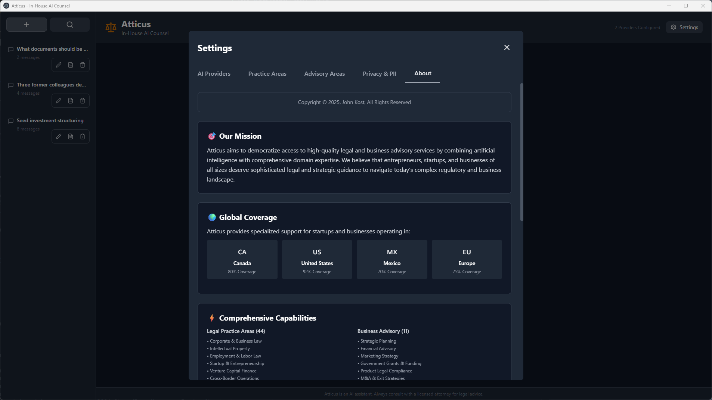
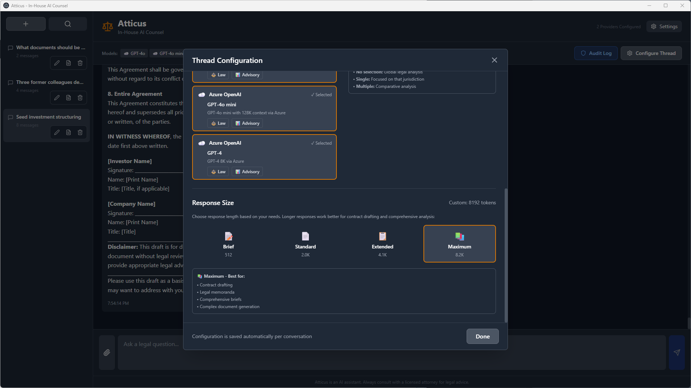
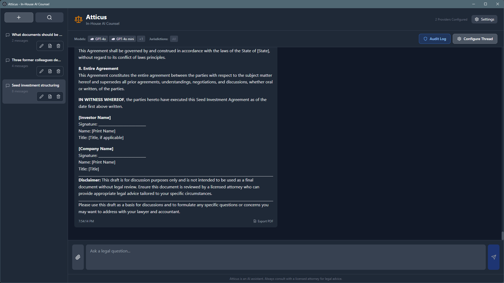
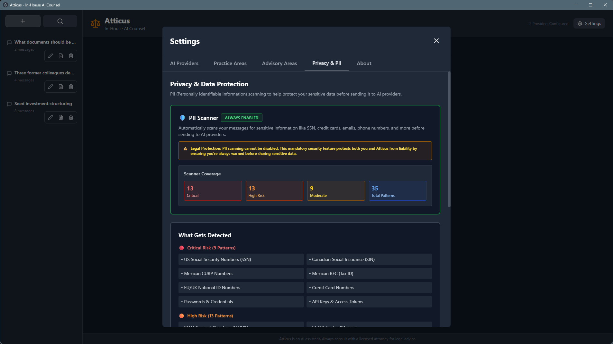
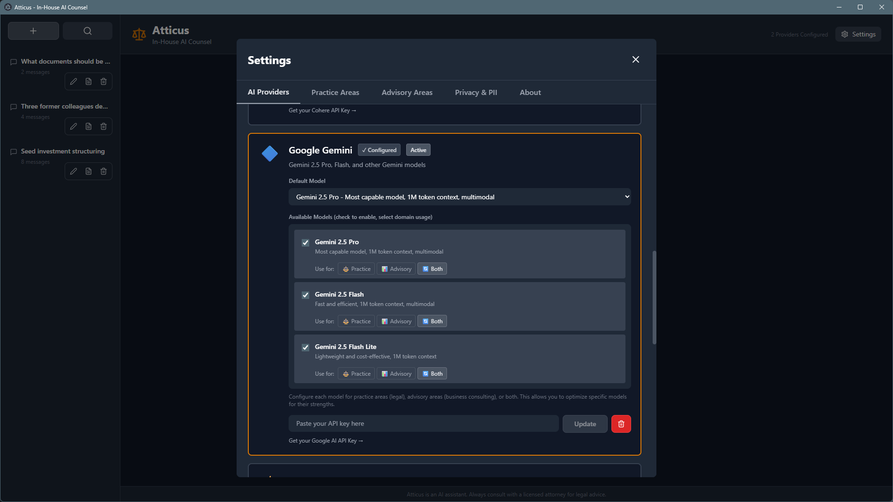

# Atticus - In-House AI Counsel

A powerful desktop application that provides entrepreneurs with AI-powered legal assistance and business advisory through multiple AI models, specialized practice area detection, intelligent multi-jurisdictional analysis with interprovincial/interstate complexity awareness, and comprehensive business consulting capabilities. The time & cost savings are a force multiplier.

> **⚠️ IMPORTANT DISCLAIMER**: Atticus provides **information, not legal advice**. Always consult with licensed professionals for legal, financial, or business decisions. See [RISK.md](RISK.md) for comprehensive risk assessment.



## ⚠️ Important Documentation

Before using Atticus, please review these critical documents:

| Document                              | Purpose                      | Key Information                                                                 |
| ------------------------------------- | ---------------------------- | ------------------------------------------------------------------------------- |
| 📖 **[README.md](README.md)**         | Getting started & features   | Multi-provider AI, 44 practice areas, jurisdictional analysis                   |
| 🔒 **[PRIVACY.md](PRIVACY.md)**       | Privacy & data protection    | Local-first architecture, third-party data flows, privacy rating: 7.5/10        |
| ⚠️ **[RISK.md](RISK.md)**             | Risk assessment & mitigation | Legal risks, accuracy concerns, security vulnerabilities, required user actions |
| 🤖 **[ETHICAL-AI.md](ETHICAL-AI.md)** | Ethical AI principles        | EU AI ethics compliance, bias mitigation, transparency commitments              |
| 📜 **[LICENSE.md](LICENSE.md)**       | Dual licensing terms         | Apache 2.0 (open source) or Commercial license                                  |

> **🚨 CRITICAL DISCLAIMER**: This application provides **information, not legal advice**. AI outputs may contain errors, hallucinations, or outdated information. Always verify with licensed professionals. See [RISK.md](RISK.md) for complete risk disclosure.

## 🚀 Quick Start

1. **Clone and install**:

   ```bash
   git clone <repository>
   cd atticus
   npm install
   ```

2. **Run in development**:

   ```bash
   npm run electron:dev
   ```

3. **Configure providers** - Get API keys and set up in Settings

📖 **[Full Documentation](docs/README.md)** | 🎯 **[Quick Start Guide](docs/QUICKSTART.md)** | 🔒 **[Privacy Policy](PRIVACY.md)** | ⚠️ **[Risk Assessment](RISK.md)** | 🤖 **[Ethical AI Analysis](ETHICAL-AI.md)**

---

## 📑 Table of Contents

- [Key Features](#-key-features)
  - [Multi-Provider AI Support](#-multi-provider-ai-support)
  - [Multi-Model Selection](#-multi-model-selection)
  - [Multi-Jurisdictional Analysis](#-multi-jurisdictional-analysis)
  - [Legal Practice Area Detection](#️-legal-practice-area-detection)
  - [Business Advisory Detection](#-business-advisory-detection)
  - [Privacy & Security Features](#-privacy--security-features)
- [Architecture & Design](#-architecture--design)
- [Configuration](#-configuration)
- [Development](#development)
- [Troubleshooting](#troubleshooting)
- [Privacy, Ethics & Risk](#-privacy-ethics--risk-assessment)
- [Contributing](#contributing)
- [License](#license)

---

## ✨ Key Features

### 🤖 Multi-Provider AI Support

Access **9 leading AI providers** with **60+ models** through one unified interface:

| Provider            | Models Available                                                                                         | Key Capabilities                                         | Best For                                          |
| ------------------- | -------------------------------------------------------------------------------------------------------- | -------------------------------------------------------- | ------------------------------------------------- |
| **🔴 OpenAI**       | GPT-4o, GPT-4o mini, o1-preview, o1-mini, GPT-4 Turbo, GPT-4, GPT-3.5 Turbo                              | Vision, Function Calling, 128K context                   | Industry standard, complex reasoning, coding      |
| **🟣 Anthropic**    | Claude 3.5 Sonnet (Oct '24), Claude 3.5 Sonnet (Jun '24), Claude 3 Opus, Claude 3 Sonnet, Claude 3 Haiku | Vision, 200K context, Function Calling                   | Advanced analysis, document review, legal writing |
| **🔵 Google**       | Gemini 1.5 Pro, Gemini 1.5 Flash, Gemini Pro (Legacy), Gemini Pro Vision (Legacy)                        | Vision, 2M token context, Function Calling               | Massive context, multimodal analysis              |
| **☁️ Azure OpenAI** | GPT-4o, GPT-4 Turbo, GPT-4, GPT-3.5 Turbo                                                                | Vision, Function Calling, Enterprise SLA                 | Enterprise deployment, compliance requirements    |
| **𝕏 xAI**           | Grok Beta, Grok Vision Beta                                                                              | Vision, Real-time knowledge                              | Current events, real-time analysis                |
| **🌬️ Mistral**      | Mistral Large 2 (123B), Mistral Medium, Mistral Small, Mixtral 8x22B, Mixtral 8x7B                       | Function Calling, EU-based                               | EU compliance, open models, cost-effective        |
| **🧬 Cohere**       | Command R+, Command R, Command, Command Light                                                            | RAG-optimized, 128K context, Function Calling            | Enterprise search, legal research, citations      |
| **⚡ Groq**         | Llama 3.3 70B, Llama 3.1 70B, Llama 3.1 8B, Mixtral 8x7B, Gemma 2 9B                                     | Ultra-fast inference (500+ tokens/sec), Function Calling | Speed-critical tasks, rapid prototyping           |
| **🔍 Perplexity**   | Sonar Large (Online), Sonar Small (Online), Sonar Large (Chat), Sonar Small (Chat)                       | Web search, Citations, 128K context                      | Legal research, current case law, fact-checking   |

**💡 Pro Tip**: Select multiple models simultaneously to cross-validate legal analysis and reduce hallucinations!

<details>
<summary><strong>📋 Detailed Model Breakdown by Provider</strong></summary>

### OpenAI (8 models)

- **GPT-4o** - Most advanced multimodal model, faster and cheaper than GPT-4 Turbo ⭐ _Default_
- **GPT-4o mini** - Affordable small model for fast, lightweight tasks
- **o1-preview** - Advanced reasoning model, excels at complex problem-solving
- **o1-mini** - Faster reasoning model, great for code and STEM
- **GPT-4 Turbo** - 128K context window, vision capabilities
- **GPT-4 Turbo Preview** - Preview version with latest features
- **GPT-4** - Original GPT-4 with 8K context
- **GPT-3.5 Turbo** - Fast and cost-effective for simple tasks

### Anthropic (5 models)

- **Claude 3.5 Sonnet (Oct '24)** - Most intelligent model, best for complex analysis and coding ⭐ _Default_
- **Claude 3.5 Sonnet (Jun '24)** - Previous version of 3.5 Sonnet
- **Claude 3 Opus** - Powerful model for highly complex tasks
- **Claude 3 Sonnet** - Balanced performance and speed
- **Claude 3 Haiku** - Fastest and most compact model

### Google (4 models)

- **Gemini 1.5 Pro** - Most capable, 2M token context, multimodal ⭐ _Default_
- **Gemini 1.5 Flash** - Fast and efficient, 1M token context, multimodal
- **Gemini Pro (Legacy)** - Previous generation, 32K context
- **Gemini Pro Vision (Legacy)** - Previous generation multimodal

### Azure OpenAI (4 models)

- **GPT-4o** - GPT-4o via Azure (if deployed) ⭐ _Default_
- **GPT-4 Turbo** - GPT-4 Turbo with 128K context via Azure
- **GPT-4** - GPT-4 8K via Azure
- **GPT-3.5 Turbo** - GPT-3.5 via Azure

### xAI (2 models)

- **Grok Beta** - Latest Grok model with real-time knowledge ⭐ _Default_
- **Grok Vision Beta** - Grok with image understanding capabilities

### Mistral AI (5 models)

- **Mistral Large 2** - Most capable (123B), best for complex reasoning ⭐ _Default_
- **Mistral Medium** - Balanced performance and cost
- **Mistral Small** - Fast and cost-effective
- **Mixtral 8x22B** - Powerful mixture-of-experts model
- **Mixtral 8x7B** - Efficient mixture-of-experts model

### Cohere (4 models)

- **Command R+** - Most capable, 128K context, best for complex legal analysis ⭐ _Default_
- **Command R** - Balanced performance and cost, 128K context
- **Command** - Fast and cost-effective for simpler tasks
- **Command Light** - Fastest, most economical option

### Groq (5 models)

- **Llama 3.3 70B** - Latest and most capable Llama model, excellent reasoning ⭐ _Default_
- **Llama 3.1 70B** - Previous generation, excellent reasoning and analysis
- **Llama 3.1 8B** - Fast and efficient for quick responses
- **Mixtral 8x7B** - Mixture-of-experts, great for diverse tasks
- **Gemma 2 9B** - Efficient and capable Google model

### Perplexity AI (4 models)

- **Sonar Large (Online)** - Most capable with real-time web search and citations ⭐ _Default_
- **Sonar Small (Online)** - Fast web search with citations, cost-effective
- **Sonar Large (Chat)** - Offline reasoning, no web search
- **Sonar Small (Chat)** - Fast offline chat model

**Total: 46 models** across 9 providers (Updated October 2024)

</details>

### 🔀 Multi-Model Selection

**Query multiple AI models simultaneously** to reduce hallucinations and get diverse perspectives:

- Select 1-9+ models per conversation
- Parallel API execution for fast responses
- Model attribution badges on each response
- Compare answers across different AI systems
- Cross-validate legal analysis

### 🌍 Multi-Jurisdictional Analysis

**Focus legal analysis on specific jurisdictions** or get comparative analysis across **CUSMA/USMCA** region and beyond:

- **🇨🇦 Canada** - Canadian federal and provincial law, including interprovincial trade and regulatory differences
- **🇺🇸 United States** - U.S. federal and state law, including interstate commerce and jurisdictional conflicts
- **🇲🇽 Mexico** - Mexican federal and state law, including interstate commerce and regulatory variations
- **🇺 European Union** - EU regulations and member state law, including cross-border harmonization

**Interprovincial/Interstate Complexity Coverage**:

Atticus intelligently addresses **internal jurisdictional complexities** within each country:

**🇨🇦 Canadian Interprovincial**:

- **Division of powers** - Federal vs. provincial jurisdiction (Constitution Act, 1867)
- **Interprovincial trade barriers** - Agreement on Internal Trade (AIT), Canadian Free Trade Agreement (CFTA)
- **Provincial regulatory differences** - Securities regulation, employment standards, professional licensing
- **Civil law vs. common law** - Quebec civil law vs. other provinces' common law
- **Provincial incorporation** - CBCA (federal) vs. provincial business corporations acts
- **Key variations** - Ontario (commercial hub), Quebec (civil law), BC, Alberta differences

**🇺🇸 Interstate Complexity**:

- **Federal vs. state jurisdiction** - Commerce Clause, Supremacy Clause, federalism principles
- **Interstate commerce** - Dormant Commerce Clause restrictions on state protectionism
- **State regulatory variations** - Corporate law, employment, taxation, professional licensing
- **Conflicts of law** - Choice of law provisions, forum shopping considerations
- **State incorporation** - Delaware (corporate law hub), vs. home state incorporation
- **Key variations** - Delaware (corporate), California (employment/consumer), New York (finance), Texas (business-friendly)

**🇲🇽 Mexican Interstate**:

- **Federal vs. state jurisdiction** - Mexican constitutional framework
- **Interstate commerce** - Regulatory coordination between states
- **State taxation variations** - State-level tax and commercial regulations
- **Border states** - Special regulations for northern border zone (Zona Libre)
- **Key variations** - Mexico City (financial hub), Nuevo León (manufacturing), Jalisco (tech), border states

**CUSMA/USMCA Coverage**:

The system is **fully optimized for CUSMA/USMCA** (Canada-United States-Mexico Agreement) cross-border operations:

- **Trade compliance** - CUSMA rules of origin, tariff classifications, customs procedures
- **Cross-border business** - Entity formation, tax planning, regulatory compliance across CA/US/MX
- **Supply chain** - Manufacturing, logistics, and distribution across North America
- **Labor mobility** - TN visas (Canada/Mexico to US), professional credentials recognition
- **Intellectual property** - Patent, trademark, and copyright protection in all three jurisdictions
- **Dispute resolution** - CUSMA Chapter 31 (dispute settlement), investor-state mechanisms
- **Interstate/interprovincial coordination** - Addressing internal barriers that affect cross-border operations

**Intelligent Prompt Modification**:

- Single jurisdiction → Focused analysis **with interprovincial/interstate guidance**
- Multiple jurisdictions → Structured comparative analysis **with cross-border complexity**
- CA + US + MX → CUSMA-specific guidance **with internal trade barrier considerations**
- No selection → Global legal perspective


_Comprehensive per-conversation configuration: select multiple AI models simultaneously, choose specific jurisdictions for legal analysis (Canada, US, Mexico, EU), and control response size with preset options or custom token limits for optimal results_

### ⚖️ Legal Practice Area Detection

Automatically detects **44 specialized legal practice areas** with **3,500+ keywords** and applies expert-level AI prompts:

<details>
<summary><strong>📋 View All 44 Practice Areas</strong></summary>

| Area                           | Focus                                          | Keywords (Sample)                                                                | Coverage      |
| ------------------------------ | ---------------------------------------------- | -------------------------------------------------------------------------------- | ------------- |
| **Corporate Law**              | Entity formation, governance, compliance       | corporation, LLC, bylaws, shareholders, board of directors                       | 🇨🇦 🇺🇸 �🇽 �🇪🇺 |
| **Litigation**                 | Dispute resolution, court proceedings          | lawsuit, plaintiff, defendant, discovery, summary judgment                       | 🇨🇦 🇺🇸 🇲🇽      |
| **Contract Law**               | Agreement drafting, negotiation, enforcement   | NDA, MSA, breach, consideration, force majeure                                   | 🇨🇦 🇺🇸 🇲🇽 🇪🇺   |
| **Intellectual Property**      | Patents, trademarks, copyrights, trade secrets | patent application, trademark registration, copyright infringement, IP portfolio | 🇨🇦 🇺🇸 🇲� �🇪🇺 |
| **Employment Law**             | Hiring, termination, workplace rights          | employment contract, wrongful termination, harassment, discrimination            | 🇨🇦 🇺🇸 🇲� �🇪🇺 |
| **Real Estate Law**            | Property transactions, leases, zoning          | commercial lease, property purchase, zoning variance, title insurance            | 🇨🇦 🇺🇸 🇲🇽      |
| **Tax Law**                    | Tax planning, compliance, disputes             | tax deduction, IRS audit, transfer pricing, tax treaty                           | 🇨🇦 🇺🇸 🇲🇽 🇪🇺   |
| **Immigration Law**            | Visas, work permits, citizenship               | H-1B, work permit, permanent residence, LMIA, Express Entry, TN visa             | 🇨🇦 🇺🇸 🇲🇽 🇪🇺   |
| **Criminal Law**               | Criminal defense, prosecution                  | criminal charges, plea bargain, sentencing, defense strategy                     | 🇨🇦 🇺🇸 🇲🇽      |
| **Family Law**                 | Divorce, custody, support                      | divorce proceedings, child custody, spousal support, prenuptial agreement        | 🇨🇦 🇺🇸 🇲🇽      |
| **Bankruptcy & Restructuring** | Insolvency, debt relief                        | Chapter 11, liquidation, creditor protection, CCAA, receivership                 | 🇨🇦 🇺🇸 🇲🇽      |
| **International Law**          | Cross-border transactions, treaties            | GDPR, CUSMA, international arbitration, trade agreements, cross-border M&A       | 🇪🇺 🌍 CUSMA   |
| **Environmental Law**          | Regulations, compliance, sustainability        | environmental assessment, emissions compliance, carbon credits                   | 🇨🇦 🇺🇸 🇲🇽 🇪🇺   |
| **Healthcare Law**             | HIPAA, medical regulations                     | patient privacy, HIPAA compliance, medical licensing, FDA approval               | 🇺🇸 🇨🇦 🇲🇽      |
| **Cybersecurity Law**          | Data protection, privacy, incident response    | data breach, GDPR compliance, privacy policy, SOC 2                              | 🇪🇺 🇺🇸 🇨🇦 🇲🇽   |
| **Startup & Entrepreneurship** | Founder agreements, equity, fundraising        | founder vesting, SAFE note, seed round, term sheet, cap table                    | 🇨🇦 🇺🇸 �🇽 �🇪🇺 |
| **Venture Capital**            | Startup financing, term sheets, exits          | Series A, liquidation preference, anti-dilution, pro rata rights                 | 🇺🇸 🇨🇦 🇲🇽      |
| **Government & Public Law**    | Regulatory compliance, lobbying                | government contracts, regulatory approval, lobbying compliance                   | 🇨🇦 🇺🇸 🇲🇽 🇪🇺   |
| **Administrative Law**         | Regulatory proceedings, agency actions         | regulatory appeal, administrative hearing, agency decision                       | 🇨🇦 🇺🇸 🇲🇽      |
| **Civil Rights Law**           | Discrimination, constitutional rights          | civil rights violation, discrimination lawsuit, constitutional challenge         | 🇺🇸 🇨🇦 🇲🇽      |
| **Personal Injury**            | Tort claims, negligence, damages               | personal injury claim, negligence, medical malpractice, damages                  | 🇨🇦 🇺🇸 🇲🇽      |
| **Estate Planning**            | Wills, trusts, succession                      | estate planning, will drafting, trust creation, probate, succession              | 🇨🇦 🇺🇸 🇲🇽 🇪🇺   |
| **Commercial Transactions**    | Business deals, M&A, securities                | asset purchase, stock purchase, due diligence, closing documents                 | 🇨🇦 🇺🇸 �🇽 �🇪🇺 |
| **Patent Law**                 | Patent prosecution, litigation                 | patent application, prior art search, patent infringement, claims drafting       | 🇺🇸 🇨🇦 �🇽 �🇪🇺 |
| **Defense & Military Law**     | UCMJ, military contracts                       | court-martial, military justice, defense contracts, security clearance           | 🇺🇸            |
| **Labor Law**                  | Union relations, collective bargaining         | collective bargaining, union certification, labor dispute, grievance             | 🇨🇦 🇺🇸 🇲🇽 🇪🇺   |

</details>

**🎯 Startup-Focused Coverage (90% Optimization)**:

The practice area system is heavily optimized for startup legal needs:

- 🏢 **Founder agreements** and equity splits (vesting, cliffs, acceleration)
- 💰 **Fundraising instruments** (SAFE notes, convertible debt, priced rounds Series A-C)
- 📊 **Cap table management** (dilution modeling, option pools, pro rata rights)
- 🌍 **Multi-jurisdiction** operations (Canada flip, Delaware C-Corp, Mexico maquiladora, EU expansion)
- 💼 **Exit strategies** (M&A structuring, IPO readiness, acqui-hire negotiations)
- 🏛️ **Government funding** (SR&ED tax credits, SBIR/STTR grants, Mexico CONACYT, Horizon Europe)
- 🛡️ **IP protection** (patent strategy, trademark portfolio, open source compliance)
- 📝 **Commercial contracts** (SaaS agreements, enterprise MSAs, channel partnerships)
- 🚚 **CUSMA/USMCA compliance** (rules of origin, tariff classifications, cross-border supply chain)

**Detection Features**:

- ✅ **2,000+ keyword triggers** - Comprehensive coverage across all areas
- ✅ **Automatic detection** - AI analyzes your query and selects appropriate practice area
- ✅ **Confidence scoring** - Know when detection is certain vs. uncertain
- ✅ **Alternative suggestions** - See other potential matches (e.g., "Also consider: IP Law, Tax Law")
- ✅ **Expandable keywords** - View all trigger keywords per area in Settings
- ✅ **Expert system prompts** - Each area has specialized AI instructions for accurate guidance

**Geographic Coverage**:

- 🇨🇦 **Canada**: 80% coverage (strongest in corporate, startup, tax, IP, employment)
- 🇺🇸 **United States**: 92% coverage (comprehensive across all practice areas)
- �🇽 **Mexico**: 70% coverage (focus on CUSMA trade, maquiladora, corporate, labor, IP)
- �🇪🇺 **European Union**: 75% coverage (focus on GDPR, cross-border, international)
- 🌐 **CUSMA Region**: Full cross-border coverage for CA/US/MX operations

Each area includes:

- ✅ **Specialized system prompts** - Expert-level guidance tailored to practice area
- ✅ **Keyword detection** - Automatic area identification from your query
- ✅ **Confidence scoring** - Transparency about detection accuracy
- ✅ **Alternative suggestions** - See other potential matches
- ✅ **Expandable keywords** - View all trigger keywords per area

### 💼 Business Advisory Areas

Automatically detects **11 specialized business advisory areas** with **1,200+ keywords** for comprehensive strategic guidance:

<details>
<summary><strong>📊 View All 11 Advisory Areas</strong></summary>

| Area                                | Focus                                               | Frameworks & Tools                                                         | Keywords (Sample)                                                                             |
| ----------------------------------- | --------------------------------------------------- | -------------------------------------------------------------------------- | --------------------------------------------------------------------------------------------- |
| **Strategic Planning & Strategy**   | Vision, competitive positioning, growth strategy    | Porter's Five Forces, Blue Ocean Strategy, SWOT, BCG Matrix, Ansoff Matrix | strategic plan, competitive analysis, market positioning, growth strategy, vision statement   |
| **Financial Advisory**              | Capital raising, M&A, valuation, financial modeling | DCF valuation, LBO modeling, 409A valuation, WACC, cap table               | venture capital, Series A funding, financial model, cash flow projection, burn rate           |
| **Marketing & Brand**               | Go-to-market, positioning, growth marketing         | STP framework, Marketing Mix (4Ps), Brand Pyramid, AARRR metrics           | product-market fit, customer acquisition, CAC, LTV, brand positioning, content marketing      |
| **Operations Management**           | Process optimization, supply chain, quality         | Lean Manufacturing, Six Sigma, Kaizen, Theory of Constraints, Kanban       | operational efficiency, process improvement, supply chain, inventory management, COGS         |
| **Human Capital & Org Development** | Talent strategy, culture, compensation              | OKRs, 9-Box Grid, Competency Models, Kirkpatrick Model                     | talent acquisition, organizational design, performance management, equity compensation        |
| **Digital Transformation**          | Tech strategy, cloud, AI/ML, cybersecurity          | Technology Adoption Curve, Cloud Migration Models, DevOps, Agile           | cloud migration, API strategy, microservices, machine learning, cybersecurity framework       |
| **Risk Management**                 | Enterprise risk, compliance, business continuity    | COSO ERM, ISO 31000, NIST CSF, BCP/DR frameworks                           | risk assessment, compliance program, business continuity, incident response, fraud prevention |
| **Sustainability & ESG**            | Environmental, social, governance, reporting        | GRI Standards, SASB, TCFD, UN SDGs, Materiality Assessment                 | ESG reporting, carbon footprint, sustainability strategy, stakeholder engagement, B Corp      |
| **M&A Advisory**                    | Deal sourcing, due diligence, integration           | PMI frameworks, Synergy Analysis, IMO structure, Day 1 Playbook            | merger integration, due diligence, synergy realization, cultural integration, earnout         |
| **Government Grants**               | R&D credits, SBIR/STTR, non-dilutive funding        | SR&ED (Canada), SBIR/STTR (US), Horizon Europe (EU), Grant Compliance      | R&D tax credit, innovation funding, grant application, non-dilutive capital, IRAP             |
| **Product Legal Compliance**        | Privacy, accessibility, regulatory, open source     | Privacy-by-Design, WCAG 2.1, OSS Compliance, GDPR/CCPA, Product Roadmap    | privacy policy, terms of service, WCAG compliance, open source license, HIPAA, GDPR           |

</details>

**🎯 World-Class Advisory Coverage (~10,800 lines)**:

Each advisory area provides **consulting-grade guidance** matching top firms (McKinsey, BCG, Bain, Goldman Sachs, Deloitte):

**Strategic & Planning**:

- 📈 **Strategic Planning** - Porter's Five Forces, Blue Ocean Strategy, SWOT analysis, OKRs, Balanced Scorecard
- 💵 **Financial Advisory** - Venture capital, growth equity, M&A sell-side, 409A valuations, financial modeling
- 🎨 **Marketing Strategy** - GTM strategy, product-market fit, CAC/LTV optimization, demand generation, ABM

**Operations & Finance**:

- ⚙️ **Operations Management** - Lean/Six Sigma, process optimization, supply chain, inventory management
- 👥 **Human Capital** - Talent acquisition, org design, compensation benchmarking, performance management
- 🌱 **Sustainability & ESG** - GRI/SASB reporting, carbon accounting, stakeholder engagement, materiality

**Technology & Growth**:

- 🤖 **Digital Transformation** - Cloud migration, AI/ML adoption, API strategy, microservices, cybersecurity
- 🛡️ **Risk Management** - Enterprise risk (COSO ERM), compliance, BCP/DR, fraud prevention, audit readiness
- 🤝 **M&A Advisory** - Post-merger integration, synergy realization, cultural integration, IT systems integration

**Innovation & Compliance**:

- 🏛️ **Government Grants** - SR&ED (Canada 35-65% credits), SBIR/STTR (US $50K-$10M), Horizon Europe (EU €500K-€15M)
- 🛡️ **Product Legal** - Privacy-by-design, WCAG accessibility, open source compliance, FinTech/HealthTech regulatory

**Advisory Features**:

- ✅ **10 core competencies** per area (110 total competencies)
- ✅ **Business frameworks** - McKinsey 7-S, BCG Growth-Share Matrix, Porter's frameworks
- ✅ **Industry best practices** - Proven methodologies from top consulting firms
- ✅ **Strategic templates** - Business model canvas, OKRs, financial models, pitch decks
- ✅ **Implementation guidance** - Step-by-step action plans and timelines
- ✅ **Metrics & benchmarks** - Industry KPIs, success metrics, performance indicators
- ✅ **Real-world examples** - Case studies and scenario-based guidance
- ✅ **1,200+ keyword triggers** - Automatic advisory area detection

**Sample Guidance Quality**:

Each advisory area includes **500-1,200 lines** of expert content:

- **Strategic Planning**: ~500 lines (Porter's Five Forces deep dive, competitive moats, strategic planning process)
- **Financial Advisory**: ~600 lines (VC fundraising stages, 409A valuations, cap table modeling, M&A sell-side)
- **Marketing Strategy**: ~1,200 lines (GTM frameworks, product-market fit, pricing strategy, growth marketing)
- **M&A Advisory**: ~500 lines (PMI phases, synergy tracking, cultural integration, IT systems integration)
- **Government Grants**: ~400 lines (SR&ED claiming, SBIR phases, Horizon Europe, compliance best practices)
- **Product Legal**: ~400 lines (Privacy-by-design, WCAG compliance, open source licensing, regulatory pathways)

Each area includes:

- ✅ **Business frameworks** - McKinsey, BCG, Porter's Five Forces
- ✅ **Industry best practices** - Proven methodologies
- ✅ **Strategic templates** - Business model canvas, OKRs
- ✅ **Implementation guidance** - Actionable recommendations

### ⚙️ Unified Settings & Configuration

**Comprehensive settings** organized in four intuitive tabs:

- 🔌 **Providers Tab** - Configure AI models and API keys
- ⚖️ **Practice Areas Tab** - View all 44 legal practice areas with expandable keywords
- 💼 **Advisory Areas Tab** - Explore all 11 business advisory areas
- ℹ️ **About Tab** - Mission, coverage statistics, capabilities overview

**Key Features**:

- **Expandable keywords** - Click "+X more" to see all detection keywords
- **Color-coded areas** - Legal (blue) vs Advisory (gold) distinction
- **Geographic coverage** - 🇨🇦 80% Canada, 🇺🇸 92% US, �🇽 70% Mexico, �🇪🇺 75% EU
- **CUSMA/USMCA optimized** - Full North American free trade zone support
- **Copyright & disclaimer** - Legal notices and AI usage guidelines

### 🎨 Model Filtering & Customization

**Show only the models you use** and **optimize them for specific domains**:

- **Enable/disable models** per provider to reduce clutter
- **Domain specialization** - Configure each model for:
  - ⚖️ **Practice Areas** (legal) - Optimized for legal queries
  - 📊 **Advisory Areas** (business) - Optimized for business consulting
  - 🔄 **Both** - Available for all queries (default)
- **Smart filtering** - Models automatically filter based on detected query type
- **Real-time detection** - Legal questions show legal-optimized models, business questions show business-optimized models
- **Visual indicators** - Clear feedback showing which domain is active
- Per-provider configuration
- Settings persist across sessions

**Benefits**:

- Faster model selection with fewer irrelevant options
- Better results by matching models to their strengths
- Cost optimization using appropriate models for each task

### �💬 Rich Chat Interface

- **Markdown rendering** for formatted responses
- **Conversation management** - save, search, and organize chats
- **Conversation search** - Find conversations by title, content, or practice area
- **Editable titles** - Rename conversations for better organization
- **Per-conversation model selection** - choose different models for different tasks
- **Real-time area detection** - automatic practice area and advisory identification
- **PDF export** - download conversations with formatting
- **Document upload** - PDF, Word, images (multimodal models)
- **Sidebar actions** - Quick access to PDF export, search, and delete

**Search & Organization**:

- 🔍 **Quick search dialog** - Filter conversations by title or message content
- ✏️ **Inline title editing** - Click edit button to rename conversations
- 📁 **Auto-save** - All conversations persist locally
- ⌨️ **Keyboard shortcuts** - Enter to save, Escape to cancel


_All conversations are stored locally on your device with full search capabilities, editable titles, and organized sidebar for easy access to your legal and business advisory history_

### 🔒 Privacy & Security

- ✅ **Local storage** - API keys stored on your machine only
- ✅ **Direct API calls** - no intermediaries or third-party servers
- ✅ **Full control** - you own your data
- ✅ **Secure credentials** - encrypted local storage

### 🏢 Why Use API Endpoints Instead of Consumer Apps?

Atticus uses **direct API access** to AI providers rather than consumer web apps (ChatGPT, Claude.ai, etc.). This architectural decision provides critical privacy and enterprise benefits:

#### **Privacy & Data Protection**

- **❌ Consumer Apps**: Your conversations are stored on provider servers, used for model training (unless opted out), and subject to provider data policies
- **✅ API Endpoints**: Zero data retention by default - providers don't store or train on your API data per enterprise agreements

**Real Impact**: Sensitive legal documents, financial data, trade secrets, and client information stay private. No risk of your proprietary strategies appearing in future model training.


_Atticus automatically detects PII and sensitive information, providing real-time warnings and anonymization options to protect confidential data before sending to AI providers_

#### **Enterprise Compliance**

- **❌ Consumer Apps**: Consumer-grade terms of service, no SLAs, limited compliance certifications
- **✅ API Endpoints**: Enterprise agreements with GDPR/HIPAA compliance options, SOC 2 Type II certifications, BAAs available

**Real Impact**: Meet regulatory requirements for handling confidential client data, PII, and protected health information.

#### **Control & Auditability**

- **❌ Consumer Apps**: Limited visibility into data handling, hard to audit usage, conversations tied to personal accounts
- **✅ API Endpoints**: Complete audit trails, usage tracking per API call, programmatic access control, local data storage

**Real Impact**: Full visibility for compliance audits, client billing justification, and internal security reviews.

#### **Cost & Flexibility**

- **❌ Consumer Apps**: Subscription per user ($20-200/mo), rate limits, restricted features, limited model selection
- **✅ API Endpoints**: Pay only for what you use, access to all models including latest releases, no rate limit surprises

**Real Impact**: Better economics for variable usage patterns, access to specialized models, no paying for unused seats.

#### **Integration & Workflow**

- **❌ Consumer Apps**: Manual copy-paste workflows, browser-based only, no automation, siloed from your tools
- **✅ API Endpoints**: Desktop application integration, automation capabilities, multi-provider flexibility, offline data storage

**Real Impact**: Professional workflow integration, use multiple AI providers simultaneously, maintain local conversation history.

**Bottom Line**: For legal and business advisory work involving confidential information, API endpoints provide the privacy guarantees, compliance certifications, and data control that consumer apps cannot match.

---

## � Coverage Statistics

**Atticus provides enterprise-grade legal and business advisory capabilities:**

### AI Provider Coverage

- **9 providers** with **60+ models** integrated
- **Latest models** (as of October 2024): GPT-4o, Claude 3.5 Sonnet, Gemini 1.5 Pro, o1-preview, Llama 3.3
- **Context windows** up to **2M tokens** (Gemini 1.5 Pro)
- **Ultra-fast inference** up to **500+ tokens/sec** (Groq)
- **Vision capabilities** across 6 providers
- **Function calling** support for structured outputs

### Legal Practice Areas

- **44 specialized practice areas** with expert system prompts
- **3,500+ keyword triggers** for automatic detection
- **Geographic coverage**: 🇨🇦 80% Canada | 🇺🇸 92% US | 🇲🇽 70% Mexico | 🇪🇺 75% EU
- **CUSMA/USMCA focus**: Full cross-border coverage for North American operations
- **Startup optimization**: 90% coverage for entrepreneurial legal needs
- **Confidence scoring** with alternative area suggestions

### Business Advisory Areas

- **11 advisory domains** with consulting-grade guidance
- **~10,800 lines** of expert advisory content (279% growth from baseline)
- **1,200+ keyword triggers** for automatic detection
- **110 core competencies** across all advisory areas
- **World-class frameworks**: McKinsey, BCG, Bain, Goldman Sachs methodologies

### Knowledge Base Size

- **Legal practice areas**: ~2,900 lines (practices.yaml)
- **Business advisory areas**: ~10,800 lines (advisory.yaml)
- **Total expertise**: **13,700+ lines** of structured guidance
- **Combined keywords**: **3,200+ triggers** for intelligent detection

### Multi-Jurisdictional Analysis

- **4 major jurisdictions**: Canada, United States, Mexico, European Union
- **CUSMA/USMCA Region**: Comprehensive North American free trade zone coverage
- **Three-dimensional complexity analysis**: International + cross-border + interprovincial/interstate
- **Intelligent prompt modification** based on jurisdiction selection
- **Comparative analysis** for multi-jurisdiction queries
- **Internal complexity awareness**: Provincial/state variations, trade barriers, conflicts of law
- **Cross-border** transaction and compliance support

---

## �📦 Installation

### Prerequisites

- Node.js 18 or higher
- npm or yarn

### Setup

**Clone or navigate to the project directory:**

```bash
cd atticus
```

**Install dependencies:**

```bash
npm install
```

**Run in development mode:**

```bash
npm run electron:dev
```

**Build for production:**

```bash
npm run electron:build
```

The built application will be in the `release` folder.

## Configuration

### Adding AI Providers

Atticus uses a **template-based provider system** with 9 pre-configured providers. Here's how to set them up:

1. **Launch Atticus**
2. **Click the Settings button** (⚙️) in the sidebar
3. **Browse the four tabs**:

   **Providers Tab** - Configure AI models:

   - OpenAI (GPT-4 Turbo, GPT-4, GPT-3.5)
   - Anthropic (Claude 3.5 Sonnet, Opus, Sonnet, Haiku)
   - Google (Gemini 1.5 Pro, Flash)
   - Azure OpenAI
   - xAI (Grok 2, Grok Vision)
   - Mistral AI (Large, Medium, Mixtral)
   - Cohere (Command R+, Command)
   - Perplexity (Sonar Large, Sonar)
   - Groq (Llama 3.1, Mixtral, Gemma 2)

   **Practice Areas Tab** - View all 44 legal practice areas:

   - Expandable keyword lists (click "+X more")
   - Color-coded by category
   - Comprehensive coverage details

   **Advisory Areas Tab** - Explore all 11 business advisory areas:

   - Strategic planning, finance, marketing, operations
   - Technology, risk, sustainability, M&A
   - Government grants and product compliance
   - Expandable keyword lists

   **About Tab** - Learn about Atticus:

   - Mission and vision
   - Geographic coverage statistics
   - Privacy and security guarantees
   - Important legal disclaimers

4. **For each provider you want to use**:

   - Click "Get your [Provider] API Key →" link to obtain an API key
   - Paste your API key in the input field
   - Click **Activate** to configure the provider
   - Once activated, you can:
     - **Select a default model** from the dropdown
     - **Enable/disable specific models** using checkboxes (only checked models appear in conversation selectors)
     - **Set as Active Provider** to make it the default for new conversations

5. **Configure Model Filtering** (optional):

   - After activating a provider, use the "Available Models" checkboxes
   - Uncheck models you don't want to see in conversation model selectors
   - This reduces clutter and shows only your preferred models

6. **Configure Domain Specialization** (optional):
   - For each enabled model, choose where it should be used:
     - ⚖️ **Practice** - Only for legal queries
     - 📊 **Advisory** - Only for business queries
     - 🔄 **Both** - Available everywhere (default)
   - Models automatically filter based on detected query type
   - Example: Configure Claude for legal, o1 for business strategy, GPT-4o for both

**Status Badges**:

- 🟢 **Configured** - Provider has an API key and is ready to use
- 🟡 **Active** - Currently set as the default provider for new conversations


_Example: Configuring Google Gemini models with domain specialization and selective model enabling_

### API Key Information

You'll need to obtain API keys from the providers you want to use:

- **OpenAI**: <https://platform.openai.com/api-keys>
- **Anthropic**: <https://console.anthropic.com/settings/keys>
- **Google AI**: <https://makersuite.google.com/app/apikey>
- **Azure OpenAI**: Through your Azure portal
- **xAI**: <https://console.x.ai/>
- **Mistral AI**: <https://console.mistral.ai/>
- **Cohere**: <https://dashboard.cohere.com/api-keys>
- **Perplexity**: <https://www.perplexity.ai/settings/api>
- **Groq**: <https://console.groq.com/keys>

**Security Notes**:

- API keys are stored locally in: `%APPDATA%/atticus/user-config.json` (Windows)
- Keys are never transmitted except to the respective AI provider
- You are billed directly by each provider based on your usage

## Usage

### Starting a Conversation

1. Click **New Conversation** (➕) in the sidebar header
2. Type your legal question or business advisory request
3. Atticus will automatically detect the practice/advisory area and provide specialized assistance
4. Upload documents using the paperclip icon (for supported models)

### Searching Conversations

1. Click the **Search** (🔍) button in the sidebar header
2. Type keywords to filter by:
   - Conversation title
   - Message content
   - Practice area or advisory area
3. Click any result to open that conversation
4. Press Escape or click outside to close

### Organizing Conversations

1. Hover over any conversation in the sidebar
2. Click the **Edit** (✏️) icon in the bottom-right corner
3. Type a new descriptive title
4. Press **Enter** to save or **Escape** to cancel
5. Conversations are auto-sorted with edited titles

### Exporting to PDF

1. Hover over a conversation in the sidebar
2. Click the document icon in the bottom-right corner
3. Choose where to save the PDF

### Best Practices

- **Legal and business advice**: Always review AI-generated content with licensed professionals
- **Specific questions**: Use detailed, specific questions for better responses
- **Document context**: Upload relevant documents for context-aware assistance
- **Multi-model validation**: Use 2-3 models to cross-validate important answers
- **Domain specialization**: Configure models for specific domains (legal/business) to optimize results and reduce costs
- **Keyword awareness**: Click "Expand keywords" in Settings to understand detection triggers
- **Organization**: Rename conversations with descriptive titles for easy retrieval
- **Search effectively**: Use the search dialog to quickly find past conversations
- **Security**: Keep API keys secure and never share them
- **Startup focus**: Leverage startup-specific areas for founder, fundraising, and growth topics

## Practice Area Keywords

Atticus uses keyword detection to identify both legal practice areas and business advisory areas. Here are some examples:

### Legal Practice Areas

- **Corporate**: merger, acquisition, shareholder, securities, incorporation
- **Litigation**: lawsuit, complaint, motion, discovery, trial
- **IP**: patent, trademark, copyright, infringement, licensing
- **Real Estate**: property, deed, lease, zoning, mortgage
- **Employment**: discrimination, harassment, wrongful termination, FMLA
- **Contracts**: agreement, breach, indemnity, warranty, NDA
- **Criminal**: prosecution, defense, felony, arrest, Miranda
- **Tax**: IRS, audit, deduction, tax planning, capital gains
- **Startup Law**: founder agreement, vesting, SAFE note, 83(b) election, cap table
- **Venture Capital**: term sheet, liquidation preference, anti-dilution, Series A

### Business Advisory Areas

- **Strategic Planning**: competitive analysis, SWOT, business model canvas, strategic roadmap
- **Financial Advisory**: valuation, financial modeling, capital structure, M&A advisory
- **Marketing Strategy**: go-to-market, brand positioning, customer acquisition, growth marketing
- **Operations**: lean manufacturing, Six Sigma, supply chain optimization, KPIs
- **HR & Organizational**: talent acquisition, performance management, organizational design, culture
- **Digital Transformation**: cloud migration, AI/ML adoption, digital strategy, innovation
- **Risk Management**: enterprise risk, business continuity, compliance frameworks, resilience
- **Sustainability**: ESG reporting, carbon footprint, sustainable operations, impact measurement
- **Government Grants**: SR&ED tax credits, SBIR grants, Horizon Europe, innovation funding

**Total Coverage**: 44 legal areas + 11 advisory areas = **55 specialized domains** with **4,500+ detection keywords**

## Architecture

**Modern stack with modular design:**

- **Frontend**: React 18 + TypeScript + Tailwind CSS
- **Desktop**: Electron 28 (Node.js)
- **State Management**: Zustand with conversation-scoped persistence
- **AI Integration**: Multi-provider template system with parallel execution
- **Practice Area System**: Modular keyword-based detection (44 legal + 11 advisory = 55 specializations)
- **Jurisdiction System**: Multi-jurisdictional analysis (CA, US, MX, EU) with interprovincial/interstate complexity
- **Multi-Model Architecture**: Parallel API execution via Promise.all()
- **Model Domain Specialization**: Real-time query detection with smart model filtering (practice/advisory/both)
- **Configuration**: YAML-based with remote updates and JSON Schema validation
- **PDF Generation**: jsPDF with custom legal formatting
- **Markdown Rendering**: react-markdown with syntax highlighting
- **Build Tool**: Vite 5.4

### Project Structure

```text
atticus/
├── electron/              # Electron main process
│   ├── main.ts           # Main process entry point
│   └── preload.ts        # Preload script (IPC bridge)
├── public/
│   └── config/          # YAML configuration files
│       ├── providers.yaml      # AI provider configurations
│       ├── practices.yaml      # Legal practice areas (26 areas)
│       └── advisory.yaml       # Business advisory areas (11 areas)
├── src/
│   ├── components/       # React components
│   │   ├── ChatWindow.tsx       # Main chat interface
│   │   ├── Sidebar.tsx          # Conversation list with search
│   │   └── Settings.tsx         # 4-tab settings (Providers, Practice, Advisory, About)
│   ├── config/          # Configuration files
│   │   ├── jurisdictions.ts     # Jurisdiction configs (CA, US, EU)
│   │   └── providerTemplates.ts # AI provider templates
│   ├── modules/         # Feature modules
│   │   └── practiceArea/        # Practice area detection module
│   │       ├── definitions.ts   # Practice area definitions (26)
│   │       ├── detector.ts      # Auto-detection logic
│   │       ├── examples.ts      # Example prompts per area
│   │       ├── types.ts         # Type definitions
│   │       ├── PracticeAreaManager.ts  # Main manager class
│   │       └── index.ts         # Module exports
│   ├── services/        # API services
│   │   ├── api.ts              # AI API integration service
│   │   ├── practiceLoader.ts   # Load legal practice areas from YAML
│   │   └── advisoryLoader.ts   # Load advisory areas from YAML
│   ├── store/           # Zustand state management
│   │   └── index.ts             # Global app state with conversation management
│   ├── types/           # TypeScript type definitions
│   │   └── index.ts             # Global types (Conversation, Jurisdiction, etc.)
│   ├── utils/           # Utility functions
│   ├── App.tsx          # Main React component
│   ├── main.tsx         # React entry point
│   └── index.css        # Global styles (Tailwind)
├── docs/                # Comprehensive documentation
│   └── ...
├── dist-electron/       # Built Electron files
├── release/             # Production builds
├── .vscode/            # VS Code settings
├── package.json         # Dependencies and scripts
├── vite.config.ts       # Vite build configuration
├── tailwind.config.js   # Tailwind CSS configuration
├── tsconfig.json        # TypeScript configuration
└── LICENSE              # Dual license (Commercial + Apache 2.0)
```

## 📚 Documentation

- ToDo

## Security Notes

⚠️ **Important Security Information**

- Your API keys are stored locally in: `%APPDATA%/atticus/user-config.json` (Windows)
- Conversations are saved in: `%APPDATA%/atticus/conversations/`
- Never share your configuration files
- Each provider bills you directly based on usage
- Review your API provider's usage dashboard regularly

## Legal Disclaimer

**Atticus is an AI assistant tool and NOT a substitute for professional legal advice.**

- Always consult with a licensed attorney for legal matters
- AI responses may contain errors or outdated information
- Do not rely solely on AI for legal decisions
- Verify all information with current laws and regulations
- Attorney-client privilege does NOT apply to AI conversations

## Development

### Available Scripts

- `npm run dev` - Start Vite dev server
- `npm run electron:dev` - Start Electron in development mode
- `npm run build` - Build for production
- `npm run electron:build` - Build Electron app for distribution

## Troubleshooting

### Provider Connection Issues

- Verify your API key is correct
- Check your internet connection
- Ensure the endpoint URL is correct (for custom providers)
- Check the provider's status page for outages

### File Upload Issues

- Ensure the model supports multimodal/RAG capabilities
- Check file size limits (varies by provider)
- Verify the file format is supported

### Multi-Model Response Issues

- If a model times out, its response will show an error badge
- Reduce the number of selected models if responses are slow
- Check individual provider status if specific models fail

## Contributing

This is a sophisticated legal AI tool. For issues or improvements, please contact the development team.

---

## 🔒 Privacy, Ethics & Risk Assessment

Atticus is built with a **privacy-first architecture** and transparent risk disclosure:

### 🔐 Privacy & Data Protection

**Local-First Architecture**: Your data stays on your device. No telemetry, no cloud storage, no tracking.

**Key Privacy Features**:

- ✅ All conversations stored locally on your device
- ✅ API keys encrypted using OS-level keychain
- ✅ No data collection or telemetry by Atticus
- ✅ Zero tracking or analytics
- ✅ Complete user control over data deletion
- ⚠️ Data sent to third-party AI providers (user-selected)

**Privacy Rating**: 7.5/10 (Strong with Third-Party Dependencies)

📄 **[Full Privacy Policy & Data Protection Assessment](PRIVACY.md)**

### ⚖️ Ethical AI Principles

Atticus is designed with responsible AI principles at its core:

**EU AI Ethics Guidelines Compliance**:

- ✅ **Human Agency & Oversight** - Users maintain full control, persistent disclaimers
- ✅ **Privacy & Data Governance** - Local-first storage, user data ownership
- ✅ **Transparency** - Clear model attribution, explicit AI limitations
- ⚠️ **Technical Robustness** - Dependent on third-party AI providers
- ⚠️ **Diversity & Fairness** - Bias mitigation through multi-model querying

**Core Ethical Commitment**: Transparency, user autonomy, and explicit acknowledgment of limitations take precedence over feature expansion.

🤖 **[Full Ethical AI Analysis & Assessment](ETHICAL-AI.md)**

### ⚠️ Risk Disclosure

**CRITICAL**: Atticus provides **information, not advice**. Understanding the risks is essential:

**Major Risk Categories**:

1. **Unauthorized Practice of Law** - AI outputs are not legal advice (Residual Risk: HIGH)
2. **Accuracy & Reliability** - AI hallucinations and outdated information (Residual Risk: MEDIUM-HIGH)
3. **Data Privacy** - Third-party AI provider exposure (Residual Risk: MEDIUM)
4. **Professional Liability** - No insurance coverage for AI-generated outputs (Residual Risk: HIGH)
5. **Security Vulnerabilities** - API key theft, supply chain risks (Residual Risk: MEDIUM)

**Required Actions**:

- ⚠️ **Always verify** AI outputs with licensed professionals
- ⚠️ **Never rely solely** on Atticus for high-stakes decisions
- ⚠️ **Understand jurisdiction** - Laws vary significantly by location
- ⚠️ **Review third-party AI providers** - Each has different privacy policies
- ⚠️ **Maintain confidentiality** - Don't share sensitive client information

⚠️ **[Full Risk Assessment & Mitigation Framework](RISK.md)**

---

## License

Dual licensed under:

- **Commercial License** - For proprietary/commercial use (see `LICENSE-COMMERCIAL.md`)
- **Apache 2.0 License** - For open source use (see `LICENSE-APACHE.md`)

See `LICENSE` file for full details.

## Version History

---

## Built with Artificial Intelligence & Human ingenuity
