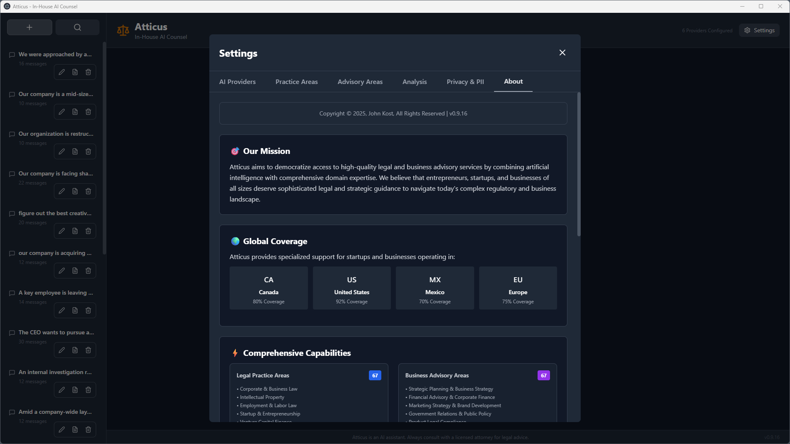
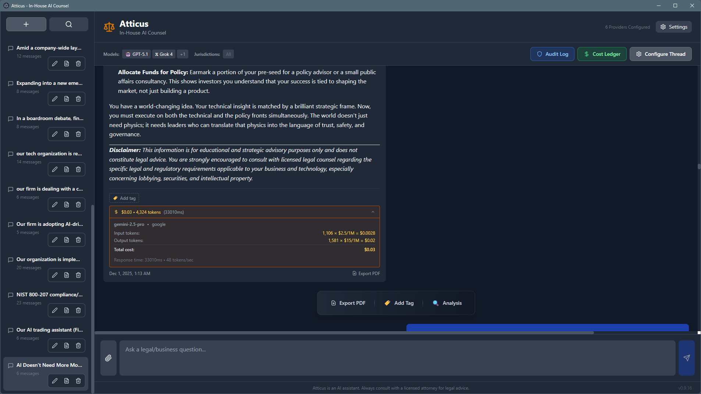
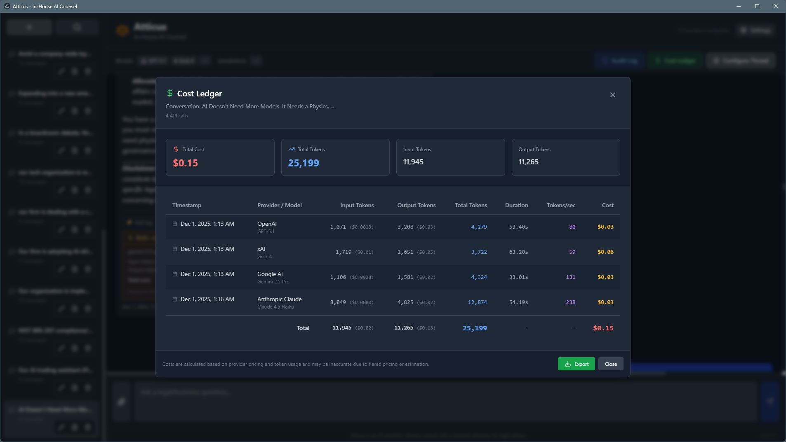
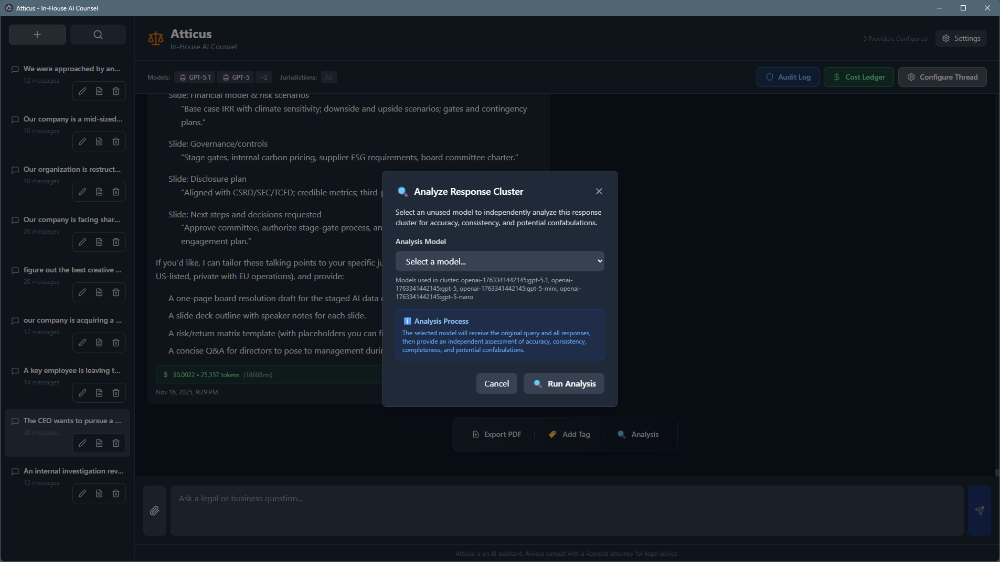
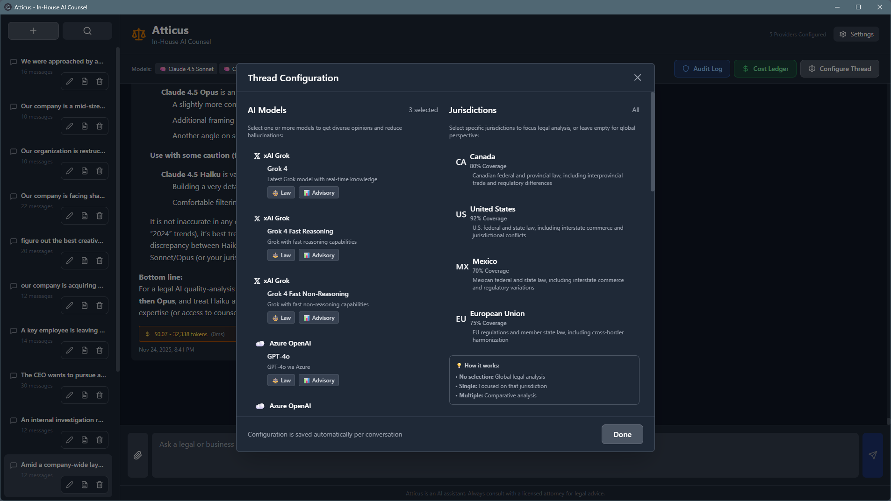
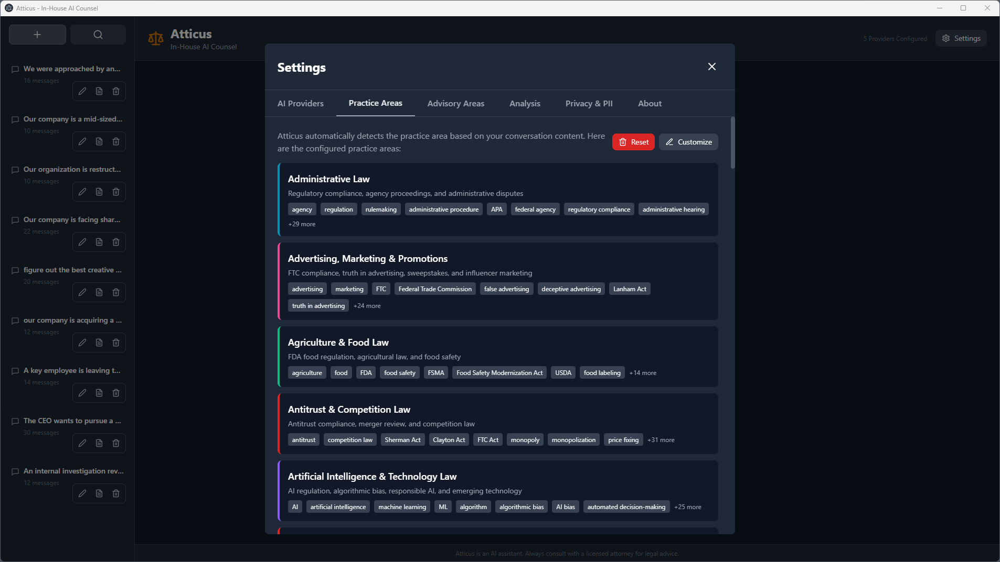
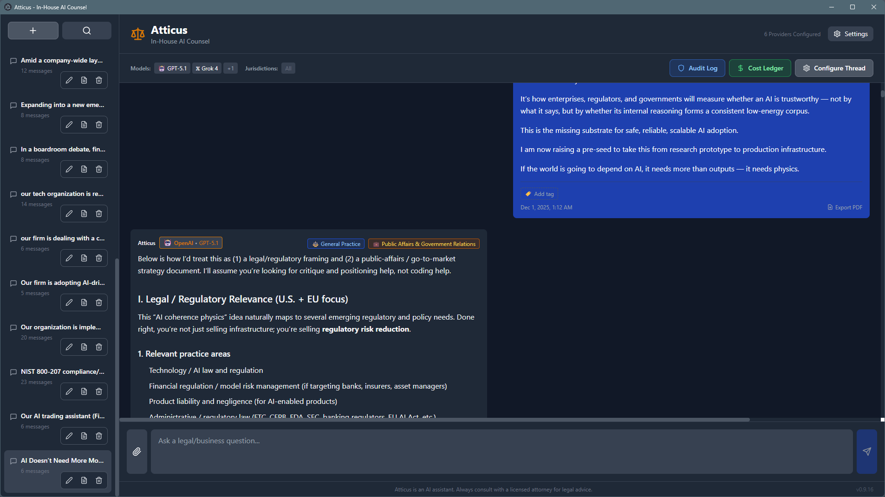
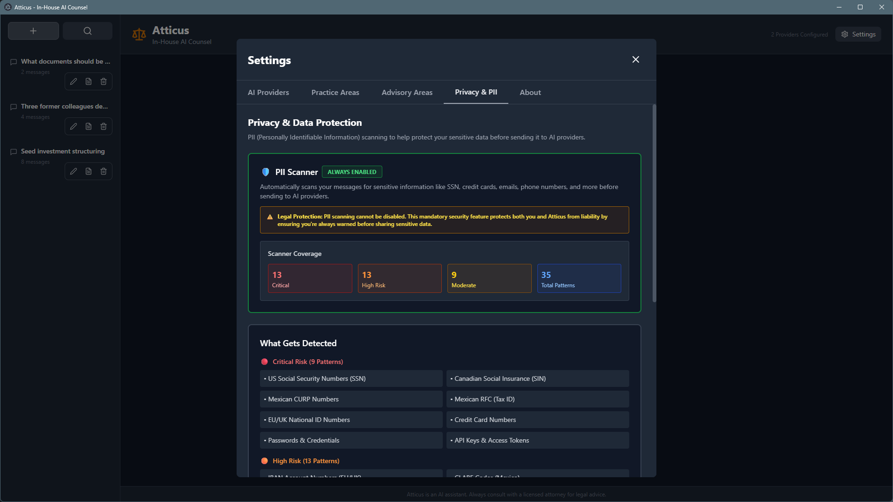
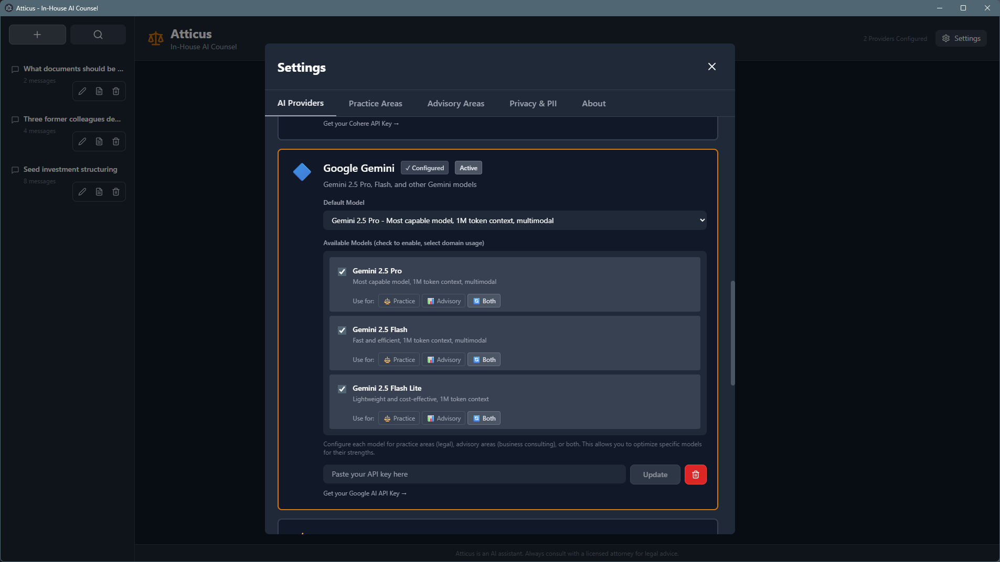

# Atticus - In-House AI Counsel

A powerful **local-first desktop application** that provides entrepreneurs with AI-powered legal assistance and business advisory through multiple AI models, **67 specialized legal practice areas**, **67 MBA-level business advisory areas**, intelligent multi-jurisdictional analysis with inter-provincial/interstate complexity awareness, and comprehensive business consulting capabilities spanning the full spectrum of business disciplines. With **offline resilience** and local data storage, your work remains accessible even when cloud services fail. The time & cost savings are a force multiplier.

> **⚠️ IMPORTANT DISCLAIMER**: Atticus provides **information, not legal advice**. Always consult with licensed professionals for legal, financial, or business decisions. See [RISK.md](RISK.md) for comprehensive risk assessment.



## ⚠️ Important Documentation

Before using Atticus, please review these critical documents:

| Document                              | Purpose                      | Key Information                                                                 |
| ------------------------------------- | ---------------------------- | ------------------------------------------------------------------------------- |
| 📖 **[README.md](README.md)**         | Getting started & features   | Multi-provider AI, 67 legal + 67 business areas, jurisdictional analysis        |
| 🔒 **[PRIVACY.md](PRIVACY.md)**       | Privacy & data protection    | Local-first architecture, third-party data flows, privacy rating: 7.5/10        |
| ⚠️ **[RISK.md](RISK.md)**             | Risk assessment & mitigation | Legal risks, accuracy concerns, security vulnerabilities, required user actions |
| 🤖 **[ETHICAL-AI.md](ETHICAL-AI.md)** | Ethical AI principles        | EU AI ethics compliance, bias mitigation, transparency commitments              |
| 📜 **[LICENSE.md](LICENSE.md)**       | Dual licensing terms         | Apache 2.0 (open source) or Commercial license                                  |

> **🚨 CRITICAL DISCLAIMER**: This application provides **information, not legal advice**. AI outputs may contain errors, hallucinations, or outdated information. Always verify with licensed professionals. See [RISK.md](RISK.md) for complete risk disclosure.

## 🚀 Quick Start

1. **Clone and install**:

   ```bash
   git clone <repository>
   cd atticus
   npm install
   ```

2. **Run in development**:

   ```bash
   npm run electron:dev
   ```

3. **Configure providers** - Get API keys and set up in Settings

📖 **[Full Documentation](docs/README.md)** | 🎯 **[Quick Start Guide](docs/QUICKSTART.md)** | 🔒 **[Privacy Policy](PRIVACY.md)** | ⚠️ **[Risk Assessment](RISK.md)** | 🤖 **[Ethical AI Analysis](ETHICAL-AI.md)**

---

## 📑 Table of Contents

- [Key Features](#-key-features)
  - [Multi-Provider AI Support](#-multi-provider-ai-support)
  - [Multi-Model Selection](#-multi-model-selection)
  - [Real-Time Cost Transparency](#-real-time-cost-transparency)
  - [AI Response Validation & Analysis](#-ai-response-validation--analysis)
  - [Multi-Jurisdictional Analysis](#-multi-jurisdictional-analysis)
  - [Legal Practice Area Detection](#️-legal-practice-area-detection)
  - [Business Advisory Detection](#-business-advisory-detection)
  - [Advanced Configuration: YAML System Prompt Editing](#️-advanced-configuration-yaml-system-prompt-editing)
  - [Privacy & Security Features](#-privacy--security-features)
  - [Offline Resilience & Business Continuity](#-offline-resilience--business-continuity)
- [Architecture & Design](#-architecture--design)
- [Configuration](#-configuration)
- [Development](#development)
- [Troubleshooting](#troubleshooting)
- [Privacy, Ethics & Risk](#-privacy-ethics--risk-assessment)
- [Contributing](#contributing)
- [License](#license)

---

## ✨ Key Features

### 🤖 Multi-Provider AI Support

Access **10 leading AI providers** with **60+ models** through one unified interface:

| Provider            | Models Available                                                                   | Key Capabilities                                         | Best For                                            |
| ------------------- | ---------------------------------------------------------------------------------- | -------------------------------------------------------- | --------------------------------------------------- |
| **🤖 OpenAI**       | GPT-5.1, GPT-5, GPT-5 Mini, GPT-5 Nano                                             | Vision, 400K context, Function Calling                   | Next-gen reasoning, complex legal analysis          |
| **🧠 Anthropic**    | Claude 4.5 Sonnet, Claude 4.5 Haiku, Claude 4.5 Opus                               | Vision, 200K context, Function Calling                   | Advanced analysis, document review, legal writing   |
| **🔷 Google**       | Gemini 2.5 Pro, Gemini 2.5 Flash, Gemini 2.5 Flash Lite                            | Vision, 1M token context, Function Calling               | Massive context, multimodal analysis                |
| **☁️ Azure OpenAI** | GPT-4o, GPT-4o mini, GPT-4                                                         | Vision, Function Calling, Enterprise SLA                 | Enterprise deployment, compliance requirements      |
| **𝕏 xAI**           | Grok 4, Grok 4 Fast Reasoning, Grok 4 Fast Non-Reasoning                           | Vision, 2M token context, Real-time knowledge            | Current events, real-time analysis, massive context |
| **🌬️ Mistral**      | Mistral Large 2 (123B), Mistral Medium, Mistral Small, Mixtral 8x22B, Mixtral 8x7B | Function Calling, EU-based, 128K context                 | EU compliance, open models, cost-effective          |
| **🧬 Cohere**       | Command R+, Command R, Command, Command Light                                      | RAG-optimized, 128K context, Function Calling            | Enterprise search, legal research, citations        |
| **⚡ Groq**         | Llama 3.3 70B, Llama 3.1 70B, Llama 3.1 8B, Mixtral 8x7B, Gemma 2 9B               | Ultra-fast inference (500+ tokens/sec), Function Calling | Speed-critical tasks, rapid prototyping             |
| **🔍 Perplexity**   | Sonar Large (Online), Sonar Small (Online), Sonar Large (Chat), Sonar Small (Chat) | Web search, Citations, 128K context                      | Legal research, current case law, fact-checking     |
| **🧠 Cerebras**     | GPT OSS 120B, Llama 3.3 70B, Llama 3.1 8B, Qwen 3 32B, Qwen 3 235B, ZAI GLM 4.6    | Extreme speed (1000-3000 tokens/sec), 128K context       | Ultra-fast inference, high-throughput tasks         |

**💡 Pro Tip**: Select multiple models simultaneously to cross-validate legal analysis and reduce hallucinations!

<details>
<summary><strong>📋 Detailed Model Breakdown by Provider</strong></summary>

### OpenAI (4 models)

- **GPT-5.1** - Next-generation model with superior reasoning and creativity (400K context) ⭐ _Default_
- **GPT-5** - Advanced model with enhanced capabilities (400K context)
- **GPT-5 Mini** - Balanced performance and cost for general tasks (400K context)
- **GPT-5 Nano** - Cost-effective version for general tasks (400K context)

### Anthropic (3 models)

- **Claude 4.5 Sonnet** - Most intelligent model, best for complex analysis and coding (200K context) ⭐ _Default_
- **Claude 4.5 Haiku** - Fastest and most compact model (200K context)
- **Claude 4.5 Opus** - Powerful model for highly complex tasks (200K context)

### Google (3 models)

- **Gemini 2.5 Pro** - Most capable model, 1M token context, multimodal ⭐ _Default_
- **Gemini 2.5 Flash** - Fast and efficient, 1M token context, multimodal
- **Gemini 2.5 Flash Lite** - Lightweight and cost-effective, 1M token context

### Azure OpenAI (3 models)

- **GPT-4o** - GPT-4o via Azure (128K context) ⭐ _Default_
- **GPT-4o mini** - GPT-4o mini with 128K context via Azure
- **GPT-4** - GPT-4 8K via Azure

### xAI (3 models)

- **Grok 4** - Latest Grok model with real-time knowledge (256K context) ⭐ _Default_
- **Grok 4 Fast Reasoning** - Grok with fast reasoning capabilities (2M context)
- **Grok 4 Fast Non-Reasoning** - Grok with fast non-reasoning capabilities (2M context)

### Mistral AI (5 models)

- **Mistral Large 2** - Most capable (123B), best for complex reasoning ⭐ _Default_
- **Mistral Medium** - Balanced performance and cost
- **Mistral Small** - Fast and cost-effective
- **Mixtral 8x22B** - Powerful mixture-of-experts model
- **Mixtral 8x7B** - Efficient mixture-of-experts model

### Cohere (4 models)

- **Command R+** - Most capable, 128K context, best for complex legal analysis ⭐ _Default_
- **Command R** - Balanced performance and cost, 128K context
- **Command** - Fast and cost-effective for simpler tasks
- **Command Light** - Fastest, most economical option

### Groq (5 models)

- **Llama 3.3 70B** - Latest and most capable Llama model, excellent reasoning ⭐ _Default_
- **Llama 3.1 70B** - Previous generation, excellent reasoning and analysis
- **Llama 3.1 8B** - Fast and efficient for quick responses
- **Mixtral 8x7B** - Mixture-of-experts, great for diverse tasks
- **Gemma 2 9B** - Efficient and capable Google model

### Perplexity AI (4 models)

- **Sonar Large (Online)** - Most capable with real-time web search and citations ⭐ _Default_
- **Sonar Small (Online)** - Fast web search with citations, cost-effective
- **Sonar Large (Chat)** - Offline reasoning, no web search
- **Sonar Small (Chat)** - Fast offline chat model

### Cerebras AI (6 models)

- **GPT OSS 120B** - Large open-source GPT model, ultra-fast inference (1000 tokens/sec) ⭐ _Default_
- **Llama 3.3 70B** - Latest Llama with exceptional speed (2000 tokens/sec)
- **Llama 3.1 8B** - Efficient Llama model with extreme speed (3000 tokens/sec)
- **Qwen 3 32B** - Chinese-English bilingual model with fast inference (2000 tokens/sec)
- **Qwen 3 235B** - Largest Qwen model with high capability (1000 tokens/sec)
- **ZAI GLM 4.6** - Advanced GLM model optimized for speed (1500 tokens/sec)

**Total: 43 models** across 10 providers (Updated November 2025)

</details>

### 🔀 Multi-Model Selection

**Query multiple AI models simultaneously** to reduce hallucinations and get diverse perspectives:

- Select 1-9+ models per conversation
- Parallel API execution for fast responses
- Model attribution badges on each response
- Compare answers across different AI systems
- Cross-validate legal analysis

### 💰 Real-Time Cost Transparency

**See exactly what you're spending on each query** with automatic token usage and cost reporting:


_Real-time cost breakdown showing input/output token usage and pricing per query - complete transparency on API expenses_

**Why Direct Provider APIs Save Money**:

Going directly to provider API endpoints (like OpenAI, Anthropic, Google) instead of using intermediary services provides **significant cost savings**:

- ✅ **No markup fees** - Pay only provider's base rate (e.g., GPT-4o: $2.50/1M input, $10/1M output)
- ✅ **No subscription required** - Pay per use only, no monthly minimums
- ✅ **Volume discounts** - Benefit from provider's tiered pricing as you scale
- ✅ **Full control** - Monitor and optimize costs in real-time
- ❌ **Avoid 2-10x markups** - Many AI chatbot services charge $20-50/month for what costs $2-5 in API usage

**Cost Report Features**:

- 📊 **Collapsible display** - Compact summary (cost, tokens, time) expands to full breakdown
- 💵 **Exact pricing** - Input tokens × rate + Output tokens × rate = Total cost
- 🎨 **Color-coded tiers** - Green (<$0.01), Amber ($0.01-$0.10), Red (>$0.10)
- ⚡ **Performance metrics** - Response time and tokens per second
- 🔍 **Model attribution** - See which model and provider generated each response

**Example Cost Comparison**:

| Service Type                  | Typical Query          | Monthly (50 queries) | Annual          |
| ----------------------------- | ---------------------- | -------------------- | --------------- |
| **Atticus (Direct API)**      | $0.01 - $0.05          | $0.50 - $2.50        | $6 - $30        |
| **ChatGPT Plus Subscription** | Included in $20/mo fee | $20/mo               | $240/year       |
| **Enterprise Chatbot**        | Included in $50/mo fee | $50/mo               | $600/year       |
| **Legal AI Service**          | $5 - $15 per query     | $250 - $750          | $3,000 - $9,000 |

💡 **Pro Tip**: Most legal queries cost **$0.001 to $0.05** with direct API access. Even with multiple models selected, costs remain minimal compared to subscription services or specialized legal AI platforms.

### 💰 Cost Ledger & Expense Tracking

**Track API costs with complete transparency** through the built-in Cost Ledger:



- **Per-Message Breakdown** - See input/output token costs for every API call
- **Real-Time Totals** - Track cumulative costs across entire conversations
- **Color-Coded Tiers** - Visual indicators for low/medium/high cost calls (green/amber/red)
- **Detailed Analytics** - Provider, model, timestamps, and individual cost components
- **Export-Ready** - Full ledger of expenses for budgeting and reporting

💡 **Pro Tip**: Use the Cost Ledger button (next to Audit Log) to review expenses and optimize model selection for cost-effective legal research.

### 🔍 AI Response Validation & Analysis

**Catch confabulations and validate accuracy** with independent AI analysis of response clusters:



- **Multi-Model Validation** - Have an unused model independently analyze and judge responses from other models
- **Consistency Checking** - Identify conflicting information across different AI responses
- **Accuracy Assessment** - Detect potential inaccuracies, hallucinations, and confabulations
- **Quality Ranking** - Get comparative rankings of responses with justifications
- **Trust Recommendations** - Receive guidance on which responses are most reliable
- **Iterative Analysis** - Run multiple analyses with different validator models for consensus building

**How it works**:

1. Get responses from multiple models for your legal query
2. Click the **Analysis** button on the cluster action bar
3. Select an unused model to act as an independent validator
4. The validator model reviews all responses and provides detailed quality assessment
5. Results include consistency checks, accuracy ratings, completeness analysis, and recommendations

💡 **Pro Tip**: Use Analysis after getting responses from 2+ models to identify potential issues before relying on the advice. Multiple validator models can provide consensus validation for critical decisions.

### 🌍 Multi-Jurisdictional Analysis

**Focus legal analysis on specific jurisdictions** or get comparative analysis across **CUSMA/USMCA** region and beyond:

- **🇨🇦 Canada** - Canadian federal and provincial law, including inter-provincial trade and regulatory differences
- **🇺🇸 United States** - U.S. federal and state law, including interstate commerce and jurisdictional conflicts
- **🇲🇽 Mexico** - Mexican federal and state law, including interstate commerce and regulatory variations
- **🇺 European Union** - EU regulations and member state law, including cross-border harmonization

**Inter-provincial/Interstate Complexity Coverage**:

Atticus intelligently addresses **internal jurisdictional complexities** within each country:

**🇨🇦 Canadian Inter-provincial**:

- **Division of powers** - Federal vs. provincial jurisdiction (Constitution Act, 1867)
- **Interprovincial trade barriers** - Agreement on Internal Trade (AIT), Canadian Free Trade Agreement (CFTA)
- **Provincial regulatory differences** - Securities regulation, employment standards, professional licensing
- **Civil law vs. common law** - Quebec civil law vs. other provinces' common law
- **Provincial incorporation** - CBCA (federal) vs. provincial business corporations acts
- **Key variations** - Ontario (commercial hub), Quebec (civil law), BC, Alberta differences

**🇺🇸 Interstate Complexity**:

- **Federal vs. state jurisdiction** - Commerce Clause, Supremacy Clause, federalism principles
- **Interstate commerce** - Dormant Commerce Clause restrictions on state protectionism
- **State regulatory variations** - Corporate law, employment, taxation, professional licensing
- **Conflicts of law** - Choice of law provisions, forum shopping considerations
- **State incorporation** - Delaware (corporate law hub), vs. home state incorporation
- **Key variations** - Delaware (corporate), California (employment/consumer), New York (finance), Texas (business-friendly)

**🇲🇽 Mexican Interstate**:

- **Federal vs. state jurisdiction** - Mexican constitutional framework
- **Interstate commerce** - Regulatory coordination between states
- **State taxation variations** - State-level tax and commercial regulations
- **Border states** - Special regulations for northern border zone (Zona Libre)
- **Key variations** - Mexico City (financial hub), Nuevo León (manufacturing), Jalisco (tech), border states

**CUSMA/USMCA Coverage**:

The system is **fully optimized for CUSMA/USMCA** (Canada-United States-Mexico Agreement) cross-border operations:

- **Trade compliance** - CUSMA rules of origin, tariff classifications, customs procedures
- **Cross-border business** - Entity formation, tax planning, regulatory compliance across CA/US/MX
- **Supply chain** - Manufacturing, logistics, and distribution across North America
- **Labor mobility** - TN visas (Canada/Mexico to US), professional credentials recognition
- **Intellectual property** - Patent, trademark, and copyright protection in all three jurisdictions
- **Dispute resolution** - CUSMA Chapter 31 (dispute settlement), investor-state mechanisms
- **Interstate/interprovincial coordination** - Addressing internal barriers that affect cross-border operations

**Intelligent Prompt Modification**:

- Single jurisdiction → Focused analysis **with interprovincial/interstate guidance**
- Multiple jurisdictions → Structured comparative analysis **with cross-border complexity**
- CA + US + MX → CUSMA-specific guidance **with internal trade barrier considerations**
- No selection → Global legal perspective


_Comprehensive per-conversation configuration: select multiple AI models simultaneously and choose specific jurisdictions for legal analysis (Canada, US, Mexico, EU) for optimal results_

### ⚖️ Legal Practice Area Detection

Automatically detects **67 specialized legal practice areas** with **5,000+ keywords** and applies expert-level AI prompts:

<details>
<summary><strong>📋 View All 67 Practice Areas</strong></summary>

| Area                           | Focus                                          | Keywords (Sample)                                                                | Coverage      |
| ------------------------------ | ---------------------------------------------- | -------------------------------------------------------------------------------- | ------------- |
| **Corporate Law**              | Entity formation, governance, compliance       | corporation, LLC, bylaws, shareholders, board of directors                       | 🇨🇦 🇺🇸 �🇽 �🇪🇺 |
| **Litigation**                 | Dispute resolution, court proceedings          | lawsuit, plaintiff, defendant, discovery, summary judgment                       | 🇨🇦 🇺🇸 🇲🇽      |
| **Contract Law**               | Agreement drafting, negotiation, enforcement   | NDA, MSA, breach, consideration, force majeure                                   | 🇨🇦 🇺🇸 🇲🇽 🇪🇺   |
| **Intellectual Property**      | Patents, trademarks, copyrights, trade secrets | patent application, trademark registration, copyright infringement, IP portfolio | 🇨🇦 🇺🇸 🇲� �🇪🇺 |
| **Employment Law**             | Hiring, termination, workplace rights          | employment contract, wrongful termination, harassment, discrimination            | 🇨🇦 🇺🇸 🇲� �🇪🇺 |
| **Real Estate Law**            | Property transactions, leases, zoning          | commercial lease, property purchase, zoning variance, title insurance            | 🇨🇦 🇺🇸 🇲🇽      |
| **Tax Law**                    | Tax planning, compliance, disputes             | tax deduction, IRS audit, transfer pricing, tax treaty                           | 🇨🇦 🇺🇸 🇲🇽 🇪🇺   |
| **Immigration Law**            | Visas, work permits, citizenship               | H-1B, work permit, permanent residence, LMIA, Express Entry, TN visa             | 🇨🇦 🇺🇸 🇲🇽 🇪🇺   |
| **Criminal Law**               | Criminal defense, prosecution                  | criminal charges, plea bargain, sentencing, defense strategy                     | 🇨🇦 🇺🇸 🇲🇽      |
| **Family Law**                 | Divorce, custody, support                      | divorce proceedings, child custody, spousal support, prenuptial agreement        | 🇨🇦 🇺🇸 🇲🇽      |
| **Bankruptcy & Restructuring** | Insolvency, debt relief                        | Chapter 11, liquidation, creditor protection, CCAA, receivership                 | 🇨🇦 🇺🇸 🇲🇽      |
| **International Law**          | Cross-border transactions, treaties            | GDPR, CUSMA, international arbitration, trade agreements, cross-border M&A       | 🇪🇺 🌍 CUSMA   |
| **Environmental Law**          | Regulations, compliance, sustainability        | environmental assessment, emissions compliance, carbon credits                   | 🇨🇦 🇺🇸 🇲🇽 🇪🇺   |
| **Healthcare Law**             | HIPAA, medical regulations                     | patient privacy, HIPAA compliance, medical licensing, FDA approval               | 🇺🇸 🇨🇦 🇲🇽      |
| **Cybersecurity Law**          | Data protection, privacy, incident response    | data breach, GDPR compliance, privacy policy, SOC 2                              | 🇪🇺 🇺🇸 🇨🇦 🇲🇽   |
| **Startup & Entrepreneurship** | Founder agreements, equity, fundraising        | founder vesting, SAFE note, seed round, term sheet, cap table                    | 🇨🇦 🇺🇸 �🇽 �🇪🇺 |
| **Venture Capital**            | Startup financing, term sheets, exits          | Series A, liquidation preference, anti-dilution, pro rata rights                 | 🇺🇸 🇨🇦 🇲🇽      |
| **Government & Public Law**    | Regulatory compliance, lobbying                | government contracts, regulatory approval, lobbying compliance                   | 🇨🇦 🇺🇸 🇲🇽 🇪🇺   |
| **Administrative Law**         | Regulatory proceedings, agency actions         | regulatory appeal, administrative hearing, agency decision                       | 🇨🇦 🇺🇸 🇲🇽      |
| **Civil Rights Law**           | Discrimination, constitutional rights          | civil rights violation, discrimination lawsuit, constitutional challenge         | 🇺🇸 🇨🇦 🇲🇽      |
| **Personal Injury**            | Tort claims, negligence, damages               | personal injury claim, negligence, medical malpractice, damages                  | 🇨🇦 🇺🇸 🇲🇽      |
| **Estate Planning**            | Wills, trusts, succession                      | estate planning, will drafting, trust creation, probate, succession              | 🇨🇦 🇺🇸 🇲🇽 🇪🇺   |
| **Commercial Transactions**    | Business deals, M&A, securities                | asset purchase, stock purchase, due diligence, closing documents                 | 🇨🇦 🇺🇸 �🇽 �🇪🇺 |
| **Patent Law**                 | Patent prosecution, litigation                 | patent application, prior art search, patent infringement, claims drafting       | 🇺🇸 🇨🇦 �🇽 �🇪🇺 |
| **Defense & Military Law**     | UCMJ, military contracts                       | court-martial, military justice, defense contracts, security clearance           | 🇺🇸            |
| **Labor Law**                  | Union relations, collective bargaining         | collective bargaining, union certification, labor dispute, grievance             | 🇨🇦 🇺🇸 🇲🇽 🇪🇺   |

</details>

**🎯 Startup-Focused Coverage (90% Optimization)**:

The practice area system is heavily optimized for startup legal needs:

- 🏢 **Founder agreements** and equity splits (vesting, cliffs, acceleration)
- 💰 **Fundraising instruments** (SAFE notes, convertible debt, priced rounds Series A-C)
- 📊 **Cap table management** (dilution modeling, option pools, pro rata rights)
- 🌍 **Multi-jurisdiction** operations (Canada flip, Delaware C-Corp, Mexico maquiladora, EU expansion)
- 💼 **Exit strategies** (M&A structuring, IPO readiness, acqui-hire negotiations)
- 🏛️ **Government funding** (SR&ED tax credits, SBIR/STTR grants, Mexico CONACYT, Horizon Europe)
- 🛡️ **IP protection** (patent strategy, trademark portfolio, open source compliance)
- 📝 **Commercial contracts** (SaaS agreements, enterprise MSAs, channel partnerships)
- 🚚 **CUSMA/USMCA compliance** (rules of origin, tariff classifications, cross-border supply chain)

**Detection Features**:

- ✅ **5,000+ keyword triggers** - Comprehensive coverage across all areas
- ✅ **Automatic detection** - AI analyzes your query and selects appropriate practice area
- ✅ **Confidence scoring** - Know when detection is certain vs. uncertain
- ✅ **Alternative suggestions** - See other potential matches (e.g., "Also consider: IP Law, Tax Law")
- ✅ **Expandable keywords** - View all trigger keywords per area in Settings
- ✅ **Expert system prompts** - Each area has specialized AI instructions for accurate guidance

**Geographic Coverage**:

- 🇨🇦 **Canada**: 80% coverage (strongest in corporate, startup, tax, IP, employment)
- 🇺🇸 **United States**: 92% coverage (comprehensive across all practice areas)
- �🇽 **Mexico**: 70% coverage (focus on CUSMA trade, maquiladora, corporate, labor, IP)
- �🇪🇺 **European Union**: 75% coverage (focus on GDPR, cross-border, international)
- 🌐 **CUSMA Region**: Full cross-border coverage for CA/US/MX operations

Each area includes:

- ✅ **Specialized system prompts** - Expert-level guidance tailored to practice area
- ✅ **Keyword detection** - Automatic area identification from your query
- ✅ **Confidence scoring** - Transparency about detection accuracy
- ✅ **Alternative suggestions** - See other potential matches
- ✅ **Expandable keywords** - View all trigger keywords per area

### 💼 Business Advisory Areas

Automatically detects **67 specialized business advisory areas** with **3,500+ keywords** for comprehensive strategic guidance across the full MBA spectrum:

<details>
<summary><strong>📊 View All 67 Advisory Areas</strong></summary>

**Core Business Functions (11 areas):**

| Area                         | Focus                                           | Keywords (Sample)                                                            |
| ---------------------------- | ----------------------------------------------- | ---------------------------------------------------------------------------- |
| **Strategic Planning**       | Vision, competitive positioning, growth         | strategic plan, competitive analysis, market positioning, growth strategy    |
| **Financial Advisory**       | Capital raising, M&A, valuation, modeling       | venture capital, Series A, financial model, cash flow projection, burn rate  |
| **Marketing Strategy**       | Go-to-market, positioning, growth marketing     | product-market fit, CAC, LTV, brand positioning, content marketing           |
| **Operations Management**    | Process optimization, supply chain, quality     | operational efficiency, process improvement, supply chain, inventory         |
| **Human Capital**            | Talent strategy, culture, compensation          | talent acquisition, organizational design, performance management            |
| **Digital Transformation**   | Tech strategy, cloud, AI/ML, cybersecurity      | cloud migration, API strategy, microservices, machine learning               |
| **Risk Management**          | Enterprise risk, compliance, continuity         | risk assessment, compliance program, business continuity, incident response  |
| **Sustainability & ESG**     | Environmental, social, governance, reporting    | ESG reporting, carbon footprint, sustainability strategy, stakeholder        |
| **M&A Advisory**             | Deal sourcing, due diligence, integration       | merger integration, due diligence, synergy realization, cultural integration |
| **Government Grants**        | R&D credits, SBIR/STTR, non-dilutive funding    | R&D tax credit, innovation funding, grant application, IRAP                  |
| **Product Legal Compliance** | Privacy, accessibility, regulatory, open source | privacy policy, terms of service, WCAG compliance, GDPR                      |

**Growth & Innovation (11 areas):**

| Area                            | Focus                                          | Keywords (Sample)                                                            |
| ------------------------------- | ---------------------------------------------- | ---------------------------------------------------------------------------- |
| **Entrepreneurship & Startups** | Venture creation, lean startup, founder        | lean startup, MVP, product-market fit, founder vesting, pitch deck           |
| **International Business**      | Cross-border strategy, market entry, trade     | international expansion, CUSMA/USMCA, foreign market, localization           |
| **Business Analytics**          | Data strategy, BI, predictive modeling         | business intelligence, data analytics, KPI dashboard, A/B testing            |
| **Supply Chain & Logistics**    | End-to-end supply chain, procurement           | supply chain optimization, inventory management, warehousing, 3PL            |
| **Sales Strategy & RevOps**     | Sales methodology, pipeline, revenue ops       | sales strategy, pipeline management, RevOps, CRM, sales enablement           |
| **Corporate Governance**        | Board effectiveness, director responsibilities | board of directors, corporate governance, fiduciary duty, audit committee    |
| **Innovation & R&D**            | Innovation strategy, product development, IP   | innovation management, R&D portfolio, design thinking, patent strategy       |
| **Customer Experience**         | CX strategy, journey mapping, service design   | customer experience, journey mapping, NPS, customer satisfaction             |
| **Organizational Design**       | Org structure, change management               | organizational design, change management, transformation, operating model    |
| **Business Negotiations**       | Negotiation strategy, deal structuring         | negotiation, BATNA, deal structuring, contract negotiation                   |
| **Crisis Management**           | Crisis response, business continuity           | crisis management, business continuity, disaster recovery, incident response |

**Specialized Functions (22 areas):**

| Area                              | Focus                                         | Keywords (Sample)                                                          |
| --------------------------------- | --------------------------------------------- | -------------------------------------------------------------------------- |
| **Brand Strategy**                | Brand positioning, architecture, equity       | brand strategy, brand positioning, brand architecture, brand equity        |
| **Pricing Strategy**              | Pricing models, optimization, revenue mgmt    | pricing strategy, pricing optimization, revenue management, value-based    |
| **Product Management**            | Product lifecycle, roadmaps, portfolio        | product management, product roadmap, product-market fit, feature priority  |
| **Business Process Improvement**  | Lean, Six Sigma, process reengineering        | process improvement, lean, Six Sigma, DMAIC, continuous improvement        |
| **Corporate Finance & Treasury**  | Capital structure, treasury operations        | corporate finance, treasury management, capital structure, cash management |
| **Turnaround & Restructuring**    | Financial distress, operational turnaround    | turnaround, restructuring, financial distress, bankruptcy                  |
| **Competitive Intelligence**      | Competitor monitoring, market intelligence    | competitive intelligence, competitor analysis, market intelligence         |
| **Business Development**          | Strategic partnerships, alliances, ecosystems | business development, strategic partnerships, channel partnerships         |
| **Intellectual Property**         | IP portfolio, patent strategy, licensing      | intellectual property, patent strategy, IP portfolio, technology licensing |
| **Quality Management**            | TQM, quality systems, ISO certifications      | quality management, TQM, ISO 9001, quality assurance                       |
| **Real Estate & Facilities**      | Workplace strategy, portfolio optimization    | real estate strategy, workplace strategy, facilities management            |
| **Tax Strategy**                  | Tax optimization, transfer pricing            | tax strategy, tax planning, transfer pricing, international tax            |
| **Insurance & Risk Transfer**     | Insurance programs, captives, claims          | insurance strategy, risk transfer, captive insurance, claims management    |
| **Investor Relations**            | IR strategy, equity story, analyst relations  | investor relations, equity story, analyst coverage, shareholder comms      |
| **Public Affairs**                | Government relations, regulatory advocacy     | public affairs, government relations, lobbying, regulatory advocacy        |
| **Franchise Development**         | Franchise models, franchisee recruitment      | franchise, franchising, franchise development, franchisee selection        |
| **Family Business**               | Succession planning, family governance        | family business, succession planning, family governance                    |
| **Nonprofit & Social Enterprise** | Mission-driven strategy, impact measurement   | nonprofit, social enterprise, impact measurement, fundraising              |
| **Retail Strategy**               | Retail formats, merchandising, store ops      | retail strategy, merchandising, store operations, omnichannel              |
| **Healthcare Practice**           | Medical practice operations, value-based care | healthcare management, practice management, value-based care               |
| **Professional Services**         | Firm economics, leverage models               | professional services, consulting firm, leverage model, partner comp       |
| **Technology Commercialization**  | Tech transfer, licensing, startup formation   | technology commercialization, tech transfer, licensing, spinout            |

</details>

**🎯 MBA-Level Advisory Coverage (67 Areas)**:

Each advisory area provides **consulting-grade guidance** matching top firms (McKinsey, BCG, Bain, Goldman Sachs, Deloitte), covering the full MBA curriculum and beyond.

**Advisory Features**:

- ✅ **670+ core competencies** (10 per area × 67 areas)
- ✅ **World-class frameworks** - McKinsey 7-S, BCG Matrix, Porter's Five Forces, Balanced Scorecard, COSO ERM, Lean/Six Sigma
- ✅ **Industry best practices** - Proven methodologies from top consulting firms and Fortune 500 companies
- ✅ **Strategic templates** - Business model canvas, OKRs, financial models, pitch decks, GTM plans, strategic roadmaps
- ✅ **Implementation guidance** - Step-by-step action plans, timelines, success metrics, and performance indicators
- ✅ **Comprehensive MBA coverage** - Strategy, finance, marketing, operations, HR, technology, specialized functions
- ✅ **Industry verticals** - Retail, healthcare, professional services, franchise, family business, nonprofit
- ✅ **Specialized expertise** - IP management, competitive intelligence, quality management, tax strategy, investor relations
- ✅ **3,500+ keyword triggers** - Automatic advisory area detection across all 67 domains

**Sample Guidance Quality**:

Each advisory area includes **500-1,200 lines** of expert content:

- **Strategic Planning**: ~500 lines (Porter's Five Forces deep dive, competitive moats, strategic planning process)
- **Financial Advisory**: ~600 lines (VC fundraising stages, 409A valuations, cap table modeling, M&A sell-side)
- **Marketing Strategy**: ~1,200 lines (GTM frameworks, product-market fit, pricing strategy, growth marketing)
- **M&A Advisory**: ~500 lines (PMI phases, synergy tracking, cultural integration, IT systems integration)
- **Government Grants**: ~400 lines (SR&ED claiming, SBIR phases, Horizon Europe, compliance best practices)
- **Product Legal**: ~400 lines (Privacy-by-design, WCAG compliance, open source licensing, regulatory pathways)

Each area includes:

- ✅ **Business frameworks** - McKinsey, BCG, Porter's Five Forces
- ✅ **Industry best practices** - Proven methodologies
- ✅ **Strategic templates** - Business model canvas, OKRs
- ✅ **Implementation guidance** - Actionable recommendations

### ⚙️ Unified Settings & Configuration

**Comprehensive settings** organized in four intuitive tabs:

- 🔌 **Providers Tab** - Configure AI models and API keys
- ⚖️ **Practice Areas Tab** - View all 67 legal practice areas with expandable keywords
- 💼 **Advisory Areas Tab** - Explore all 67 business advisory areas
- ℹ️ **About Tab** - Mission, coverage statistics, capabilities overview

**Key Features**:

- **Expandable keywords** - Click "+X more" to see all detection keywords
- **Color-coded areas** - Legal (blue) vs Advisory (gold) distinction
- **Geographic coverage** - 🇨🇦 80% Canada, 🇺🇸 92% US, �🇽 70% Mexico, �🇪🇺 75% EU
- **CUSMA/USMCA optimized** - Full North American free trade zone support
- **Copyright & disclaimer** - Legal notices and AI usage guidelines

### ✏️ Advanced Configuration: YAML System Prompt Editing

**Full control over AI behavior** with direct YAML configuration editing for power users:


_Advanced YAML editor in Settings allows direct modification of practice areas, advisory areas, and analysis configurations - customize system prompts, keywords, detection rules, and AI behavior at a granular level_

**Comprehensive Editing Capabilities**:

- **📝 Practice Areas Configuration** - Edit all 67 legal practice areas directly in YAML

  - Customize system prompts with expert-level legal instructions for each area
  - Modify keyword detection rules (5,000+ keywords across all areas)
  - Adjust area names, descriptions, and color coding
  - Enable/disable specific practice areas
  - Add new practice areas with custom detection logic

- **💼 Advisory Areas Configuration** - Edit all 67 business advisory areas

  - Customize consulting-grade system prompts for strategic guidance
  - Modify business keyword detection (3,500+ keywords)
  - Adjust advisory focus areas and descriptions
  - Add new advisory domains with custom expertise

- **🔍 Analysis Configuration** - Control AI response validation behavior
  - Customize system prompts for multi-model validation
  - Define accuracy assessment criteria
  - Configure consistency checking logic
  - Adjust confabulation detection sensitivity

**Advanced Features**:

- **🔄 Factory Reset** - Restore default configurations from `https://jdai.ca/atticus/`
  - Separate reset buttons for Practice Areas, Advisory Areas, and Analysis
  - Confirmation dialogs prevent accidental resets
  - Fetch latest official configurations from remote endpoint
- **🛡️ Customization Protection** - Modified configurations are protected from automatic updates

  - `customized: true` flag prevents overwriting your changes on app restart
  - Clear visual indicators show factory vs. customized status
  - Manual control over when to adopt upstream updates

- **✅ Real-Time Validation** - Instant feedback on YAML syntax and structure

  - JSON Schema validation ensures configuration integrity
  - Duplicate ID detection prevents conflicts
  - Required field validation (id, name, description, keywords)
  - Color format validation for UI consistency

- **📊 Validation Scripts** - Pre-startup validation for all configurations
  - `validate-practices-clean.js` - Validates all 67 practice areas
  - `validate-advisory-clean.js` - Validates all 67 advisory areas
  - `validate-providers-clean.js` - Validates provider configurations
  - `validate-analysis-clean.js` - Validates analysis settings
  - Customization status reporting in validation output

**Why Direct YAML Editing?**

- **🎯 Precision Control** - Fine-tune AI behavior beyond what UI controls offer
- **🚀 Power User Features** - Implement custom practice areas for niche legal domains
- **🔬 Experimentation** - Test different system prompts and detection strategies
- **📚 Version Control** - Configuration files can be tracked in Git for team collaboration
- **🏢 Enterprise Customization** - Adapt Atticus to firm-specific practice areas and terminology

**Configuration File Locations**:

- **Development**: `c:\JDAI\atticus\public\config\`
- **Production**: `%APPDATA%\atticus\config\` (Windows) after first edit
- Files: `practices.yaml`, `advisory.yaml`, `analysis.yaml`, `providers.yaml`

💡 **Pro Tip**: Use the expandable keyword viewer in the UI to understand detection patterns before editing. Make incremental changes and test with the validation scripts to ensure configuration integrity.

⚠️ **Caution**: Direct YAML editing is powerful but requires understanding of YAML syntax and JSON Schema validation. Always use the "Reset" buttons if configurations become corrupted. The factory configurations from `https://jdai.ca/atticus/` are always available as a fallback.

### 🎨 Model Filtering & Customization

**Show only the models you use** and **optimize them for specific domains**:

- **Enable/disable models** per provider to reduce clutter
- **Domain specialization** - Configure each model for:
  - ⚖️ **Practice Areas** (legal) - Optimized for legal queries
  - 📊 **Advisory Areas** (business) - Optimized for business consulting
  - 🔄 **Both** - Available for all queries (default)
- **Smart filtering** - Models automatically filter based on detected query type
- **Real-time detection** - Legal questions show legal-optimized models, business questions show business-optimized models
- **Visual indicators** - Clear feedback showing which domain is active
- Per-provider configuration
- Settings persist across sessions

**Benefits**:

- Faster model selection with fewer irrelevant options
- Better results by matching models to their strengths
- Cost optimization using appropriate models for each task

### �💬 Rich Chat Interface

- **Markdown rendering** for formatted responses
- **Conversation management** - save, search, and organize chats
- **Conversation search** - Find conversations by title, content, or practice area
- **Editable titles** - Rename conversations for better organization
- **Per-conversation model selection** - choose different models for different tasks
- **Real-time area detection** - automatic practice area and advisory identification
- **PDF export** - download conversations with formatting
- **Document upload** - PDF, Word, images (multimodal models)
- **Sidebar actions** - Quick access to PDF export, search, and delete

**Search & Organization**:

- 🔍 **Quick search dialog** - Filter conversations by title or message content
- ✏️ **Inline title editing** - Click edit button to rename conversations
- 📁 **Auto-save** - All conversations persist locally
- ⌨️ **Keyboard shortcuts** - Enter to save, Escape to cancel


_All conversations are stored locally on your device with full search capabilities, editable titles, and organized sidebar for easy access to your legal and business advisory history_

### 🔒 Privacy & Security

- ✅ **Local storage** - API keys stored on your machine only
- ✅ **Direct API calls** - no intermediaries or third-party servers
- ✅ **Full control** - you own your data
- ✅ **Secure credentials** - encrypted local storage
- ✅ **Offline resilience** - work continues when internet/cloud services are down

### 💪 Offline Resilience & Business Continuity

**Atticus works when the cloud doesn't.** Unlike web-based AI tools that become completely unusable during outages, Atticus maintains critical functionality:

- **📚 Access Your Work** - All conversations, research, and analysis remain accessible locally even when internet is down
- **📝 Continue Working** - Review past conversations, search through history, export PDFs, and prepare queries offline
- **🔍 Search & Review** - Full-text search across all conversations works without internet connectivity
- **💾 Local-First Architecture** - All data stored on your machine; you're never locked out of your own work
- **📊 Cost Analysis** - Review expense ledgers and token usage reports offline

**Real-World Impact**: During AWS outages (Dec 2021, Jun 2022, Dec 2022), Azure incidents (Jan 2023, Jul 2024), or Cloudflare disruptions (Jun 2022, Nov 2023), web-based AI tools become completely inaccessible. Atticus users continue reviewing research, preparing queries, and accessing critical legal analysis without interruption.

💡 **Business Continuity**: When you need to reference legal research during a pitch, court preparation, or client call, cloud outages can't block access to your work. Your data stays with you, not trapped in someone else's datacenter.

### 🏢 Why Use API Endpoints Instead of Consumer Apps?

Atticus uses **direct API access** to AI providers rather than consumer web apps (ChatGPT, Claude.ai, etc.). This architectural decision provides critical privacy and enterprise benefits:

#### **Privacy & Data Protection**

- **❌ Consumer Apps**: Your conversations are stored on provider servers, used for model training (unless opted out), and subject to provider data policies
- **✅ API Endpoints**: Zero data retention by default - providers don't store or train on your API data per enterprise agreements

**Real Impact**: Sensitive legal documents, financial data, trade secrets, and client information stay private. No risk of your proprietary strategies appearing in future model training.


_Atticus automatically detects PII and sensitive information, providing real-time warnings and anonymization options to protect confidential data before sending to AI providers_

#### **Enterprise Compliance**

- **❌ Consumer Apps**: Consumer-grade terms of service, no SLAs, limited compliance certifications
- **✅ API Endpoints**: Enterprise agreements with GDPR/HIPAA compliance options, SOC 2 Type II certifications, BAAs available

**Real Impact**: Meet regulatory requirements for handling confidential client data, PII, and protected health information.

#### **Control & Auditability**

- **❌ Consumer Apps**: Limited visibility into data handling, hard to audit usage, conversations tied to personal accounts
- **✅ API Endpoints**: Complete audit trails, usage tracking per API call, programmatic access control, local data storage

**Real Impact**: Full visibility for compliance audits, client billing justification, and internal security reviews.

#### **Cost & Flexibility**

- **❌ Consumer Apps**: Subscription per user ($20-200/mo), rate limits, restricted features, limited model selection
- **✅ API Endpoints**: Pay only for what you use, access to all models including latest releases, no rate limit surprises

**Real Impact**: Better economics for variable usage patterns, access to specialized models, no paying for unused seats.

#### **Integration & Workflow**

- **❌ Consumer Apps**: Manual copy-paste workflows, browser-based only, no automation, siloed from your tools
- **✅ API Endpoints**: Desktop application integration, automation capabilities, multi-provider flexibility, offline data storage

**Real Impact**: Professional workflow integration, use multiple AI providers simultaneously, maintain local conversation history.

**Bottom Line**: For legal and business advisory work involving confidential information, API endpoints provide the privacy guarantees, compliance certifications, and data control that consumer apps cannot match.

---

## � Coverage Statistics

**Atticus provides enterprise-grade legal and business advisory capabilities:**

### AI Provider Coverage

- **10 providers** with **60+ models** integrated
- **Latest models** (as of November 2025): GPT-5.1, Claude 4.5 Sonnet, Gemini 2.5 Pro, Grok 4, Llama 3.3
- **Context windows** up to **2M tokens** (xAI Grok 4)
- **Ultra-fast inference** up to **3000 tokens/sec** (Cerebras)
- **Vision capabilities** across 6 providers
- **Function calling** support for structured outputs

### Legal Practice Areas

- **67 specialized practice areas** with expert system prompts
- **5,000+ keyword triggers** for automatic detection
- **Geographic coverage**: 🇨🇦 80% Canada | 🇺🇸 92% US | 🇲🇽 70% Mexico | 🇪🇺 75% EU
- **CUSMA/USMCA focus**: Full cross-border coverage for North American operations
- **Startup optimization**: 90% coverage for entrepreneurial legal needs
- **Confidence scoring** with alternative area suggestions

### Business Advisory Areas

- **67 advisory domains** with consulting-grade guidance
- **~25,000 lines** of expert advisory content (expanded coverage)
- **3,500+ keyword triggers** for automatic detection
- **670 core competencies** across all advisory areas (10 per area)
- **World-class frameworks**: McKinsey, BCG, Bain, Goldman Sachs, Deloitte methodologies
- **Full MBA coverage**: Strategy, finance, marketing, operations, HR, technology, specialized functions
- **Industry verticals**: Retail, healthcare, professional services, franchise, family business, nonprofit

### Knowledge Base Size

- **Legal practice areas**: ~8,500 lines (practices.yaml)
- **Business advisory areas**: ~25,000 lines (advisory.yaml)
- **Total expertise**: **33,500+ lines** of structured guidance
- **Combined keywords**: **8,500+ triggers** for intelligent detection

### Multi-Jurisdictional Analysis

- **4 major jurisdictions**: Canada, United States, Mexico, European Union
- **CUSMA/USMCA Region**: Comprehensive North American free trade zone coverage
- **Three-dimensional complexity analysis**: International + cross-border + interprovincial/interstate
- **Intelligent prompt modification** based on jurisdiction selection
- **Comparative analysis** for multi-jurisdiction queries
- **Internal complexity awareness**: Provincial/state variations, trade barriers, conflicts of law
- **Cross-border** transaction and compliance support

---

## �📦 Installation

### Prerequisites

- Node.js 18 or higher
- npm or yarn

### Setup

**Clone or navigate to the project directory:**

```bash
cd atticus
```

**Install dependencies:**

```bash
npm install
```

**Run in development mode:**

```bash
npm run electron:dev
```

**Build for production:**

```bash
npm run electron:build
```

The built application will be in the `release` folder.

## Configuration

### Adding AI Providers

Atticus uses a **template-based provider system** with 9 pre-configured providers. Here's how to set them up:

1. **Launch Atticus**
2. **Click the Settings button** (⚙️) in the sidebar
3. **Browse the four tabs**:

   **Providers Tab** - Configure AI models:

   - OpenAI (GPT-5.1, GPT-5, GPT-5 Mini, GPT-5 Nano)
   - Anthropic (Claude 4.5 Sonnet, Claude 4.5 Haiku, Claude 4.5 Opus)
   - Google (Gemini 2.5 Pro, Gemini 2.5 Flash, Gemini 2.5 Flash Lite)
   - Azure OpenAI (GPT-4o, GPT-4o mini, GPT-4)
   - xAI (Grok 4, Grok 4 Fast Reasoning, Grok 4 Fast Non-Reasoning)
   - Mistral AI (Mistral Large 2, Mistral Medium, Mistral Small, Mixtral 8x22B, Mixtral 8x7B)
   - Cohere (Command R+, Command R, Command, Command Light)
   - Groq (Llama 3.3 70B, Llama 3.1 70B, Llama 3.1 8B, Mixtral 8x7B, Gemma 2 9B)
   - Perplexity (Sonar Large Online, Sonar Small Online, Sonar Large Chat, Sonar Small Chat)
   - Cerebras (GPT OSS 120B, Llama 3.3 70B, Llama 3.1 8B, Qwen 3 32B, Qwen 3 235B, ZAI GLM 4.6)

   **Practice Areas Tab** - View all 67 legal practice areas:

   - Expandable keyword lists (click "+X more")
   - Color-coded by category
   - Comprehensive coverage details

   **Advisory Areas Tab** - Explore all 67 business advisory areas:

   - Strategic planning, finance, marketing, operations
   - Technology, risk, sustainability, M&A
   - Government grants and product compliance
   - Expandable keyword lists

   **About Tab** - Learn about Atticus:

   - Mission and vision
   - Geographic coverage statistics
   - Privacy and security guarantees
   - Important legal disclaimers

4. **For each provider you want to use**:

   - Click "Get your [Provider] API Key →" link to obtain an API key
   - Paste your API key in the input field
   - Click **Activate** to configure the provider
   - Once activated, you can:
     - **Select a default model** from the dropdown
     - **Enable/disable specific models** using checkboxes (only checked models appear in conversation selectors)
     - **Set as Active Provider** to make it the default for new conversations

5. **Configure Model Filtering** (optional):

   - After activating a provider, use the "Available Models" checkboxes
   - Uncheck models you don't want to see in conversation model selectors
   - This reduces clutter and shows only your preferred models

6. **Configure Domain Specialization** (optional):
   - For each enabled model, choose where it should be used:
     - ⚖️ **Practice** - Only for legal queries
     - 📊 **Advisory** - Only for business queries
     - 🔄 **Both** - Available everywhere (default)
   - Models automatically filter based on detected query type
   - Example: Configure Claude for legal, o1 for business strategy, GPT-4o for both

**Status Badges**:

- 🟢 **Configured** - Provider has an API key and is ready to use
- 🟡 **Active** - Currently set as the default provider for new conversations


_Example: Configuring Google Gemini models with domain specialization and selective model enabling_

### API Key Information

You'll need to obtain API keys from the providers you want to use:

- **OpenAI**: <https://platform.openai.com/api-keys>
- **Anthropic**: <https://console.anthropic.com/settings/keys>
- **Google AI**: <https://makersuite.google.com/app/apikey>
- **Azure OpenAI**: Through your Azure portal
- **xAI**: <https://console.x.ai/>
- **Mistral AI**: <https://console.mistral.ai/>
- **Cohere**: <https://dashboard.cohere.com/api-keys>
- **Perplexity**: <https://www.perplexity.ai/settings/api>
- **Groq**: <https://console.groq.com/keys>
- **Cerebras**: <https://cloud.cerebras.ai/>

**Security Notes**:

- API keys are stored locally in: `%APPDATA%/atticus/user-config.json` (Windows)
- Keys are never transmitted except to the respective AI provider
- You are billed directly by each provider based on your usage

## Usage

### Starting a Conversation

1. Click **New Conversation** (➕) in the sidebar header
2. Type your legal question or business advisory request
3. Atticus will automatically detect the practice/advisory area and provide specialized assistance
4. Upload documents using the paperclip icon (for supported models)

### Searching Conversations

1. Click the **Search** (🔍) button in the sidebar header
2. Type keywords to filter by:
   - Conversation title
   - Message content
   - Practice area or advisory area
3. Click any result to open that conversation
4. Press Escape or click outside to close

### Organizing Conversations

1. Hover over any conversation in the sidebar
2. Click the **Edit** (✏️) icon in the bottom-right corner
3. Type a new descriptive title
4. Press **Enter** to save or **Escape** to cancel
5. Conversations are auto-sorted with edited titles

### Exporting to PDF

1. Hover over a conversation in the sidebar
2. Click the document icon in the bottom-right corner
3. Choose where to save the PDF

### Best Practices

- **Legal and business advice**: Always review AI-generated content with licensed professionals
- **Specific questions**: Use detailed, specific questions for better responses
- **Document context**: Upload relevant documents for context-aware assistance
- **Multi-model validation**: Use 2-3 models to cross-validate important answers
- **Domain specialization**: Configure models for specific domains (legal/business) to optimize results and reduce costs
- **Keyword awareness**: Click "Expand keywords" in Settings to understand detection triggers
- **Organization**: Rename conversations with descriptive titles for easy retrieval
- **Search effectively**: Use the search dialog to quickly find past conversations
- **Security**: Keep API keys secure and never share them
- **Startup focus**: Leverage startup-specific areas for founder, fundraising, and growth topics

## Practice Area Keywords

Atticus uses keyword detection to identify both legal practice areas and business advisory areas. Here are some examples:

### Legal Practice Areas

- **Corporate**: merger, acquisition, shareholder, securities, incorporation
- **Litigation**: lawsuit, complaint, motion, discovery, trial
- **IP**: patent, trademark, copyright, infringement, licensing
- **Real Estate**: property, deed, lease, zoning, mortgage
- **Employment**: discrimination, harassment, wrongful termination, FMLA
- **Contracts**: agreement, breach, indemnity, warranty, NDA
- **Criminal**: prosecution, defense, felony, arrest, Miranda
- **Tax**: IRS, audit, deduction, tax planning, capital gains
- **Startup Law**: founder agreement, vesting, SAFE note, 83(b) election, cap table
- **Venture Capital**: term sheet, liquidation preference, anti-dilution, Series A

### Business Advisory Keywords

**Core Business (11 areas)**:

- **Strategic Planning**: competitive analysis, SWOT, business model canvas, strategic roadmap, Porter's Five Forces
- **Financial Advisory**: valuation, financial modeling, capital structure, M&A advisory, 409A valuation
- **Marketing Strategy**: go-to-market, brand positioning, customer acquisition, growth marketing, CAC/LTV
- **Operations**: lean manufacturing, Six Sigma, supply chain optimization, KPIs, process improvement
- **HR & Organizational**: talent acquisition, performance management, organizational design, culture, OKRs
- **Digital Transformation**: cloud migration, AI/ML adoption, digital strategy, innovation, microservices
- **Risk Management**: enterprise risk, business continuity, compliance frameworks, resilience, COSO ERM
- **Sustainability**: ESG reporting, carbon footprint, sustainable operations, impact measurement, GRI
- **M&A Advisory**: post-merger integration, due diligence, synergy realization, cultural integration
- **Government Grants**: SR&ED tax credits, SBIR grants, Horizon Europe, innovation funding, R&D credits
- **Product Legal**: privacy-by-design, WCAG accessibility, GDPR compliance, open source licensing

**Growth & Innovation (11 areas)**:

- **Entrepreneurship**: lean startup, MVP, product-market fit, founder vesting, pitch deck, seed funding
- **International**: market entry, CUSMA/USMCA, foreign market, localization, cross-border trade
- **Analytics**: business intelligence, data analytics, KPI dashboard, A/B testing, predictive modeling
- **Supply Chain**: supply chain optimization, inventory management, warehousing, 3PL, logistics
- **Sales & RevOps**: pipeline management, RevOps, CRM, sales enablement, MEDDIC, sales methodology
- **Governance**: board of directors, fiduciary duty, audit committee, D&O insurance, corporate governance
- **Innovation & R&D**: innovation management, R&D portfolio, design thinking, patent strategy
- **Customer Experience**: journey mapping, NPS, customer satisfaction, service design, CX strategy
- **Org Design**: organizational design, change management, transformation, operating model
- **Negotiations**: BATNA, deal structuring, contract negotiation, value creation, negotiation tactics
- **Crisis**: crisis management, business continuity, disaster recovery, incident response

**Specialized Functions (22 areas)**:

- **Brand**: brand positioning, brand architecture, brand equity, rebranding, brand strategy
- **Pricing**: pricing optimization, revenue management, value-based pricing, price elasticity
- **Product**: product roadmap, product-market fit, product lifecycle, feature prioritization
- **Process**: lean, Six Sigma, DMAIC, continuous improvement, kaizen, process reengineering
- **Treasury**: capital structure, cash management, hedging, treasury operations, corporate finance
- **Turnaround**: restructuring, financial distress, bankruptcy, debt restructuring, turnaround
- **CI**: competitive intelligence, competitor analysis, market intelligence, war gaming
- **BD**: business development, strategic partnerships, channel partnerships, alliance management
- **IP**: patent strategy, IP portfolio, technology licensing, patent filing, IP commercialization
- **Quality**: TQM, ISO 9001, quality assurance, Six Sigma quality, quality management systems
- **Real Estate**: workplace strategy, facilities management, lease negotiation, corporate real estate
- **Tax**: tax planning, transfer pricing, international tax, R&D tax credits, tax optimization
- **Insurance**: risk transfer, captive insurance, claims management, D&O insurance, risk financing
- **IR**: equity story, analyst coverage, shareholder communications, investor relations strategy
- **Public Affairs**: government relations, lobbying, regulatory advocacy, policy positions
- **Franchise**: franchising, franchise development, franchisee selection, royalty structure
- **Family**: succession planning, family governance, generational transition, family business
- **Nonprofit**: impact measurement, fundraising, grant writing, social enterprise, mission-driven
- **Retail**: merchandising, store operations, omnichannel, same-store sales, retail analytics
- **Healthcare**: practice management, value-based care, revenue cycle, EHR, HIPAA compliance
- **Prof Services**: consulting firm, leverage model, partner compensation, utilization, firm economics
- **Tech Transfer**: technology commercialization, licensing, spinout, proof of concept, IP licensing

**Total Coverage**: 67 legal areas + 67 advisory areas = **134 specialized domains** with **8,500+ detection keywords**

## Architecture

**Modern stack with modular design:**

- **Frontend**: React 18 + TypeScript + Tailwind CSS
- **Desktop**: Electron 28 (Node.js)
- **State Management**: Zustand with conversation-scoped persistence
- **AI Integration**: Multi-provider template system with parallel execution
- **Practice Area System**: Modular keyword-based detection (67 legal + 67 advisory = 134 specializations)
- **Jurisdiction System**: Multi-jurisdictional analysis (CA, US, MX, EU) with interprovincial/interstate complexity
- **Multi-Model Architecture**: Parallel API execution via Promise.all()
- **Model Domain Specialization**: Real-time query detection with smart model filtering (practice/advisory/both)
- **Configuration**: YAML-based with remote updates and JSON Schema validation
- **PDF Generation**: jsPDF with custom legal formatting
- **Markdown Rendering**: react-markdown with syntax highlighting
- **Build Tool**: Vite 5.4

### Project Structure

```text
atticus/
├── public/
│   └── config/          # YAML configuration files
│       ├── providers.yaml      # AI provider configurations
│       ├── practices.yaml      # Legal practice areas (67 areas)
│       └── advisory.yaml       # Business advisory areas (67 areas)
├── src/
│   ├── electron/         # Electron main process
│   │   ├── main.ts       # Main process entry point
│   │   └── preload.ts    # Preload script (IPC bridge)
│   ├── components/       # React components
│   │   ├── ChatWindow.tsx       # Main chat interface
│   │   ├── Sidebar.tsx          # Conversation list with search
│   │   └── Settings.tsx         # 4-tab settings (Providers, Practice, Advisory, About)
│   ├── config/          # Configuration files
│   │   ├── jurisdictions.ts     # Jurisdiction configs (CA, US, EU)
│   │   └── providerTemplates.ts # AI provider templates
│   ├── modules/         # Feature modules
│   │   └── practiceArea/        # Practice area detection module
│   │       ├── definitions.ts   # Practice area definitions (67)
│   │       ├── detector.ts      # Auto-detection logic
│   │       ├── examples.ts      # Example prompts per area
│   │       ├── types.ts         # Type definitions
│   │       ├── PracticeAreaManager.ts  # Main manager class
│   │       └── index.ts         # Module exports
│   ├── services/        # API services
│   │   ├── api.ts              # AI API integration service
│   │   ├── practiceLoader.ts   # Load legal practice areas from YAML
│   │   └── advisoryLoader.ts   # Load advisory areas from YAML
│   ├── store/           # Zustand state management
│   │   └── index.ts             # Global app state with conversation management
│   ├── types/           # TypeScript type definitions
│   │   └── index.ts             # Global types (Conversation, Jurisdiction, etc.)
│   ├── utils/           # Utility functions
│   ├── App.tsx          # Main React component
│   ├── main.tsx         # React entry point
│   └── index.css        # Global styles (Tailwind)
├── docs/                # Comprehensive documentation
│   └── ...
├── dist-electron/       # Built Electron files
├── release/             # Production builds
├── .vscode/            # VS Code settings
├── package.json         # Dependencies and scripts
├── vite.config.ts       # Vite build configuration
├── tailwind.config.js   # Tailwind CSS configuration
├── tsconfig.json        # TypeScript configuration
└── LICENSE              # Dual license (Commercial + Apache 2.0)
```

## 📚 Documentation

- ToDo

## Security Notes

⚠️ **Important Security Information**

- Your API keys are stored locally in: `%APPDATA%/atticus/user-config.json` (Windows)
- Conversations are saved in: `%APPDATA%/atticus/conversations/`
- Never share your configuration files
- Each provider bills you directly based on usage
- Review your API provider's usage dashboard regularly

## Legal Disclaimer

**Atticus is an AI assistant tool and NOT a substitute for professional legal advice.**

- Always consult with a licensed attorney for legal matters
- AI responses may contain errors or outdated information
- Do not rely solely on AI for legal decisions
- Verify all information with current laws and regulations
- Attorney-client privilege does NOT apply to AI conversations

## Development

### Available Scripts

- `npm run dev` - Start Vite dev server
- `npm run electron:dev` - Start Electron in development mode
- `npm run build` - Build for production
- `npm run electron:build` - Build Electron app for distribution

## Troubleshooting

### Provider Connection Issues

- Verify your API key is correct
- Check your internet connection
- Ensure the endpoint URL is correct (for custom providers)
- Check the provider's status page for outages

### File Upload Issues

- Ensure the model supports multimodal/RAG capabilities
- Check file size limits (varies by provider)
- Verify the file format is supported

### Multi-Model Response Issues

- If a model times out, its response will show an error badge
- Reduce the number of selected models if responses are slow
- Check individual provider status if specific models fail

## Contributing

This is a sophisticated legal AI tool. For issues or improvements, please contact the development team.

---

## 🔒 Privacy, Ethics & Risk Assessment

Atticus is built with a **privacy-first architecture** and transparent risk disclosure:

### 🔐 Privacy & Data Protection

**Local-First Architecture**: Your data stays on your device. No telemetry, no cloud storage, no tracking.

**Key Privacy Features**:

- ✅ All conversations stored locally on your device
- ✅ API keys encrypted using OS-level keychain
- ✅ No data collection or telemetry by Atticus
- ✅ Zero tracking or analytics
- ✅ Complete user control over data deletion
- ⚠️ Data sent to third-party AI providers (user-selected)

**Privacy Rating**: 7.5/10 (Strong with Third-Party Dependencies)

📄 **[Full Privacy Policy & Data Protection Assessment](PRIVACY.md)**

### ⚖️ Ethical AI Principles

Atticus is designed with responsible AI principles at its core:

**EU AI Ethics Guidelines Compliance**:

- ✅ **Human Agency & Oversight** - Users maintain full control, persistent disclaimers
- ✅ **Privacy & Data Governance** - Local-first storage, user data ownership
- ✅ **Transparency** - Clear model attribution, explicit AI limitations
- ⚠️ **Technical Robustness** - Dependent on third-party AI providers
- ⚠️ **Diversity & Fairness** - Bias mitigation through multi-model querying

**Core Ethical Commitment**: Transparency, user autonomy, and explicit acknowledgment of limitations take precedence over feature expansion.

🤖 **[Full Ethical AI Analysis & Assessment](ETHICAL-AI.md)**

### 🔧 Code Quality & Technical Standards

**Atticus maintains high code quality standards** with continuous technical debt remediation:

**Type Safety**:

- ✅ Strong TypeScript typing throughout codebase
- ✅ Eliminated `any` types in favor of proper interfaces
- ✅ Comprehensive type definitions for all data structures
- ✅ Proper interface definitions for legal/advisory areas (`LegalPracticeArea[]`)
- ✅ Type-safe compliance violation structures

**Error Handling**:

- ✅ Structured logging with `createLogger()` utility
- ✅ No silent error swallowing - all catch blocks documented
- ✅ Consistent error propagation patterns
- ✅ Comprehensive audit logging for security events

**Code Organization**:

- ✅ Clean separation of concerns (UI, services, types, utilities)
- ✅ Consistent naming conventions and patterns
- ✅ Well-documented public APIs
- ✅ Regular refactoring to reduce cognitive complexity

**Recent Improvements (v0.9.19)**:

- Replaced all `console.log` calls with structured logger
- Fixed empty catch blocks with explanatory comments
- Added `ComplianceViolation` interface for type safety
- Improved `Attachment` and `FileUploadResult` type definitions
- Enhanced error handling in Settings and LogViewer components

### ⚠️ Risk Disclosure

**CRITICAL**: Atticus provides **information, not advice**. Understanding the risks is essential:

**Major Risk Categories**:

1. **Unauthorized Practice of Law** - AI outputs are not legal advice (Residual Risk: HIGH)
2. **Accuracy & Reliability** - AI hallucinations and outdated information (Residual Risk: MEDIUM-HIGH)
3. **Data Privacy** - Third-party AI provider exposure (Residual Risk: MEDIUM)
4. **Professional Liability** - No insurance coverage for AI-generated outputs (Residual Risk: HIGH)
5. **Security Vulnerabilities** - API key theft, supply chain risks (Residual Risk: MEDIUM)

**Required Actions**:

- ⚠️ **Always verify** AI outputs with licensed professionals
- ⚠️ **Never rely solely** on Atticus for high-stakes decisions
- ⚠️ **Understand jurisdiction** - Laws vary significantly by location
- ⚠️ **Review third-party AI providers** - Each has different privacy policies
- ⚠️ **Maintain confidentiality** - Don't share sensitive client information

⚠️ **[Full Risk Assessment & Mitigation Framework](RISK.md)**

---

## License

Dual licensed under:

- **Commercial License** - For proprietary/commercial use (see `LICENSE-COMMERCIAL.md`)
- **Apache 2.0 License** - For open source use (see `LICENSE-APACHE.md`)

See `LICENSE` file for full details.

## Version History

### v0.9.19 (Current)

**Code Quality & Technical Debt Improvements**:

- ✅ Enhanced type safety across codebase (eliminated `any[]` types)
- ✅ Replaced `console.log` with structured logging in all components
- ✅ Fixed empty catch blocks with proper error documentation
- ✅ Added proper TypeScript interfaces for legal/advisory areas
- ✅ Improved error handling in Settings and LogViewer
- ✅ Created `ComplianceViolation` interface for GDPR/HIPAA/CCPA tracking

**UI Improvements**:

- ✅ Simplified top buttons to icons-only for cleaner interface
- ✅ Log Viewer now displays full date and time (not just time)
- ✅ Enhanced button tooltips for better usability

**Architecture**:

- ✅ Consistent logging patterns throughout application
- ✅ Better type definitions for file uploads and attachments
- ✅ Improved code maintainability and readability

---

## Built with Artificial Intelligence & Human Ingenuity
