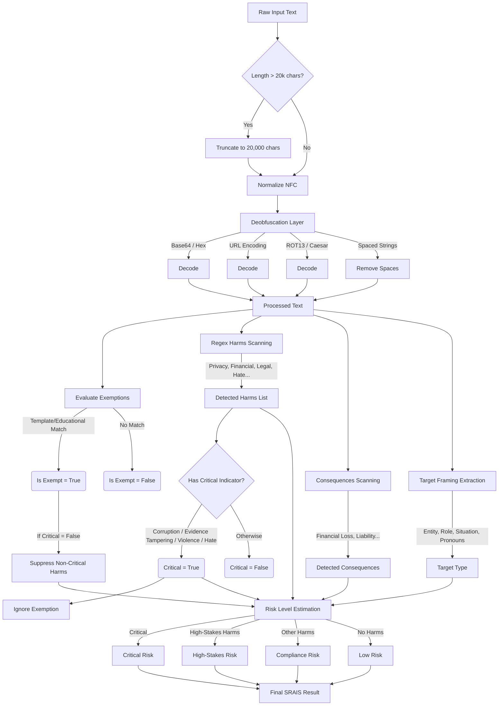

# Heuristic Harm Analysis (SRAIS) Engineering Note

**Document Version:** 1.0.0
**Scope:** Engineering review of the Self-harm, Risk, and Intent Scanner (SRAIS) heuristic harm analysis.

---

## 1. Overview

The **SRAIS Harm Scanner Service** is a heuristic-based harm and risk detection engine implemented in `sraisScanner.ts`. It is designed to act as an initial, fast-pass filter to evaluate user queries for potential risks, particularly in legal and business contexts. The engine operates entirely locally, avoiding the overhead, latency, and privacy concerns associated with calling external LLM-based moderation APIs.

SRAIS uses a multi-layered approach consisting of:
1. **Deobfuscation & Preprocessing**
2. **Exemption Anchoring**
3. **Regular Expression (Regex) Matching**
4. **Context & Target Framing**
5. **Risk Level Estimation**

It offers multilingual support (English, French, and Spanish) using Unicode-aware regular expressions.

---

## 2. Architecture and Flow

The following Mermaid diagram illustrates the execution flow of the heuristic harm analysis pipeline for a given text input.

---

## 3. Component Details

### 3.1 Preprocessing and Deobfuscation
To prevent malicious users from easily bypassing the heuristic scanner using simple encoding techniques, the system performs several normalization and deobfuscation steps:
- **Unicode Normalization:** Converts to Canonical Composition (`NFC`).
- **Base64 & Hex Decoding:** Detects blocks of 16+ base64 or hex characters and decodes them, appending any readable text to the end of the payload.
- **URL Decoding:** Decodes heavily percent-encoded text (`%20`, etc.).
- **ROT13/Caesar Cipher Detection:** Applies a ROT13 shift to attempt to extract hidden meaning.
- **Spaced String Recombination:** Converts obfuscations like `b y p a s s` back into `bypass`.

*Note: The deobfuscation outputs are appended to the main string so the original text remains intact for evaluation.*

### 3.2 Multilingual Regex Matching
The core of the scanner relies on predefined dictionaries of risky terms spanning English, French, and Spanish.
Instead of standard word boundaries (`\b`), which fail on accented or non-ASCII characters, it uses a custom `createUnicodeBoundaryRegex` function. This leverages Unicode property lookarounds (`(?<!\p{L})` and `(?!\p{L})`) to accurately match words like `fraude`, `scandale`, and `cacher`.

### 3.3 The Exemption Mechanism
Recognizing that legal apps are frequently asked to draft hypothetical or template documents, the scanner employs an **Exemption Anchor** (`EXEMPT_TEMPLATE_REGEX`). 
If the user asks to "draft a generic template agreement" or "write a hypothetical statement", the scanner suppresses non-critical harms (like `Financial` or `Privacy`).

However, **Critical Indicators** (e.g., violence, hate speech, bribery, or instructions to destroy evidence) explicitly override this exemption. Asking the system to "write a standard template to bribe a foreign official" will still trigger a Critical risk level.

### 3.4 Risk Levels
Harms are mapped to one of four risk levels, which determine the severity of the localized warning presented to the user:
- **Critical:** Involves extreme security/safety concerns (violence, hate, evidence tampering, bribery).
- **High-Stakes:** Involves corporate/legal decisions with major impact (active litigation, breach of contract, defamation).
- **Compliance:** Moderate risks involving regulatory guidelines, data privacy, or audits.
- **Low:** No harmful patterns detected.

---

## 4. Reliability Evaluation

### Strengths
1. **Speed and Efficiency:** Regex scanning and lightweight deobfuscation execute in milliseconds, allowing synchronous pre-flight checks before expensive LLM inference.
2. **Local and Private:** Does not transmit the prompt to a third-party moderation endpoint, preserving data sovereignty.
3. **Multilingual:** Handles English, French, and Spanish natively, avoiding the "English-only bias" common in early heuristic systems.
4. **Defense-in-Depth:** Features like ROT13 decoding, spaced-string recombination, and Unicode boundaries make simple bypasses difficult.

### Limitations and Vulnerabilities
1. **Semantic Blindness:** Regex patterns cannot understand context. "How do I deal with bankruptcy?" and "Help me commit bankruptcy fraud" might trigger the same rule.
2. **Hardcoded Limits:** The engine truncates inputs to 20,000 characters to prevent ReDoS (Regular Expression Denial of Service). A sophisticated attacker could pad their malicious prompt with 20,000 characters of benign text, causing the scanner to silently ignore the true payload.
3. **Rigid Deobfuscation:** The deobfuscation is deterministic and basic. It checks for exact ROT13 (but not ROT12 or ROT14).
4. **Brittle Exemptions:** The `EXEMPT_TEMPLATE_REGEX` requires exact phrasing (`draft`, `create`, `standard`, `template`). A user employing a slightly different synonym (e.g., "Assemble a boilerplate contract") might experience false-positive harm flags.
5. **False Negatives:** Bad actors using euphemisms, slang, or novel languages not represented in the `HARM_MAP` will easily bypass the system. 

### Conclusion
The SRAIS heuristic analysis is highly reliable as a **first layer of defense** meant to catch low-effort misuse and categorize typical corporate queries. It is computationally cheap and protects privacy. However, it is **unreliable against sophisticated adversarial attacks** (prompt injection or obfuscation) and should always be paired with post-generation LLM guardrails or a secondary semantic analysis pass if high-assurance safety is required.
