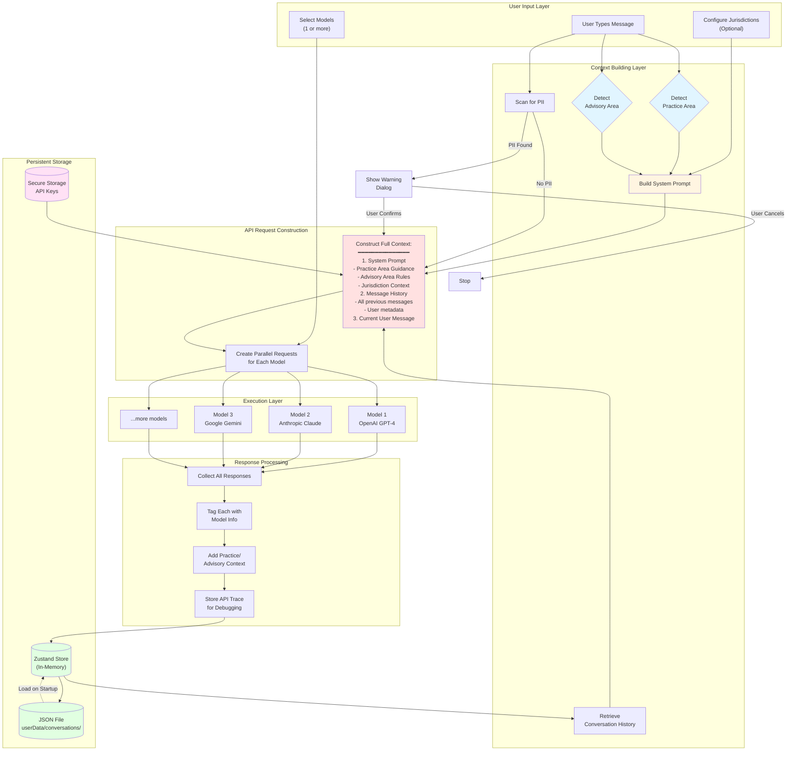
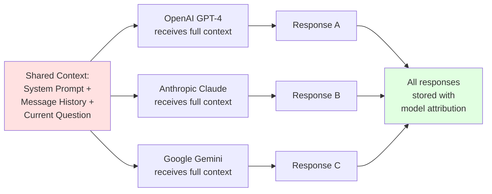
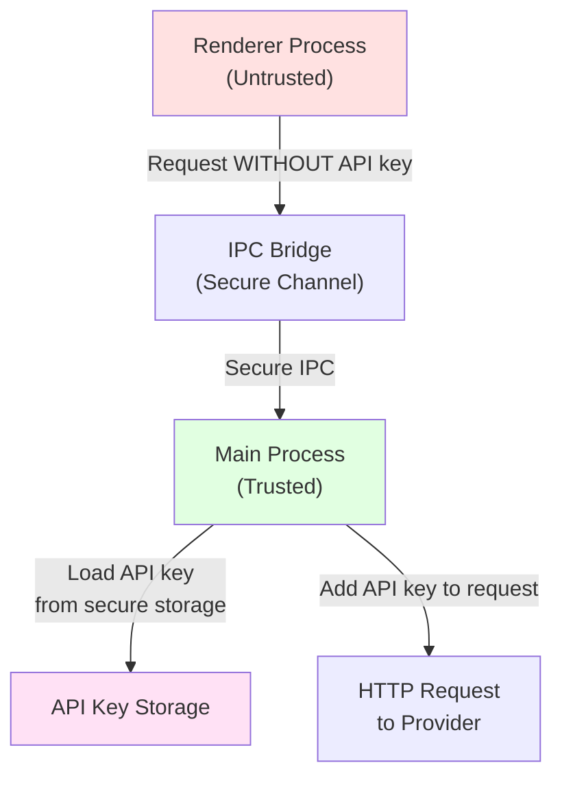

# Context Management Architecture

This diagram illustrates how conversation context is built, stored, and used throughout a thread's lifecycle.



## Context Lifecycle Details

### 1. **Initial Context Creation**

When a user starts typing:

- **Practice Area Detection**: Analyzes input for legal domain (Criminal, Contract, Family, etc.)
- **Advisory Area Detection**: Identifies business context (Risk, Compliance, HR, etc.)
- **System Prompt Construction**: Combines practice + advisory + jurisdiction guidance

### 2. **Context Accumulation**

Each message exchange adds to context:

```javascript
messages: [
  { role: "user", content: "Q1", practiceArea: "Contract Law" },
  {
    role: "assistant",
    content: "A1",
    modelInfo: { provider: "openai", model: "gpt-4" },
  },
  { role: "user", content: "Q2", practiceArea: "Contract Law" },
  {
    role: "assistant",
    content: "A2",
    modelInfo: { provider: "anthropic", model: "claude-3-opus" },
  },
  // ... continues growing
];
```

### 3. **Context Transmission**

Every API request includes:

- **System Prompt** (static for conversation)
- **Full Message History** (dynamic, grows with each exchange)
- **Provider Configuration** (model, temperature, maxTokens)
- **Security Context** (API key from secure storage)

### 4. **Context Persistence**

After each successful exchange:

- **In-Memory**: Zustand store immediately updated
- **File System**: JSON written to `userData/conversations/{conversationId}.json`
- **Structure Preserved**: All metadata (practice area, model info, timestamps) saved

### 5. **Context Restoration**

On app restart:

- JSON files loaded from disk
- Full conversation state restored
- User can continue from last message with full context

## Multi-Model Context Sharing

When multiple models are selected, **the same context is sent to all models**:



Each model:

- Receives **identical** conversation history
- Gets **same** system prompt with legal/advisory guidance
- Processes independently and returns unique response
- Response tagged with `modelInfo` for attribution

## Security Context Isolation



**Key Security Feature**: API keys never exposed to renderer process. Context building happens in renderer, but actual API calls execute in main process with keys injected securely.
