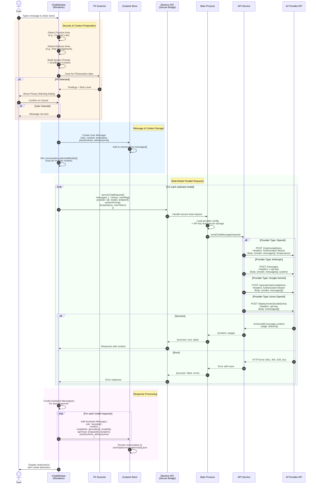

# User Prompt Flow - Sequence Diagram

This diagram shows how a user prompt flows through Atticus to API provider(s), including context management and multi-model support.



## Key Context Flow Points

1. **Message History**: Every API request includes the **full conversation history** (`messages[]` array)
2. **System Prompt**: Built dynamically from:
   - Practice area system prompt (e.g., "Contract Law")
   - Advisory area guidance (e.g., "Risk Management")
   - Jurisdiction-specific legal context (e.g., "Ontario, Canada")
3. **Model Information**: Each assistant message stores which model generated it
4. **Parallel Execution**: Multiple models receive the same context simultaneously
5. **Persistence**: All context saved to JSON after each exchange

## Context Structure

```json
{
  "messages": [
    { "role": "user", "content": "...", "practiceArea": "Contract Law" },
    {
      "role": "assistant",
      "content": "...",
      "modelInfo": { "providerId": "openai", "modelId": "gpt-4" }
    }
  ],
  "selectedModels": [
    { "providerId": "openai", "modelId": "gpt-4" },
    { "providerId": "anthropic", "modelId": "claude-3-opus" }
  ],
  "selectedJurisdictions": ["ON-CA", "CA"],
  "practiceArea": "Contract Law"
}
```
