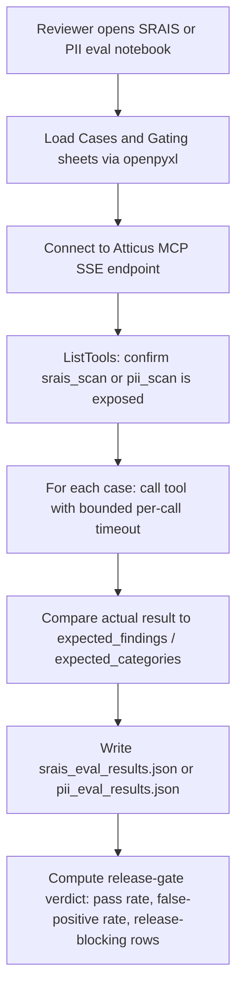

# PRD: Atticus MCP Evaluation Notebooks (SRAIS/Harms & PII)

## 1. Summary

The `evals()/` directory contains two Jupyter notebooks — [SRAIS-MCP-Evaluations.ipynb](evals()/SRAIS-MCP-Evaluations.ipynb) and [PII-MCP-Evaluations.ipynb](evals()/PII-MCP-Evaluations.ipynb) — that connect to the running Atticus MCP server (`http://localhost:3133/sse`, started via `Atticus --mcp`) and exercise the `srais_scan` and `pii_scan` tools with a small, hardcoded set of test cases. This PRD defines the requirements for these notebooks as a repeatable **quality/regression evaluation harness** for Atticus's two core content-safety scanners: SRAIS (legal/regulatory/financial-misconduct harm detection) and PII (personally identifiable information detection).

This revision hardens the harness by moving **eval prompts/test cases and gating parameters (pass-rate thresholds, timeouts, release-blocking rules) out of hardcoded Python literals in the notebooks and into version-controlled Excel workbooks** (`evals()/data/srais_eval_cases.xlsx`, `evals()/data/pii_eval_cases.xlsx`). This lets non-engineering reviewers (compliance/legal, per §5) author and adjust test cases and gating thresholds without editing notebook code, while keeping the loader strict enough that malformed or tampered spreadsheets fail loudly rather than silently degrading eval coverage.

## 2. Problem Statement

`srais_scan` and `pii_scan` are risk-critical tools — they gate whether potentially harmful or sensitive content is flagged before being sent to an AI provider or saved to disk (see [src/services/sraisScanner.ts](src/services/sraisScanner.ts), [src/services/piiScanner.ts](src/services/piiScanner.ts)). Today there is no automated, repeatable way to verify:
- Detection accuracy (true positive / true negative rate) as scanner logic evolves.
- Regression safety when patterns, thresholds, or categories are added/changed.
- Parity between what the notebooks assert and what the audit/UI layers consume (`hasFindings`, `detectedCategories`, `detectedPatterns`/`findings`).

The current notebooks are a manual proof-of-concept: 4 test cases per scanner, run ad hoc, with no CI hook, no historical trend tracking, and (per the last recorded run) a **known blocking bug** in the `pii_scan` path.

Additionally, today's test cases and pass/fail thresholds are inline Python literals inside the notebook cells (`eval_inputs = [...]`, an implicit 100%-per-case pass criterion with no configurable tolerance). This has two consequences: (1) only engineers comfortable editing notebook code can add cases or adjust gating, excluding the compliance/legal reviewers this harness is meant to serve independently (§5), and (2) there is no single source of truth for "what pass rate blocks a release" — it's implicit in ad hoc `print()` statements rather than an explicit, reviewable configuration.

## 3. Goals

1. Provide a deterministic, repeatable eval harness for `srais_scan` and `pii_scan` runnable against a locally started Atticus MCP server.
2. Cover representative true-positive, true-negative, and adversarial/obfuscated cases for both scanners.
3. Produce machine-readable, comparable results (`srais_eval_results.json`, `pii_eval_results.json`) suitable for pass/fail gating and trend tracking across runs.
4. Surface scanner regressions (false negatives on known-bad content, false positives on known-good content) before release.
5. Keep the harness self-contained (no dependency on production test suite) so it can be run by non-engineering reviewers (compliance/legal) against a built Atticus instance.
6. Externalize eval prompts/test cases and gating parameters into structured, version-controlled Excel workbooks so non-engineers can safely author/adjust them under normal code-review controls, without touching notebook code.
7. Make gating (pass/fail, release-blocking) an explicit, auditable configuration rather than implicit logic embedded in print statements.

## 4. Non-Goals

- Replacing the existing Vitest unit tests for `sraisScanner.ts` / `piiScanner.ts` ([src/test/piiScanner.test.ts](src/test/piiScanner.test.ts)) — those remain the source of truth for logic-level unit coverage.
- Load/performance testing of the MCP server.
- Evaluating any tool other than `srais_scan` and `pii_scan`.
- Automated fixing of scanner detection logic (this PRD is about the eval harness, not the scanners themselves).
- Building a general-purpose no-code test-authoring UI — Excel plus the notebook loader (§7) is the intended editing surface, not a custom web app.
- Storing real client/user data in the eval workbooks — all rows must be synthetic (§9).

## 5. Users / Stakeholders

- **Engineers** modifying `sraisScanner.ts` / `piiScanner.ts` who need fast feedback on detection changes.
- **Compliance/Legal reviewers** (per [SRAI.md](SRAI.md), [ETHICAL-AI.md](ETHICAL-AI.md), [PRIVACY.md](PRIVACY.md)) who need to independently validate harm/PII detection claims without reading source code.
- **Release owners** who need a go/no-go signal before shipping a build that changes scanning behavior.

## 6. Architecture (Current)



| Aspect | SRAIS notebook | PII notebook |
|---|---|---|
| Test cases | 4 (`T001`–`T004`) | 4 (`PII-001`–`PII-004`) |
| Categories covered | Clear, obfuscated/HIL-bypass, financial misconduct, severe/critical harm | Clear, SSN+phone, email+credit card, IP+API key |
| Pass criterion | `hasFindings` boolean match only | `hasFindings` match **and** `detectedCategories` superset match |
| Last recorded result | 4/4 pass (`srais_eval_results.json`) | **0/4 — all failed** with `McpError -32602 invalid_union` (`pii_eval_results.json`) |
| Timeouts | 5s connect, 10s per-tool-call, 60s whole-suite | same |
| Output | Overwrites `srais_eval_results.json` each run | Overwrites `pii_eval_results.json` each run |

**Known bug:** every `pii_scan` call in the last run failed MCP result-schema validation (the Python `mcp` client rejects the tool's `content` payload — none of the `text`/`image`/`audio` union variants match). This blocks the PII eval from producing any usable signal today and must be fixed as part of this workstream (client/server MCP SDK version mismatch, or a malformed `content` item shape returned by `case 'pii_scan'` in [src/electron/mcpServer.ts](src/electron/mcpServer.ts)).

## 7. Excel-Driven Eval Data & Gating Architecture

To satisfy Goals #6/#7, test cases and gating parameters move from inline Python literals to two version-controlled workbooks read at notebook startup. This section is the contract both notebooks and any future CI runner must implement against.

### 7.1 File layout

```
evals()/
  data/
    srais_eval_cases.xlsx     # SRAIS/Harms test cases + gating config
    pii_eval_cases.xlsx       # PII test cases + gating config
```

Each workbook contains two sheets:

- **`Cases`** — one row per test case (replaces the current `eval_inputs` Python list).
- **`Gating`** — key/value gating parameters (replaces implicit thresholds currently only expressed as `print()` statements).

### 7.2 `Cases` sheet schema

| Column | Type | Required | Notes |
|---|---|---|---|
| `id` | string | yes | Unique per workbook (e.g., `T001`, `PII-001`); loader must reject duplicates. |
| `category` | string | yes | Human-readable grouping (e.g., "Obfuscated / HIL Bypass"). |
| `language` | string | yes | ISO 639-1 code (e.g., `en`, `es`); default `en` if blank. Required to satisfy FR-10's non-English coverage requirement and make coverage auditable. |
| `text` | string | yes | The prompt/document text to scan. |
| `expected_findings` | boolean (`TRUE`/`FALSE`) | yes | Maps to `expected_findings` in the current harness. |
| `expected_categories` | string | PII only | Comma-separated `PIIType` values (e.g., `usSsn,phoneNumber`); blank for SRAIS or when `expected_findings` is `FALSE`. |
| `is_negative_control` | boolean | yes | `TRUE` marks a false-positive-resistance case (FR-11/FR-16); used for separate FP-rate reporting (§11). |
| `release_blocking` | boolean | yes | `TRUE` means a failure on this row blocks release regardless of aggregate pass rate (e.g., known-severe-harm or SSN cases); `FALSE` rows only count toward the aggregate threshold. |
| `notes` | string | no | Reviewer rationale, free text. |
| `added_by` / `added_date` | string / date | no | Provenance for audit trail; not used by the loader logic. |

### 7.3 `Gating` sheet schema

| Parameter | Type | Example | Meaning |
|---|---|---|---|
| `MIN_PASS_RATE_PCT` | number | `95` | Minimum aggregate pass rate (non-`release_blocking` rows) to consider the suite passing. |
| `MAX_FALSE_POSITIVE_RATE_PCT` | number | `0` | Maximum allowed failure rate among `is_negative_control=TRUE` rows. |
| `CONNECT_TIMEOUT_SECONDS` | number | `5` | Maps to existing SSE connect timeout. |
| `PER_CALL_TIMEOUT_SECONDS` | number | `10` | Maps to existing per-tool-call timeout. |
| `SUITE_TIMEOUT_SECONDS` | number | `60` | Maps to existing whole-suite timeout. |
| `DATASET_VERSION` | string | `2026.08.1` | Freeform version tag written into the result JSON (§7.4) so a run is traceable to the workbook revision that produced it. |

### 7.4 Loader & result-format requirements

- The notebook must read both sheets via `pandas.read_excel(path, sheet_name=..., engine="openpyxl")` (see §9 SEC-1 for why `openpyxl` specifically) at the start of the run, replacing the current inline `eval_inputs` cell.
- All gating thresholds/timeouts currently hardcoded in Python (5s/10s/60s, implicit 100%-pass expectation) must be sourced exclusively from the `Gating` sheet — no duplicate hardcoded fallback values inside the notebook.
- `srais_eval_results.json` / `pii_eval_results.json` must include a top-level `datasetVersion` (from `DATASET_VERSION`) and `gating` object (the resolved thresholds used for that run) alongside the existing per-case array, so a result file is self-describing without needing the workbook to interpret it.
- The notebook must compute and print a **release-gate verdict** (`PASS`/`FAIL`) derived from `MIN_PASS_RATE_PCT`, `MAX_FALSE_POSITIVE_RATE_PCT`, and any failed `release_blocking=TRUE` row, in addition to the existing per-case pass/fail summary.

## 8. Functional Requirements

### 8.1 Shared harness behavior (both notebooks)
- FR-1: Connect to the Atticus MCP SSE endpoint with a bounded connect timeout (sourced from `Gating.CONNECT_TIMEOUT_SECONDS`); fail fast with an actionable error message (server not running / port blocked / server frozen) rather than hanging.
- FR-2: Enumerate available tools and confirm the target tool (`srais_scan` or `pii_scan`) is exposed before running the suite.
- FR-3: Execute each test case with a bounded per-call timeout (sourced from `Gating.PER_CALL_TIMEOUT_SECONDS`); a single hung/failed case must not abort the remaining cases (collect-and-continue, not fail-fast).
- FR-4: Apply a bounded whole-suite timeout (sourced from `Gating.SUITE_TIMEOUT_SECONDS`) as a safety net.
- FR-5: Persist results to a JSON file per run (`srais_eval_results.json` / `pii_eval_results.json`) with per-case `id`, `category`, `passed`, `error`, `data`, plus the run-level `datasetVersion` and resolved `gating` object (§7.4).
- FR-6: Print a human-readable summary (per-case pass/fail, aggregate score `%`, false-positive rate on negative-control rows, and the overall release-gate verdict) to notebook output.
- FR-7: Every test case must declare an explicit expected outcome via the `Cases` sheet (no case may rely on manual eyeballing to determine pass/fail).
- FR-7a: The loader must validate the `Cases`/`Gating` sheets against the schemas in §7.2/§7.3 before running any test — reject (raise, don't silently skip) missing required columns, duplicate `id` values, non-boolean values in boolean columns, or a `Gating` sheet missing any required parameter.

### 8.2 SRAIS/Harms-specific
- FR-8: `srais_eval_cases.xlsx` must include, at minimum: benign/clear text, obfuscated bypass attempts (e.g., character-spacing tricks), financial-misconduct/compliance risk, and severe/critical harm categories (matches existing `T001`–`T004`).
- FR-9: Pass criterion compares `hasFindings` against `expected_findings`; when `detectedPatterns` is present, log pattern name + confidence for reviewer inspection (informational, not currently a hard-fail dimension).
- FR-10: Expand `srais_eval_cases.xlsx` to cover all harm categories the scanner supports (see `detectedHarms` taxonomy in `sraisScanner.ts`) and add non-English rows (`language` \u2260 `en`) — the tool is documented as "multilingual" and coverage must be verifiable directly from the `language` column.
- FR-11: Add negative-control adversarial rows (`is_negative_control=TRUE`; content that *looks* risky but should not trigger, e.g. discussing SRAIS policy itself) to measure false-positive rate, not just false-negative rate.

### 8.3 PII-specific
- FR-12: Fix the MCP result-schema validation failure blocking all `pii_scan` eval calls before this harness can be considered functional.
- FR-13: `pii_eval_cases.xlsx` must include, at minimum: benign text, SSN + phone, email + credit card, IP address + API key/token (matches existing `PII-001`–`PII-004`).
- FR-14: Pass criterion requires both `hasFindings` match and that `detectedCategories` is a superset of the row's parsed `expected_categories` (already implemented — retain).
- FR-15: Expand category coverage in `pii_eval_cases.xlsx` to all `PIIType` values supported by `piiScanner.ts` (current dataset only exercises 6 of the supported categories) and add international ID formats already supported by the scanner (per `piiScanner.test.ts` references to CA/MX formats).
- FR-16: Add boundary/near-miss rows (`is_negative_control=TRUE`; e.g., 9-digit numbers that are not SSNs, malformed emails) to validate false-positive resistance.

## 9. Security Requirements

Moving eval data/gating into spreadsheets edited by non-engineers introduces new integrity and supply-chain considerations that must be addressed rather than assumed away:

- SEC-1 (Safe parsing library): Read workbooks with `pandas.read_excel(..., engine="openpyxl")` (or `openpyxl` directly). Do not use the legacy `xlrd` engine for `.xlsx` (it no longer supports the format and predates hardening work) — mirrors the app's own precedent of preferring `exceljs` over the vulnerable `xlsx`/SheetJS package for Excel handling ([src/electron/converters.ts](src/electron/converters.ts)).
- SEC-2 (Formula/content-injection defense): Treat any cell value beginning with `=`, `+`, `-`, or `@` as literal text, not a formula — load with `data_only=True`/read computed values only, never execute or re-evaluate formulas, and never re-open the workbook in a way that could trigger macro execution (workbooks must not contain macros; reject `.xlsm` files outright, only accept `.xlsx`).
- SEC-3 (Schema validation before use): Enforce §7.2/§7.3 schemas (FR-7a) before any row is used to drive a network call — this is a data-integrity gate, not just a usability nicety, since a malformed `expected_categories` value could silently produce a false "PASS".
- SEC-4 (Synthetic data only): All `text` values, especially in `pii_eval_cases.xlsx`, must be synthetic (fabricated SSNs/emails/cards, e.g. `123-45-6789`, `4111 1111 1111 1111` test-range cards) — never real user or client data, since these workbooks are committed to source control and may be shared with reviewers outside the engineering team.
- SEC-5 (Change control on gating): Changes to the `Gating` sheet (especially threshold loosening, e.g. lowering `MIN_PASS_RATE_PCT` or raising `MAX_FALSE_POSITIVE_RATE_PCT`) must go through the same code-review process as source changes — a spreadsheet edit that silently weakens the release gate is equivalent in risk to weakening a test assertion in code.
- SEC-6 (Reviewability despite binary format): Since `.xlsx` is a binary/zip format that doesn't diff cleanly in `git`, either (a) keep each workbook minimal enough that reviewers open it directly to verify changes, or (b) generate and commit a companion flattened `.csv` export of the `Cases`/`Gating` sheets on save, so pull-request diffs remain human-readable. Pick one approach and document it in `evals()/README.md`.
- SEC-7 (Least-privilege file access): The notebook must open workbooks read-only; it must never write back to `srais_eval_cases.xlsx`/`pii_eval_cases.xlsx` (only to the JSON result files), so a buggy run can't corrupt the source-of-truth test data.

## 10. Non-Functional Requirements

- Must run against a locally running Atticus instance only (`--mcp` flag); no network calls to external services.
- Must not require modifying production source to run (read-only against the running app).
- Execution time for the full pair of suites should stay well under the existing 60s per-suite timeout for routine local runs.
- Notebooks must degrade gracefully (clear, actionable stderr messages) when the server is not running, unreachable, or times out — this already exists and must be preserved.
- Adds `pandas` and `openpyxl` as required Python dependencies for both notebooks (document in `evals()/README.md` alongside the existing `mcp` package requirement).
- Workbook load time must not materially affect the existing per-suite timeout budget — parsing `Cases`/`Gating` sheets should complete in well under a second for realistic dataset sizes (tens to low hundreds of rows).

## 11. Success Metrics

- 100% of test cases execute without harness-level errors (connection/timeout/schema errors) on a healthy Atticus build — i.e., failures reflect scanner behavior, not harness defects.
- SRAIS suite: ≥95% pass rate on true-positive cases, 0 false positives on the negative-control set — enforced automatically via `Gating.MIN_PASS_RATE_PCT`/`MAX_FALSE_POSITIVE_RATE_PCT`, not eyeballed.
- PII suite: 100% pass rate on documented category test cases (PII false negatives are treated as release blockers given data-protection stakes per [PRIVACY.md](PRIVACY.md)) — every PII true-positive row must be marked `release_blocking=TRUE`.
- Both result JSON files are diff-able across runs so a regression (previously-passing case now failing) is detectable without manual comparison, and each result file is traceable to the exact workbook `DATASET_VERSION` that produced it.
- 100% of malformed-workbook conditions (missing column, bad boolean, duplicate `id`, missing gating parameter) are caught by the loader with an actionable error before any MCP call is attempted — zero silent fallback to stale/default thresholds.

## 12. Risks / Open Questions

- **Blocking bug (FR-12)**: root cause of the `pii_scan` MCP schema mismatch is unconfirmed (client/server SDK version drift vs. malformed content payload) and needs investigation before dataset expansion is worthwhile.
- Small sample size (4 cases/scanner) means current pass rates are not statistically meaningful; expansion (FR-10, FR-15) is required before using this harness as a release gate.
- No CI integration exists — suites currently require a human to start Atticus with `--mcp` and manually open/run the notebook. Decide whether this stays a manual pre-release checklist item or gets automated (e.g., headless `nbclient` run in a pipeline step).
- Result files are overwritten each run with no timestamped history — trend/regression tracking across releases is not currently possible.
- SEC-6's diffability tradeoff needs a decision before the workbooks are adopted as the source of truth — an un-diffable binary gating file is itself a governance risk.
- Non-engineer authors may not naturally follow the boolean/comma-separated-list conventions in `expected_categories`/boolean columns; consider a data-validation dropdown/template workbook to reduce malformed submissions, though the loader (FR-7a) remains the authoritative enforcement point regardless.

## 13. Acceptance Criteria

- [ ] `pii_scan` eval notebook runs all cases with `error: null` on a healthy build (bug fixed).
- [ ] Both datasets migrated to `evals()/data/srais_eval_cases.xlsx` and `evals()/data/pii_eval_cases.xlsx` per §7.1/§7.2, with no remaining inline Python `eval_inputs` literal in either notebook.
- [ ] Gating thresholds (`MIN_PASS_RATE_PCT`, `MAX_FALSE_POSITIVE_RATE_PCT`, all timeouts) are sourced exclusively from the `Gating` sheet, with no hardcoded duplicate values in notebook code.
- [ ] Both datasets expanded per FR-10/FR-11 (SRAIS) and FR-15/FR-16 (PII).
- [ ] Loader rejects malformed workbooks (missing columns, duplicate IDs, bad booleans, incomplete `Gating` sheet) with an actionable error (FR-7a), covered by at least one deliberately-malformed test fixture.
- [ ] Result JSON files include `datasetVersion` and the resolved `gating` object, and a `PASS`/`FAIL` release-gate verdict is printed and included in the output.
- [ ] Both notebooks documented in [docs/MCP.md](docs/MCP.md) or a dedicated `evals()/README.md` describing how to run them (prereqs: start Atticus with `--mcp`, install `mcp`/`pandas`/`openpyxl` Python packages) and how to edit the Excel workbooks safely (§9 SEC-1..SEC-7).

## Related Documentation
- [evals()/SRAIS-MCP-Evaluations.ipynb](../evals()/SRAIS-MCP-Evaluations.ipynb) / [evals()/PII-MCP-Evaluations.ipynb](../evals()/PII-MCP-Evaluations.ipynb) — the notebooks this PRD governs
- [src/services/sraisScanner.ts](../src/services/sraisScanner.ts) / [src/services/piiScanner.ts](../src/services/piiScanner.ts) — scanners under evaluation
- [src/electron/mcpServer.ts](../src/electron/mcpServer.ts) — hosts `srais_scan`/`pii_scan`
- [evals()/PRD-MCP.md](../evals()/PRD-MCP.md) — transport/security contract this harness depends on
- [PRD-SRAIS.md](./PRD-SRAIS.md) / [PRD-PII.md](./PRD-PII.md) — product requirements for the scanners this harness gates
- [ ] Result JSON schema stable enough to diff run-over-run for regression detection.
