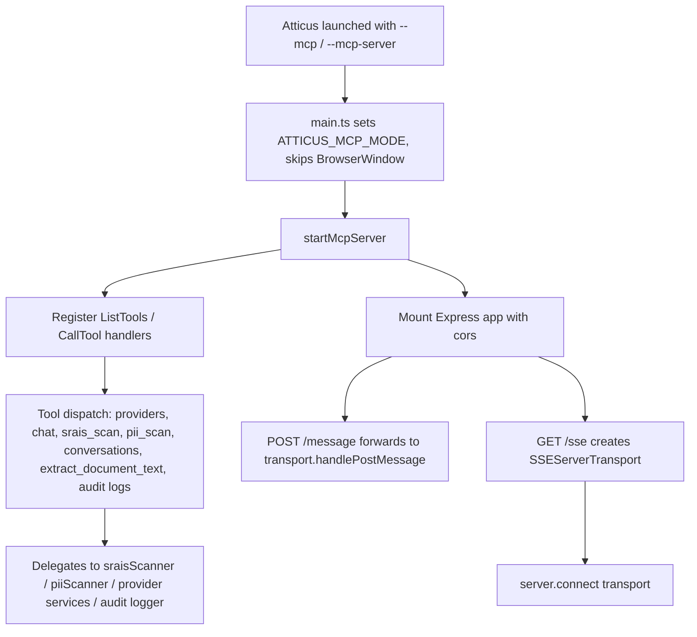

# PRD: Atticus Model Context Protocol (MCP) Interface

## 1. Summary

Atticus can run in a headless mode (`--mcp` / `--mcp-server` flag) that starts an Express + SSE server ([src/electron/mcpServer.ts](src/electron/mcpServer.ts)) exposing 9 tools over the Model Context Protocol on `http://localhost:3133/sse`. This lets external AI agents (Claude Desktop, Cursor, custom MCP clients) drive Atticus's provider management, chat completion, content-safety scanning (SRAIS/PII), conversation storage, document extraction, and audit-log retrieval capabilities without the Electron GUI.

This PRD covers the MCP interface as a **dual-purpose product surface**:
1. A **regression/eval harness backend** — the stable, low-level contract that `evals()/SRAIS-MCP-Evaluations.ipynb` and `evals()/PII-MCP-Evaluations.ipynb` depend on (see [evals()/PRD-Evals().md](evals()/PRD-Evals().md)).
2. A **first-class capability platform for advanced Atticus users** — solo practitioners and power users who want to script, automate, and extend their Atticus workflow (bulk conversation search/tagging, exports, batch scanning, streaming chat) from Claude Desktop, Cursor, or custom tooling, not just Atticus's own GUI.

Both uses share the same server, so this PRD defines the full contract, its security bar, and the capability gaps that block advanced-user adoption today.

## 2. Problem Statement

The MCP interface currently works functionally (per [docs/MCP.md](docs/MCP.md), [scripts/test-mcp.ts](scripts/test-mcp.ts), [src/test/mcpServer.test.ts](src/test/mcpServer.test.ts)) but has two distinct gaps:

**Security gaps** (blocking any trustworthy multi-purpose use):
- No authentication or authorization on any tool — any process that can reach the port can call `send_chat_message` (spending the user's configured API credits), read arbitrary local files via `extract_document_text`, or read/write conversation data.
- The HTTP listener binds without an explicit host, so it is not provably loopback-only.
- Documentation asserts audit logging coverage ("All actions executed via MCP tools are recorded in the Atticus Audit logger") that is not implemented for tool calls in `mcpServer.ts` today — only `get_audit_logs` *reads* existing logs; no handler writes an audit entry when a tool is invoked.
- The SSE transport is stored in a single module-level variable, which is unsafe for more than one concurrent client connection.

**Capability gaps** (blocking advanced-user adoption beyond eval scripts):
- MCP only declares the `tools` capability — Atticus's rich conversation model (tags, practice areas, advisory areas — see [src/types/tags.ts](src/types/tags.ts), [src/types/index.ts](src/types/index.ts)) has no MCP-exposed way to search, filter, or organize by any of it.
- `list_conversations` / `get_audit_logs` have no pagination, date-range, or query filtering — only a flat list or a `limit`.
- No tool exists to update conversation metadata (tags, practice/advisory area), delete a conversation, or export one (Atticus already has PDF export logic in [src/utils/pdfExport.ts](src/utils/pdfExport.ts) that MCP does not surface).
- No batch/bulk scanning tool — `srais_scan`/`pii_scan` take one string at a time, so scanning a whole conversation or document set requires N round-trips from the calling agent.
- `send_chat_message` is request/response only; there is no streamed/incremental token delivery for agents that want to render partial completions.
- MCP mode is CLI-flag-only (`--mcp`/`--mcp-server`) with no GUI affordance to enable it, see its status, see the assigned port, or view/rotate an auth token — a real barrier for non-technical advanced users.

This PRD defines what "done" looks like for the MCP interface as a hardened, capability-complete, documented product feature rather than a functional prototype scoped only to internal eval scripts.

## 3. Goals

1. Define the complete, accurate contract (tools, parameters, return shapes) for the MCP surface.
2. Close the gap between documented security guarantees and actual behavior (audit logging, key exposure).
3. Establish a minimum security bar appropriate for a local-loopback tool server that touches API keys, local files, and legal/compliance data.
4. Ensure the interface behaves correctly under realistic usage: multiple concurrent MCP clients, malformed input, and long-running or hung external agents.
5. Keep the existing smoke test (`test-mcp.ts`) and unit tests (`mcpServer.test.ts`) as living, expanding specifications of this contract.
6. Extend the tool surface so advanced users can drive the same conversation-management, tagging, export, and batch-scanning workflows available in the GUI, from any MCP client.
7. Make MCP mode discoverable and configurable without editing CLI flags or environment variables (in-app toggle, status, port, and auth token management).
8. Adopt the broader MCP spec where it fits (resources/prompts, not just tools) so Atticus data and workflows are addressable in the idiomatic way MCP clients expect.

## 4. Non-Goals

- Redesigning the SRAIS/PII scanner detection logic itself (see the separate eval-harness PRD in [evals()/PRD-Evals().md](evals()/PRD-Evals().md)).
- Supporting `stdio` transport (explicitly out of scope per existing docs — Windows Electron GUI constraints require SSE).
- Multi-tenant/remote-network deployment (this is a single-user, single-machine local tool by design) — advanced-user capabilities below are additive to the local single-user model, not a pivot to a hosted service.
- Full parity with every GUI feature on day one — new tools are prioritized by advanced-user value (see §7.2) and can ship incrementally behind the same versioned contract (FR-1).

## 5. Users / Stakeholders

- **External AI agents / MCP clients** (Claude Desktop, Cursor, `@modelcontextprotocol/inspector`, custom scripts) consuming Atticus as a tool provider.
- **Advanced/power Atticus users** — solo practitioners or teams who want to script bulk conversation triage, tagging, export, or scanning from outside the GUI (e.g., "scan and tag every conversation from this week that has PII findings").
- **Atticus end users** who opt into headless MCP mode and implicitly trust that it doesn't widen their local attack surface or leak API spend/data to unintended callers.
- **QA/release owners** relying on `scripts/test-mcp.ts` and the `evals()/` notebooks as pre-release smoke/regression tests.

## 6. Architecture (Current)

- `main.ts` detects `--mcp`/`--mcp-server` on launch, sets `ATTICUS_MCP_MODE=true` (redirects logger output to stderr so stdout stays clean for JSON-RPC framing per [src/services/debugLogger.ts](src/services/debugLogger.ts)), skips creating the BrowserWindow, and calls `startMcpServer()`.
- `startMcpServer()` builds an `@modelcontextprotocol/sdk` `Server`, registers `ListToolsRequestSchema` and `CallToolRequestSchema` handlers, then mounts an Express app with `cors()` enabled and two routes:
  - `GET /sse` — creates a new `SSEServerTransport` and calls `server.connect(transport)`.
  - `POST /message` — forwards to `transport.handlePostMessage`.
- The port defaults to `3133`, overridable via `ATTICUS_MCP_PORT`; `expressApp.listen(PORT, ...)` is called with no explicit host argument.
- The `transport` reference is a single `let` variable at module scope, reassigned on every new `GET /sse` connection.

## 7. Tool Inventory & Capability Expansion

### 7.1 Current Tool Inventory (contract to maintain)

| # | Tool | Params | Returns | Notes |
|---|---|---|---|---|
| 1 | `list_providers` | none | Provider list, API keys stripped | Reads `getUserConfigPath()` |
| 2 | `send_chat_message` | `providerId`, `messages[]`, `systemPrompt?`, `temperature?`, `maxTokens?` | Formatted completion | Uses stored key via `loadProviderWithApiKey`; caller never sees the key |
| 3 | `srais_scan` | `text` | `{ hasFindings, findings[] }` (harm/target/consequences/riskLevel) | Delegates to `sraisScanner.scan` |
| 4 | `pii_scan` | `text` | `{ hasFindings, detectedCategories[] }` (camelCase category names remapped from internal enum) | Delegates to `piiScanner.scan`; has its own try/catch returning error payload instead of throwing |
| 5 | `list_conversations` | none | `[{id, title, messageCount, updatedAt}]` | Reads `userData/conversations/*.json`; no pagination or filtering |
| 6 | `load_conversation` | `id` | Full conversation JSON | File path built from raw `id` |
| 7 | `save_conversation` | `conversation` (object with `id`, `messages`) | `{success, path}` | File path built from raw `conversation.id`; creates dir if missing |
| 8 | `extract_document_text` | `filePath` (absolute) | Extracted text | No path allow-list; reads any file the OS user can read |
| 9 | `get_audit_logs` | `limit?` (default 100) | Recent audit entries, newest first | Only tool that touches the audit logger; no date-range or event-type filter |

### 7.2 Proposed Advanced-User Tool Additions

These extend the surface so power users can script the same conversation-management, tagging, export, and scanning workflows the GUI already supports (per [src/types/index.ts](src/types/index.ts), [src/types/tags.ts](src/types/tags.ts), [src/utils/pdfExport.ts](src/utils/pdfExport.ts)), without inventing features that don't exist in the app today. Each should ship behind the same security bar as §9 (SEC-1..SEC-6 apply equally to new tools).

| Tool | Params | Returns | Rationale |
|---|---|---|---|
| `search_conversations` | `query?`, `tags?[]`, `practiceArea?`, `advisoryArea?`, `dateFrom?`, `dateTo?`, `limit?`, `offset?` | Paginated conversation summaries matching filters | `list_conversations` has no filtering today; power users need to find "last week's contracts tagged client-acme" without downloading every conversation. |
| `update_conversation_metadata` | `id`, `tags?[]`, `practiceArea?`, `advisoryArea?`, `title?` | Updated conversation summary | Lets an agent tag/organize conversations in bulk (e.g., after a batch PII scan) instead of only being able to overwrite a whole conversation via `save_conversation`. |
| `delete_conversation` | `id`, `confirm: true` | `{success}` | Explicit destructive-action tool; requires an explicit `confirm` flag (not implicit) per operational-safety norms for irreversible actions. |
| `export_conversation` | `id`, `format: 'pdf'` | `{success, path}` | Surfaces existing `exportConversationToPDF` ([src/utils/pdfExport.ts](src/utils/pdfExport.ts)) so agents can generate client-ready deliverables directly. |
| `list_tags` | none | Tag list with usage counts | Read-only view into the existing tag store ([src/types/tags.ts](src/types/tags.ts)) so agents can discover valid tag values before calling `update_conversation_metadata`/`search_conversations`. |
| `srais_scan_batch` / `pii_scan_batch` | `texts: string[]` (or `conversationId`) | Array of per-item scan results | Avoids N round-trips when an agent needs to scan every message in a conversation or a batch of documents; reuses the existing single-item scanners internally. |
| `scan_document` | `filePath`, `scanTypes?: ('srais'\|'pii')[]` | Extracted text summary + scan results | Composes `extract_document_text` + `srais_scan`/`pii_scan` into one call, the common advanced-user workflow of "is this file safe to send." |
| `list_provider_models` | `providerId` | Model list for that provider | `list_providers` exposes configured providers but not per-provider available models, which callers need to pick a `send_chat_message` target intelligently. |

Streaming is addressed separately in §7.3, not as a discrete tool.

### 7.3 Capability Surface Expansion (Resources & Prompts)

The server currently only declares `capabilities: { tools: {} }`. To behave idiomatically for MCP clients and better serve advanced users, evaluate adding:

- **Resources**: expose read-only, addressable resources (e.g., `conversation://{id}`, `audit-log://recent`) so clients can list/read Atticus data the way MCP resource browsers expect, instead of only via ad hoc tool calls. This is additive and lower-risk than new tools since resources are inherently read-oriented.
- **Prompts**: if/when Atticus grows a reusable prompt-template feature (none exists in the codebase today), expose it as MCP prompts so clients can list and invoke named templates directly — tracked as a future dependency, not started until the underlying feature exists.
- **Streaming completions**: extend `send_chat_message` (or add a distinct `send_chat_message_stream` tool, since MCP tool results are not inherently streamable the way SSE model responses are) to deliver incremental tokens via MCP notifications, matching the token-by-token experience the in-app chat window already provides.

## 8. Functional Requirements

- FR-1: `ListTools` response must remain in sync across three sources of truth that currently duplicate the schema — `mcpServer.ts` (runtime), `public/config/tools.json` (published spec), and [docs/MCP.md](docs/MCP.md) (human docs). Add a check (test or script) that fails when these drift. This applies to every tool added under §7.2 as well.
- FR-2: Every tool handler must return a well-formed MCP `content` array on both success and failure; failures must set `isError: true` rather than throwing raw errors past the SDK boundary (already true for the generic `catch` at the bottom of the dispatcher; `pii_scan` currently duplicates this with its own inner try/catch — consolidate to one pattern).
- FR-3: `srais_scan` / `pii_scan` output shapes must stay stable (`hasFindings`, `findings`/`detectedCategories`) since they are consumed both by the eval notebooks in `evals()/` and by internal UI code (`usePiiDecisionHandlers.ts`, `useSendHandler.ts`); `srais_scan_batch`/`pii_scan_batch` must reuse these exact per-item shapes inside their array response so eval/UI consumers can be trivially adapted.
- FR-4: `save_conversation` and `load_conversation` must validate/sanitize the `id`/`conversation.id` value (reject path separators, `..`, null bytes) before constructing a filesystem path, to prevent path traversal outside `userData/conversations`. `update_conversation_metadata`, `delete_conversation`, and `export_conversation` must apply the same ID validation.
- FR-5: `extract_document_text` (and the new `scan_document`) must validate `filePath` against an intended scope (e.g., reject traversal, symlink escapes, or restrict to explicitly user-selected files) rather than accepting any absolute path unconditionally.
- FR-6: The SSE transport must support multiple concurrent client sessions without cross-talk — replace the single module-level `transport` variable with a session-keyed map (e.g., keyed by the SSE session ID the SDK already generates) so a second client connecting doesn't hijack routing for the first.
- FR-7: Every tool invocation (not just `get_audit_logs` reads) must write an audit log entry (tool name, arguments summary, timestamp, success/error) so the documented claim in `docs/MCP.md` ("All actions executed via MCP tools are recorded") becomes true, or the docs must be corrected to describe actual coverage. Destructive tools (`delete_conversation`) must log at a distinct severity from read tools.
- FR-8: `search_conversations` and `get_audit_logs` must support consistent pagination (`limit`/`offset` or cursor) so advanced users can page through large result sets without loading everything into one response.
- FR-9: `delete_conversation` must require an explicit `confirm: true` argument and must not support wildcard/bulk deletion in a single call, to bound the blast radius of a single misfired agent action.
- FR-10: New tools in §7.2 must ship with the same test coverage bar as existing tools (unit test in `mcpServer.test.ts`, smoke-test case in `test-mcp.ts`) before being considered complete — no tool ships contract-only.

## 9. Security Requirements

- SEC-1 (Access control — currently missing): Require a shared-secret/token check (e.g., a bearer token generated on first `--mcp` launch and required on every request) before dispatching any tool call. Today any local process — or any browser tab, given permissive CORS — can call every tool.
- SEC-2 (Network exposure): Explicitly bind the Express listener to `127.0.0.1` (loopback) instead of the current no-host default, so the server is not reachable from other devices on the LAN.
- SEC-3 (CORS): Replace the default `cors()` (reflects any origin) with an explicit, narrow policy, or drop CORS entirely if only non-browser MCP clients are a supported use case — this closes the "malicious webpage calls `localhost:3133`" (DNS-rebinding/CSRF-style) attack class.
- SEC-4 (Path safety): Implement FR-4/FR-5 above; treat all client-supplied path/ID fields as untrusted input at this boundary (OWASP A01 — Broken Access Control / Path Traversal).
- SEC-5 (Credential exposure): `send_chat_message` must continue to never return raw API keys in responses or logs (already true) and should additionally rate-limit or make spend visible, since an unauthenticated caller (absent SEC-1) can otherwise consume the user's paid API quota silently.
- SEC-6 (Audit truthfulness): Implement FR-7 or correct the documentation; a compliance-relevant product (per [SRAI.md](SRAI.md)/[PRIVACY.md](PRIVACY.md)) cannot ship a documented guarantee that isn't enforced in code.

## 10. Configurability & Discoverability Requirements

Advanced users today must know to pass `--mcp`/`--mcp-server` on the command line and read `ATTICUS_MCP_PORT` env var conventions — there is no in-app affordance. This is a real adoption barrier for non-technical power users (e.g., solo practitioners) who are otherwise a target audience for this feature.

- CFG-1: Add a Settings toggle to enable/disable MCP mode without relaunching from the CLI (may still require an app restart to take effect, but must not require editing shortcuts/scripts).
- CFG-2: Surface the active port, connection URL, and running/stopped status in the GUI when MCP mode is enabled, so users can copy the exact value into their MCP client config.
- CFG-3: Once SEC-1 (auth token) ships, display/regenerate the token from the same Settings surface — never require the user to read it from a log file or generate one manually.
- CFG-4: Document the advanced-user workflow (not just the eval-harness workflow) in `docs/MCP.md`: example client configs for common tasks (search + tag conversations, batch-scan a folder, export a matter to PDF), not only the existing Claude Desktop bridging example.

## 11. Non-Functional Requirements

- Startup must keep stdout clean of non-JSON-RPC output while in MCP mode (already implemented via `ATTICUS_MCP_MODE` redirecting the logger to stderr) — preserve this invariant in any future logging changes.
- Tool handlers should remain fast/non-blocking for scan tools (`srais_scan`, `pii_scan` are local pattern-matching, no network I/O) and bounded for I/O tools (`extract_document_text`, conversation read/write).
- The interface must degrade gracefully when the Atticus app/provider config is missing (`list_providers` already returns an empty-config message rather than throwing).
- `search_conversations`/`get_audit_logs` pagination (FR-8) must keep response payload sizes bounded even against large conversation histories, so MCP responses don't exceed typical client message-size limits.
- Batch tools (`srais_scan_batch`/`pii_scan_batch`) must apply a bounded per-item and whole-batch timeout, mirroring the timeout discipline already used by the `evals()/` notebooks against single-item calls.

## 12. Testing / QA Requirements

- Maintain and extend [scripts/test-mcp.ts](scripts/test-mcp.ts) (builds the app, spawns `--mcp`, connects an SDK `Client`, exercises all 9 tools) as the canonical end-to-end smoke test; add cases for the new security requirements (e.g., assert traversal `id`/`filePath` values are rejected, assert a second concurrent SSE client can operate independently once FR-6 lands).
- Maintain [src/test/mcpServer.test.ts](src/test/mcpServer.test.ts) as the unit-level contract test for handler registration and tool listing; expand it to cover error paths (malformed args, missing provider, nonexistent conversation ID) for each handler.
- Keep the `evals()/` notebooks as the domain-specific accuracy harness for `srais_scan`/`pii_scan` outputs (tracked separately) — MCP-level tests here should only assert the *transport contract* (shape, error handling), not scanner accuracy.
- Add smoke-test coverage in `test-mcp.ts` for each §7.2 tool as it ships (`search_conversations` filters, `delete_conversation` requiring `confirm`, `export_conversation` producing a real PDF, batch scan tools matching single-item results).
- Add a manual/scripted verification pass for CFG-1..CFG-4 (Settings toggle, displayed port/status/token) as part of release QA, since these are GUI-facing and not covered by the headless smoke test.

## 13. Risks / Open Questions

- Adding auth (SEC-1) changes the integration story for Claude Desktop/Cursor bridging described in `docs/MCP.md`; needs a UX decision (token displayed in-app? config file? env var?) before implementation.
- FR-6 (session-keyed transport) requires confirming how the MCP SDK's `SSEServerTransport` exposes a session identifier usable as a map key.
- Tightening `extract_document_text` (SEC-4/FR-5) may break legitimate current usage if callers rely on scanning arbitrary paths outside a "known documents" set — needs a decision on the intended trust boundary (any local file the OS user can read vs. an explicit allow-list/picker-selected set).
- §7.2's `search_conversations` filter fields (tags/practiceArea/advisoryArea) depend on the existing tag/practice-area data model ([src/types/tags.ts](src/types/tags.ts)) staying stable; coordinate with any in-flight tagging feature work.
- Streaming (§7.3) may require a different MCP result pattern (server-initiated notifications) than the current simple request/response tool calls — needs an SDK capability check before committing to a design.
- Resources/Prompts (§7.3) are additive capability declarations; confirm current MCP clients in scope (Claude Desktop, Cursor) actually support them before investing implementation effort.

## 14. Acceptance Criteria

- [ ] Unauthenticated requests to `/sse` or `/message` are rejected once SEC-1 ships (with a documented opt-in/config path for legitimate clients).
- [ ] Server listener is bound to loopback only (SEC-2), verified by a test attempting a non-loopback bind check or connection from a non-local interface.
- [ ] `save_conversation` / `load_conversation` reject IDs containing path-traversal sequences (FR-4), covered by a unit test.
- [ ] `extract_document_text` enforces a defined path-safety policy (FR-5), covered by a unit test.
- [ ] Two concurrent SSE clients can each list/call tools independently without one overwriting the other's transport (FR-6).
- [ ] Every successful and failed tool call produces a corresponding audit log entry retrievable via `get_audit_logs` (FR-7/SEC-6), or `docs/MCP.md` is corrected to state actual coverage.
- [ ] `public/config/tools.json`, `docs/MCP.md`, and the runtime `ListTools` response agree on every tool's name, params, and description (FR-1).
- [ ] `search_conversations`, `update_conversation_metadata`, `delete_conversation`, `export_conversation`, `list_tags`, `srais_scan_batch`, `pii_scan_batch`, and `scan_document` are implemented, documented, and tested per FR-10 (§7.2).
- [ ] MCP mode can be enabled/disabled and its connection details (port, status, token) viewed from Settings without touching the CLI (CFG-1/CFG-2/CFG-3).

## Related Documentation
- [src/electron/mcpServer.ts](../src/electron/mcpServer.ts) — server implementation
- [scripts/test-mcp.ts](../scripts/test-mcp.ts) — end-to-end smoke test
- [src/test/mcpServer.test.ts](../src/test/mcpServer.test.ts) — unit-level contract tests
- [docs/MCP.md](../docs/MCP.md) — human-facing tool documentation
- [public/config/tools.json](../public/config/tools.json) — published tool spec (must stay in sync per FR-1)
- [evals()/PRD-Evals().md](../evals()/PRD-Evals().md) — eval harness relying on `srais_scan`/`pii_scan` over this transport
- [PRD-SRAIS.md](./PRD-SRAIS.md) / [PRD-PII.md](./PRD-PII.md) — the scanners exposed via `srais_scan`/`pii_scan`
