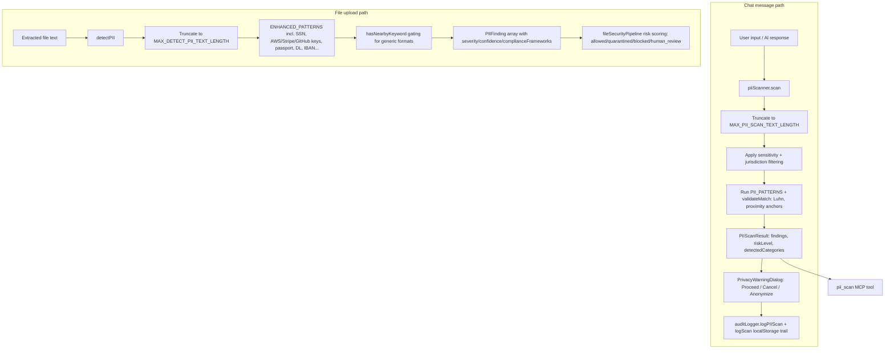

# PRD: PII Detection & Privacy Protection Feature

## 1. Summary

Atticus's PII (Personally Identifiable Information) feature is a **mandatory, always-on, locally-executed** privacy gate that scans text for sensitive data before it can leave the device — either sent to an AI provider (chat messages) or processed further (uploaded documents). It is implemented as **two independent scanners** covering two distinct surfaces:

1. **`piiScanner.ts`** ([src/services/piiScanner.ts](../src/services/piiScanner.ts)) — scans chat message text (both user input and AI responses) in the send flow ([useSendHandler.ts](../src/components/hooks/useSendHandler.ts), [useSendMessage.ts](../src/components/hooks/useSendMessage.ts)), PDF export ([pdfExport.ts](../src/utils/pdfExport.ts)), and the MCP `pii_scan` tool ([mcpServer.ts](../src/electron/mcpServer.ts)). Detects 30 `PIIType` categories, jurisdiction-aware (US/CA/MX/EU/UK), with a redaction/anonymize capability and a persistent local audit log.
2. **`piiDetector.ts`** ("Enhanced PII Detector," [src/services/security/piiDetector.ts](../src/services/security/piiDetector.ts)) — scans **uploaded file content** as Phase 3A of the file upload security pipeline ([fileSecurityPipeline.ts](../src/services/fileSecurityPipeline.ts)), producing confidence-scored, compliance-framework-tagged findings alongside adversarial-pattern/steganography/obfuscation detection for the same file.

The scanner is legally load-bearing: PII scanning **cannot be disabled** by the user, and every scan plus the user's resulting decision (proceed/cancel/anonymize) is logged locally to protect both the user's client-confidentiality obligations and Atticus from liability (see [PRIVACY.md](../PRIVACY.md), [HIL.md](../HIL.md)).

## 2. Problem Statement

Legal and business professionals routinely paste client-identifying information (SSNs, financial account numbers, medical record numbers, addresses, credentials) into AI chat prompts or upload documents containing it, often without realizing the content will be transmitted to a third-party AI provider subject to that provider's own data-retention policy. Separately, uploaded documents may contain not just PII but embedded credentials (API keys, private keys) that pose a distinct security risk if processed or echoed back by an LLM.

Prior to hardening, the file-upload scanner (`piiDetector.ts`) had a significant detection gap: it declared support for SSN, AWS keys, Stripe keys, US passports, driver's licenses (4 states), and Bitcoin addresses in its pattern table, but the scanning function never actually invoked most of them — meaning uploaded documents containing SSNs (despite this being explicitly advertised in [src/services/security/README.md](../src/services/security/README.md)) passed through completely undetected. This PRD defines the corrected, complete contract both scanners must satisfy.

## 3. Goals

1. Detect the full advertised set of PII categories reliably on both the chat-message and file-upload surfaces, with jurisdiction awareness where applicable.
2. Guarantee PII scanning cannot be bypassed or disabled — it is a mandatory legal-protection control, not a user preference.
3. Minimize false positives on overly generic formats (bare 8/9/40-character sequences) via contextual/proximity anchoring, without silently missing real matches.
4. Give users actionable choices (Proceed / Cancel / Anonymize) rather than a hard block, consistent with Atticus's Human-in-the-Loop model.
5. Maintain a complete, tamper-evident local audit trail of every scan and every user decision, for legal-protection purposes.
6. Keep both scanners' output contracts stable for all consumers (UI dialogs, MCP `pii_scan`, file security pipeline, eval harness).
7. Bound worst-case scan cost against pathologically large input (defensive length caps).

## 4. Non-Goals

- Merging `piiScanner.ts` and `piiDetector.ts` into a single implementation. They serve different surfaces (interactive chat vs. batch file analysis with confidence scoring and compliance-framework tagging) and this PRD documents them as two contracts that must be **kept in parity for detection coverage**, not unified into one module.
- Machine-learning-based entity recognition (e.g., NER models) — detection is intentionally regex/pattern-based for full local execution with no model dependency, consistent with Atticus's privacy-by-design architecture.
- Automatic redaction/blocking without user consent for the chat-message path — `piiScanner.ts` always defers to an explicit user decision (Proceed/Cancel/Anonymize); only the file-upload pipeline ([fileSecurityPipeline.ts](../src/services/fileSecurityPipeline.ts)) may auto-`block`/`quarantine` based on overall risk score, which is a separate, file-specific policy layer outside this PRD's scope.
- Redesigning the MCP transport/security model around `pii_scan` (covered in [PRD-MCP.md](../evals()/PRD-MCP.md)).

## 5. Users / Stakeholders

- **Atticus end users**, whose every outbound message and every uploaded document is scanned, and who make the final proceed/anonymize/cancel decision.
- **Compliance/legal reviewers** relying on the local audit log (`PrivacyAuditLogViewer.tsx`) as evidence that users were warned before transmitting sensitive data.
- **External MCP clients** calling `pii_scan` directly.
- **Engineers** maintaining pattern coverage and jurisdiction accuracy as new PII formats or compliance requirements emerge.

## 6. Architecture (Current)

### 6.1 `piiScanner.ts` (chat-message scanner)
- `PIIType` enum (30 members) spans Identity (SSN/SIN/CURP/RFC/PASSPORT/DRIVERS_LICENSE/NATIONAL_ID/NIE/DNI), Financial (CREDIT_CARD/BANK_ACCOUNT/ROUTING_NUMBER/TRANSIT_NUMBER/IBAN/SWIFT_BIC/CLABE), Contact (EMAIL/PHONE), Healthcare (MEDICAL_RECORD/HEALTH_CARD), Authentication (PASSWORD_PATTERN/API_KEY), Legal (CASE_NUMBER), Geographic (IP_ADDRESS), Business (TAX_ID/VAT_NUMBER), Names (FULL_NAME), Addresses (STREET_ADDRESS/POSTAL_CODE).
- `RiskLevel` enum: `CRITICAL` (SSN, credit cards, passwords), `HIGH` (email, phone, most financial IDs), `MODERATE` (addresses, case numbers), `LOW`.
- `PII_PATTERNS`: module-level array of `{ type, pattern, riskLevel, description, recommendation, redactor, jurisdictions }`; each pattern declares which jurisdictions it applies to (`US`/`CA`/`MX`/`EU`/`UK`).
- `PIIScanner` class: `sensitivityLevel` (`strict`/`moderate`/`relaxed`, persisted to `localStorage`, **only gates which risk tiers are scanned, never a global on/off switch**); `scan(text, jurisdictions?)` truncates to `MAX_PII_SCAN_TEXT_LENGTH` (200,000 chars), filters patterns by sensitivity/jurisdiction, runs `processPattern` per pattern, computes overall `riskLevel` and a human-readable `summary`.
- `validateMatch`: extra validation beyond the raw regex — Luhn checksum + ±15-character proximity keyword anchor (`card`/`visa`/`amex`/etc.) for `CREDIT_CARD`; digit-exclusion checks (`000000000`, `123456789`) for `SSN`; example-domain exclusion for `EMAIL`; generic-name exclusion for `FULL_NAME`.
- `anonymize(text, result)`: replaces each finding's span with its redacted form (e.g., `123-45-6789` → `XXX-XX-6789`) to produce a safe-to-send version of the text, used by the "Anonymize" dialog option.
- Audit/logging methods: `logScan`, `getScanLogs`, `exportLogs`, `clearLogs`, `getTotalScanCount` — persisted per-conversation to `localStorage` under `piiScanLogs_{conversationId}`.

### 6.2 `piiDetector.ts` (file-upload scanner)
- `ENHANCED_PATTERNS`: SSN, medical record numbers, Rx/prescription numbers, JWT tokens, AWS access/secret keys, GitHub tokens, Stripe keys, PEM private keys, Bitcoin addresses, IBAN, per-state US driver's licenses (CA/NY/TX/FL), US passport, full names, email, North American phone, DOB, street address, ZIP/postal codes, generic credentials.
- `hasNearbyKeyword(text, index, matchLength, keywordRegex, window=40)`: proximity-gates overly generic formats (bare 40-char AWS-secret-shaped strings, bare 9-digit passport-shaped numbers, bare 7-8 char driver's-license-shaped strings) against a corroborating keyword nearby, to avoid false-positive floods on ordinary text.
- `isValidSsn`: excludes `000000000`/`123456789` sequences, mirroring `piiScanner.ts`'s SSN validation (kept as two independent implementations by design — see §4).
- `detectPII(text, metadata)`: async, truncates to `MAX_DETECT_PII_TEXT_LENGTH` (500,000 chars), returns `PIIFinding[]` with `severity` (`critical`/`high`/`medium`/`low`), `confidence` (0-100), redacted `content`, `location` (indices/line number/context snippet), and `complianceFrameworks` (GDPR/CCPA/HIPAA/PCI-DSS tags per finding type).
- Consumed exclusively by `analyzeFile()`'s Phase 3A ([fileSecurityPipeline.ts](../src/services/fileSecurityPipeline.ts)), which combines PII findings with adversarial/steganography/obfuscation/AI-evasion findings into an overall `riskScore` and `action` (`allowed`/`quarantined`/`blocked`/`human_review`).
- `PIIType` is re-exported as a **value** (`export { PIIType }`), not type-only, since it is a real runtime enum and `fileSecurityPipeline.ts` imports it through this module.

## 7. PII Category & Risk Taxonomy

`piiScanner.ts`'s `RiskLevel` stratifies its 30 `PIIType` members; `piiDetector.ts` maps its own findings to an equivalent `severity` scale plus per-finding `complianceFrameworks` tags:

| `RiskLevel` (`piiScanner.ts`) | Scope | Example `PIIType` members | Equivalent `piiDetector.ts` `severity` |
|---|---|---|---|
| `CRITICAL` | Must warn | SSN, SIN, CURP, RFC, NATIONAL_ID, CREDIT_CARD (6 network patterns), PASSWORD_PATTERN, API_KEY | `critical` |
| `HIGH` | Should warn | IBAN, CLABE, HEALTH_CARD, VAT_NUMBER, PASSPORT, EMAIL, PHONE, BANK_ACCOUNT, ROUTING_NUMBER, TRANSIT_NUMBER, SWIFT_BIC, MEDICAL_RECORD | `high` |
| `MODERATE` | May warn | DRIVERS_LICENSE, TAX_ID, CASE_NUMBER, STREET_ADDRESS (3 formats), POSTAL_CODE, IP_ADDRESS, FULL_NAME | `medium` |
| `LOW` | Informational only | Reserved tier; no `PII_PATTERNS` entries currently assigned | `low` |

`piiDetector.ts`-only categories (JWT tokens, AWS/GitHub/Stripe keys, PEM private keys, Bitcoin addresses) are tagged `severity: 'critical'` and carry `complianceFrameworks` such as `GDPR`, `CCPA`, `HIPAA`, and `PCI-DSS` per finding type, since file-upload findings feed directly into `fileSecurityPipeline.ts`'s compliance-violation reporting.

## 8. UX / HIL Gating Flow

Per [HIL.md §2.1](../HIL.md), the PII gate runs **first**, before SRAIS, in the message send flow:
- `piiScanner.scan()` runs on every submitted message (mandatory — no setting disables it).
- If `hasFindings`, the send is halted and `PrivacyWarningDialog` ([src/components/PrivacyWarningDialog.tsx](../src/components/PrivacyWarningDialog.tsx)) is shown, listing findings grouped by risk tier (Critical/High/Moderate) with redacted previews.
- The user chooses exactly one of:
  - **Cancel** — halt, return to editor.
  - **Anonymize** — locally replace each detected span with its redacted form (`piiScanner.anonymize`), then re-populate the input for the user to review/send.
  - **Proceed anyway** — send the original text as-is (an explicit, logged override).
- Every scan and the resulting decision is written to the audit log (`auditLogger.logPIIScan`, `AuditEventType.PII_USER_ANONYMIZED`/etc.) and to the per-conversation `piiScanLogs_*` local log, viewable via `PrivacyAuditLogViewer.tsx`.
- Only after the PII gate clears (no findings, or user proceeded/anonymized) does the SRAIS harm gate run (see [PRD-SRAIS.md](./PRD-SRAIS.md)).

## 9. Functional Requirements

- FR-1: PII scanning must run on every chat message send and every AI response with no user-facing way to disable it (`sensitivityLevel` only adjusts which risk tiers are included, never turns scanning off).
- FR-2: `piiScanner.scan()` and `detectPII()` must each apply a defensive text-length cap (`MAX_PII_SCAN_TEXT_LENGTH` = 200,000; `MAX_DETECT_PII_TEXT_LENGTH` = 500,000) before pattern matching, to bound worst-case regex cost.
- FR-3: Both scanners must independently validate `SSN`-shaped matches against invalid sequences (`000000000`, `123456789`) rather than trusting the raw regex shape alone.
- FR-4: `CREDIT_CARD` matches must pass a Luhn checksum **and** a nearby-keyword proximity check before being reported, to avoid flagging arbitrary numeric sequences.
- FR-5: Overly generic `piiDetector.ts` formats (bare AWS-secret-shaped 40-char strings, bare 9-digit passport numbers, bare state-specific driver's-license-shaped strings) must require a corroborating nearby keyword (`hasNearbyKeyword`) before being reported.
- FR-6: `piiDetector.ts` must detect the full pattern set it declares in `ENHANCED_PATTERNS` — no pattern may be declared but silently unused by `detectPII()`. Any newly added pattern must be wired into the detection function in the same change.
- FR-7: `PIIType` must remain re-exported as a runtime value (not type-only) from any intermediate module (`piiDetector.ts`, `fileSecurityPipeline.ts`), since it is a real enum consumers may use at runtime (`PIIType.SSN`), not just as a type annotation.
- FR-8: `anonymize()` must produce output with every finding span replaced by its type-specific redaction format, safe to re-send without exposing the original sensitive value.
- FR-9: Every scan with findings must be logged (audit logger + local per-conversation log) together with the user's eventual decision (`proceed`/`cancel`/`anonymize`), for legal-protection traceability.
- FR-10: `PIIScanResult`/`PIIFinding` output shapes must remain stable across UI dialogs, MCP `pii_scan`, and the file security pipeline; the MCP tool's camelCase category remapping (e.g. `SSN` → `usSsn`) must stay consistent with the documented contract in [evals()/PRD-Evals().md](../evals()/PRD-Evals().md).

## 10. Security Requirements

- SEC-1: PII scanning must execute entirely locally — no scanned text or findings are ever transmitted externally as part of the scan itself.
- SEC-2: The scanner must be non-optional / cannot be disabled via any exposed setting, since it is a legal-protection control, not a convenience feature.
- SEC-3: Detected values must always be stored/displayed in redacted form (`value`/`content` fields); `piiDetector.ts`'s `originalContent` field (full unredacted match, used only for internal analysis) must never be logged or surfaced to the UI/audit trail.
- SEC-4: Length caps (FR-2) must be enforced before any regex pass, not just before the first pattern, to prevent a large payload from causing disproportionate work partway through the pattern list.
- SEC-5: The MCP `pii_scan` tool must validate/cap its `text` input the same way (see `mcpServer.ts`'s `validateScanText`) before delegating to `piiScanner.scan`.

## 11. Non-Functional Requirements

- NFR-1: `piiScanner.scan()` must run synchronously in the message-send critical path with no perceptible delay for typical message lengths.
- NFR-2: `detectPII()` is async but must complete within `analyzeFile()`'s overall budget; large files rely on the length cap (FR-2), not unbounded processing time.
- NFR-3: Local `localStorage`-based audit logs (`piiScanLogs_*`) must not grow unbounded without a documented retention/expiry path — `clearLogs()` exists but is not currently invoked automatically (tracked in §13).
- NFR-4: Must function fully offline; no network dependency for detection or logging.

## 12. Testing / QA Requirements

- Unit tests: [src/test/piiScanner.test.ts](../src/test/piiScanner.test.ts) (chat-message scanner: pattern coverage, Luhn validation, anonymization, jurisdiction filtering) and [src/test/piiDetector.test.ts](../src/test/piiDetector.test.ts) (file-upload scanner: SSN validation, AWS/Stripe/passport/driver's-license context-gating, length-cap truncation).
- Accuracy/regression harness: `evals()/PII-MCP-Evaluations.ipynb` against the `pii_scan` MCP tool, gated per [PRD-Evals().md](../evals()/PRD-Evals().md) (category coverage tracked as FR-15/FR-16 there).
- Any new `ENHANCED_PATTERNS`/`PII_PATTERNS` entry must ship with a corresponding unit test asserting both true-positive detection and, where the format is generic, a false-positive-avoidance case (bare value without context keyword).

## 13. Risks / Open Questions

- `piiScanner.ts` and `piiDetector.ts` are maintained as two independent implementations with overlapping but not identical coverage (e.g., `piiDetector.ts` has Bitcoin/JWT/GitHub-token/private-key detection that `piiScanner.ts` does not; `piiScanner.ts` has broader jurisdiction coverage — CA/MX/EU national IDs — that `piiDetector.ts` does not). Any future consolidation must preserve the union of both pattern sets, not regress either surface.
- `piiDetector.ts` has no `strict`/`moderate`/`relaxed` sensitivity concept — it always runs its full pattern set (mitigated by per-pattern proximity gating instead).
- Detection is pattern-based; PII expressed without a recognizable format (e.g., a name mentioned in free-flowing prose, an address described conversationally) may be missed on the `piiDetector.ts` `fullName`/`streetAddress` patterns, which require a fairly rigid shape.
- Batch scanning (`pii_scan_batch` over MCP) is proposed but not implemented — see [PRD-MCP.md §7.2](../evals()/PRD-MCP.md).
- Open question: should `piiScanLogs_*` entries (NFR-3) gain an automatic retention/expiry policy, and if so, what default window is appropriate for legal-protection purposes?

## 14. Acceptance Criteria

- [ ] `piiDetector.ts` detects every pattern declared in `ENHANCED_PATTERNS` — no orphaned patterns — verified by a test per pattern.
- [ ] SSN detection on both scanners rejects `000000000`/`123456789`.
- [ ] `CREDIT_CARD` matches require both Luhn validity and a nearby-keyword proximity anchor.
- [ ] `PIIType` is confirmed usable as a runtime value through every re-export path (`piiDetector.ts`, `fileSecurityPipeline.ts`).
- [ ] Length caps (`MAX_PII_SCAN_TEXT_LENGTH`, `MAX_DETECT_PII_TEXT_LENGTH`) are covered by dedicated truncation tests.
- [ ] `pii_scan` MCP category remap matches the documented camelCase contract in [PRD-Evals().md](../evals()/PRD-Evals().md).
- [ ] `anonymize()` output never re-exposes the original sensitive value for any finding type.

## Related Documentation
- [src/services/piiScanner.ts](../src/services/piiScanner.ts) — chat-message scanner implementation
- [src/services/security/piiDetector.ts](../src/services/security/piiDetector.ts) — file-upload scanner implementation
- [src/services/fileSecurityPipeline.ts](../src/services/fileSecurityPipeline.ts) — file upload pipeline consuming `piiDetector.ts`
- [src/components/PrivacyWarningDialog.tsx](../src/components/PrivacyWarningDialog.tsx) — UI gate
- [HIL.md](../HIL.md) — Human-in-the-Loop gating flow
- [PRIVACY.md](../PRIVACY.md) — mandatory-scanner privacy commitments
- [evals()/PRD-Evals().md](../evals()/PRD-Evals().md) — eval harness contract for `pii_scan`
- [evals()/PRD-MCP.md](../evals()/PRD-MCP.md) — MCP transport/security surrounding `pii_scan`
- [PRD-SRAIS.md](./PRD-SRAIS.md) — the harm-detection gate that runs immediately after this one
