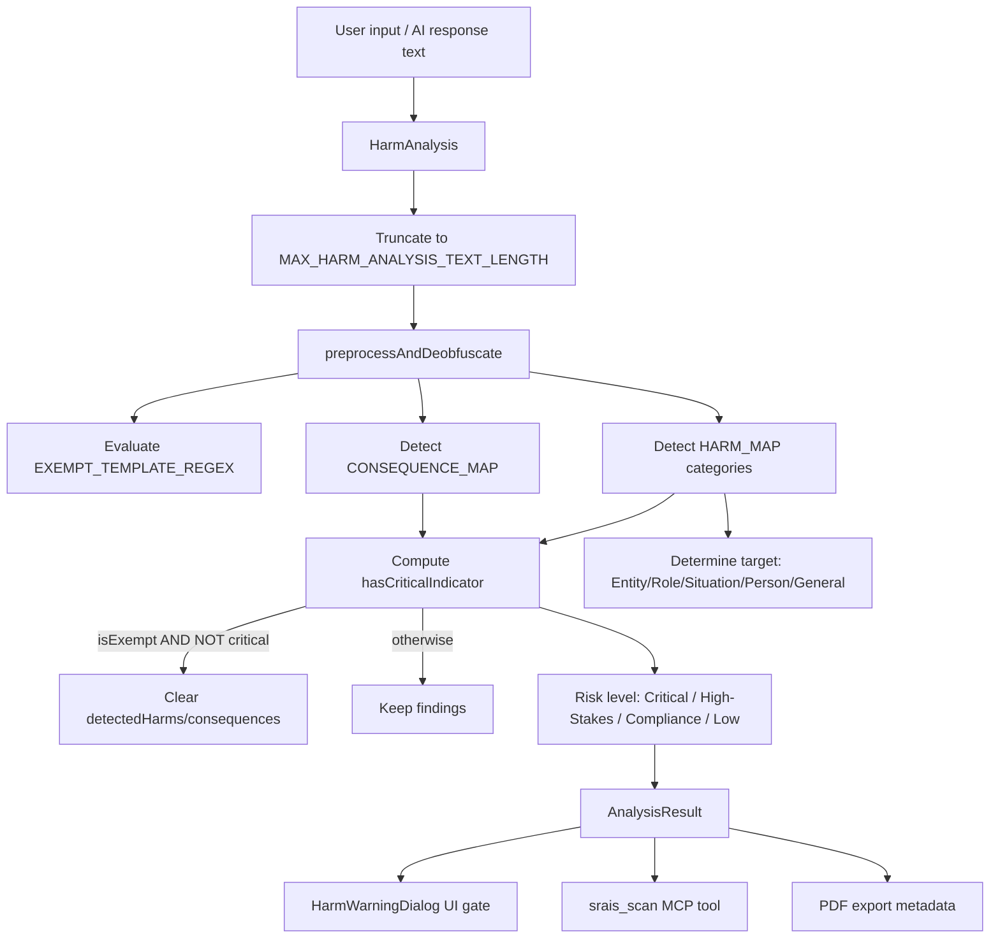

# PRD: SRAIS Harm Detection Scanner

## 1. Summary

The **Safe and Responsible AI Implementation Scanner (SRAIS)** ([src/services/sraisScanner.ts](../src/services/sraisScanner.ts)) is Atticus's local, regex-based content-safety gate. Before a user's message is sent to any external AI provider, and again on every AI response, SRAIS scans the text for legal, financial, regulatory, reputational, IP, contractual, violence, and hate-related risk indicators across English, French, and Spanish. Findings are surfaced through a blocking `HarmWarningDialog` ([src/components/HarmWarningDialog.tsx](../src/components/HarmWarningDialog.tsx)) that stratifies risk into **Critical / High-Stakes / Compliance / Low** tiers and gives the user localized advisory guidance before they may proceed. SRAIS is also exposed to external MCP clients via the `srais_scan` tool ([src/electron/mcpServer.ts](../src/electron/mcpServer.ts)).

SRAIS is a Human-in-the-Loop (HIL) control, not an automated blocker: it never silently drops a message. It informs and gates; the human always makes the final send/cancel decision (see [HIL.md](../HIL.md)).

## 2. Problem Statement

Legal and business users routinely draft prompts involving litigation, financial misconduct, regulatory exposure, or — in adversarial or careless cases — requests that could facilitate evidence tampering, bribery, or violence. Sending such content to a third-party AI provider without any local review creates legal and safety exposure for both the user and Atticus. At the same time, legitimate legal work (contract templates, compliance guidelines, educational examples) frequently *uses the same vocabulary* as genuine harms ("draft an agreement," "describe a breach"), so a naive keyword scanner produces unacceptable false-positive friction.

SRAIS must therefore do two things simultaneously and correctly:
1. Reliably flag genuine risk indicators, including across three languages and basic adversarial obfuscation (base64/hex/URL/ROT13/spaced-letter encoding).
2. Reduce false positives for legitimate template/educational drafting **without ever letting that reduction suppress a genuinely critical indicator** (violence, hate, bribery, evidence tampering).

A prior implementation defect violated (2): an "educational/template" exemption regex existed in two variants, one of which made its qualifier word (`standard`/`generic`/`template`/etc.) optional — meaning *any* "write/draft/create a statement/agreement/disclosure" phrasing, including one that also requested bribing a regulator or destroying evidence, fully bypassed detection. This has been fixed (see §9) but defines the security bar this PRD holds the scanner to going forward.

## 3. Goals

1. Detect harm indicators across 9 categories, 3 languages, with acceptable false-positive/false-negative rates, verified by an automated eval harness.
2. Guarantee that Critical-tier indicators (violence, hate, corruption/bribery, evidence tampering) can never be suppressed by template/educational framing or by any other exemption logic.
3. Resist basic adversarial obfuscation (encoding/spacing tricks) without materially increasing false positives on ordinary text.
4. Keep scan latency negligible relative to typical message-send flows (local regex only, no network I/O, no ML inference).
5. Provide risk-stratified, localized, actionable guidance to the user rather than a flat "blocked" experience.
6. Keep the detection contract (`AnalysisResult`, `SRAISRiskLevel`, `HarmCategory`) stable for all consumers (UI, MCP, PDF export, eval harness).

## 4. Non-Goals

- Machine-learning-based classification. SRAIS is intentionally a fully local, deterministic, pattern-matching design — consistent with Atticus's privacy-by-design/local-first architecture (no text ever leaves the device for scanning purposes).
- Legal adjudication or advice. SRAIS output is advisory metadata only; it never blocks a send outright — the human always retains final agency (per [HIL.md](../HIL.md)).
- Supporting languages beyond EN/FR/ES (current explicit scope).
- Redesigning the MCP transport/security model around `srais_scan` (covered in [PRD-MCP.md](../evals()/PRD-MCP.md)).
- Replacing the Vitest unit suite ([src/test/sraisScanner.test.ts](../src/test/sraisScanner.test.ts)) with the eval notebook, or vice versa — they serve different purposes (logic unit coverage vs. accuracy/regression tracking, see [PRD-Evals().md](../evals()/PRD-Evals().md)).

## 5. Users / Stakeholders

- **Atticus end users** (solo practitioners, in-house/business teams) whose prompts and AI responses are scanned on every send.
- **Compliance/legal reviewers** relying on the audit trail of SRAIS findings attached to conversations and PDF exports.
- **External MCP clients** (Claude Desktop, Cursor, eval notebooks) calling `srais_scan` directly.
- **Engineers** maintaining detection accuracy as new harm patterns or bypass techniques are discovered.

## 6. Architecture (Current)

- **Entry points**: `buildSraisAnalysisMetadata(text)` (used by [useSendHandler.ts](../src/components/hooks/useSendHandler.ts), [useSendMessage.ts](../src/components/hooks/useSendMessage.ts), and [pdfExport.ts](../src/utils/pdfExport.ts)); `sraisScanner.scan(text)` (used by the MCP `srais_scan` tool); both funnel through `HarmAnalysis(inputs: string[])`.
- **Preprocessing** (`preprocessAndDeobfuscate`): normalizes to NFC, then appends decoded variants of any detected base64 (≥16 chars), hex (≥16 chars), URL-encoded, ROT13, and letter-spaced (`b y p a s s`) segments to the text before pattern matching — so an obfuscated payload is still visible to the regex passes without needing to replace the original text.
- **Unicode-aware matching** (`createUnicodeBoundaryRegex`): uses `(?<!\p{L})...(?!\p{L})` lookaround instead of `\b`, since `\b` does not behave correctly around accented characters common in French/Spanish.
- **Detection maps** (module-level, hoisted once at load): `HARM_MAP` (9 `HarmCategory` patterns), `ROLE_MAP`, `ENTITY_MAP`, `SITUATION_MAP`, `CONSEQUENCE_MAP`, `PRONOUNS_REGEX`. None use `g`/`y` flags, so sharing them across calls carries no match-state risk.
- **Exemption gate** (`EXEMPT_TEMPLATE_REGEX`): matches drafting-action verbs (`draft`/`create`/`describe`/`write`) followed by a **mandatory** (`{1,3}`, non-optional) qualifier (`standard`/`generic`/`template`/`blank`/`sample`/`example`/`educational`/`academic`/`hypothetical`/`fictional`) before a subject noun (`statement`/`guideline`/`agreement`/etc.).
- **Critical-tier override**: `CORRUPTION_OR_EVIDENCE_TAMPERING_REGEX` (bribery/corruption keywords + delete/destroy/hide/conceal + evidence/record/file/document compounds, EN/FR/ES) and membership in `CRITICAL_HARM_CATEGORIES = ['Violence', 'Hate']` are evaluated **independently of the exemption gate**. `detectedHarms`/`consequences` are only cleared when `isExempt && !hasCriticalIndicator`.
- **Risk-level derivation**: `Critical` if any critical indicator; else `High-Stakes` if any of `HIGH_STAKES_HARM_CATEGORIES = ['Legal','Financial','Contractual','IntellectualProperty','Reputational']` present; else `Compliance` if any harm detected at all; else `Low`.
- **Target/framing classification**: independently determines whether the text concerns an `Entity`, a `Role` (Founder/Investor/Management/Legal/Employee), a `Situation` (M&A/Board/Operations/Digital), a `Person` (pronoun fallback), or `General`.
- **Length cap**: `MAX_HARM_ANALYSIS_TEXT_LENGTH = 20_000` characters; input beyond this is truncated before regex processing, while `originalText` in the result preserves the untruncated raw text for UI display.

## 7. Detection Taxonomy

| `HarmCategory` | Risk tier contribution | Example triggers (EN) |
|---|---|---|
| `Violence` | Critical (always) | kill, attack, threat, cyberattack, exploiting vulnerabilities |
| `Hate` | Critical (always) | racist, sexist, slur |
| `Legal` | High-Stakes | sue, lawsuit, litigation |
| `Financial` | High-Stakes | bankruptcy, fraud, bribery, embezzlement, concealment/tampering compounds |
| `Contractual` | High-Stakes | breach, violation |
| `IntellectualProperty` | High-Stakes | infringement |
| `Reputational` | High-Stakes | slander, libel, scandal, defamation |
| `Regulatory` | Compliance | regulator, fine, penalty, sanction |
| `Privacy` | Compliance | data breach, unauthorized disclosure |

Corruption/evidence-tampering compounds (e.g. "destroy the evidence," "hide the records") escalate to **Critical** regardless of which `HarmCategory` they also match, via `CORRUPTION_OR_EVIDENCE_TAMPERING_REGEX`, since these indicate obstruction/complicity rather than merely discussing a risk topic.

## 8. UX / HIL Gating Flow

Per [HIL.md §2.1](../HIL.md): SRAIS runs **after** the PII gate clears (see [PRD-PII.md](./PRD-PII.md)). If `SRAISCheck` finds risks:
- If the text matches the educational exemption **and has no critical indicator** → send proceeds directly, no dialog shown.
- Otherwise → `HarmWarningDialog` is shown, color-coded by highest risk tier (red = Critical, orange = High-Stakes, yellow = Compliance), displaying per-finding detected harms, target classification, consequences, and localized advisory guidance (`getSraisActionGuidance`, EN/FR/ES). The user must explicitly **Send Anyway** or **Cancel** — there is no silent auto-send and no silent auto-block.
- Findings attached to a message persist in `message.metadata.sraisAnalysis` and are surfaced later via the `MessageBubble` harm badge and included in PDF exports ([pdfExport.ts](../src/utils/pdfExport.ts)).

## 9. Functional Requirements

- FR-1: `HarmAnalysis` must always run harm/consequence detection before evaluating any exemption; exemption logic must only ever *clear* already-computed findings, never skip detection outright.
- FR-2: Critical-tier indicators (`Violence`, `Hate`, corruption/evidence-tampering) must be computed independently of `isExempt` and must never be cleared by the exemption gate, regardless of future changes to `EXEMPT_TEMPLATE_REGEX`. Any change to the exemption pattern must be re-verified against this invariant (see the regression tests in §11).
- FR-3: The exemption qualifier group must remain mandatory (non-optional quantifier); a change that makes it optional again reintroduces the historical bypass vulnerability described in §2 and must be rejected in review.
- FR-4: Detection must operate correctly on Unicode/diacritic text in FR/ES via `createUnicodeBoundaryRegex`, not `\b`.
- FR-5: `preprocessAndDeobfuscate` must attempt base64/hex/URL/ROT13/spaced-string decoding and append (not replace) decoded content, so obfuscated bypass attempts are still visible to the harm/consequence regexes.
- FR-6: Input text must be capped at `MAX_HARM_ANALYSIS_TEXT_LENGTH` before regex processing; `originalText` in the returned `AnalysisResult` must remain the untruncated raw input for display purposes.
- FR-7: The `AnalysisResult`/`SRAISScanResult`/`HarmCategory`/`SRAISRiskLevel` shapes must remain stable, since they are consumed by UI (`HarmWarningDialog`, `MessageBubble`), MCP (`srais_scan`), and PDF export simultaneously.
- FR-8: `getSraisActionGuidance` must provide EN/FR/ES text for every non-`Low` risk level.

## 10. Security Requirements

- SEC-1: No exemption logic may reduce net safety coverage relative to having no exemption at all for Critical-tier categories (this is the core lesson from the historical bypass — see §2).
- SEC-2: Regex maps hoisted to module scope must never use `g`/`y` flags (or must reset `lastIndex` before reuse) to avoid cross-call match-state leakage.
- SEC-3: Scanning must remain fully local — no network calls, no external service dependency — consistent with Atticus's privacy commitments ([SRAI.md](../SRAI.md), [PRIVACY.md](../PRIVACY.md)).
- SEC-4: The `MAX_HARM_ANALYSIS_TEXT_LENGTH` cap must bound worst-case regex work against pathologically large input (e.g., an unbounded MCP `srais_scan` caller); see also `mcpServer.ts`'s own `validateScanText` cap.

## 11. Non-Functional Requirements

- NFR-1: The scan must run synchronously in the message-send critical path with no perceptible UI delay — regex evaluation only, no network I/O, no ML inference.
- NFR-2: Memory footprint of the hoisted detection regexes (`HARM_MAP`, `ROLE_MAP`, `ENTITY_MAP`, `SITUATION_MAP`, `CONSEQUENCE_MAP`, `PRONOUNS_REGEX`) must stay constant across calls — no per-call re-allocation.
- NFR-3: Empty or whitespace-only input must resolve to `riskLevel: 'Low'` with no findings, never throw.
- NFR-4: Must function fully offline; no network dependency for detection.

## 12. Testing / QA Requirements

- Unit tests: [src/test/sraisScanner.test.ts](../src/test/sraisScanner.test.ts) — covers category detection, multilingual matching, obfuscation bypass attempts, risk-level thresholds, template exemption behavior, and (as of the bypass fix) explicit regression tests asserting that bribery/evidence-tampering/violence/hate phrased as "draft/write/create a statement/agreement" always resolve to `riskLevel: 'Critical'`, while genuinely benign template requests remain exempt.
- Accuracy/regression harness: `evals()/SRAIS-MCP-Evaluations.ipynb` against `srais_scan` over MCP, gated by pass-rate/false-positive thresholds defined in [PRD-Evals().md](../evals()/PRD-Evals().md).
- Any change to `HARM_MAP`, `EXEMPT_TEMPLATE_REGEX`, or `CORRUPTION_OR_EVIDENCE_TAMPERING_REGEX` must be re-validated against both suites before merge.

## 13. Risks / Open Questions

- Coverage is regex/keyword-based; sufficiently paraphrased or purely semantic harmful requests (no matching keyword) will not be detected — an inherent limitation of the non-ML design choice (§4).
- No per-category confidence score is returned today (binary detected/not-detected per category); a future iteration could add graduated confidence akin to `piiDetector.ts`'s `confidence` field.
- Eval dataset (`evals()/data/srais_eval_cases.xlsx`) coverage across all 9 harm categories and non-English rows is tracked as an open item in [PRD-Evals().md](../evals()/PRD-Evals().md) (FR-10/FR-11), not yet fully populated.
- `srais_scan_batch` (batch scanning over MCP) is proposed but not implemented — see [PRD-MCP.md §7.2](../evals()/PRD-MCP.md).
- Open question: should the scanner move from binary category detection to graduated per-category confidence, and if so, does that change the `AnalysisResult` contract for existing consumers (FR-7)?

## 14. Acceptance Criteria

- [ ] Critical-tier indicators (`Violence`, `Hate`, corruption/evidence-tampering) cannot be suppressed by exemption logic in any regression test case.
- [ ] All 9 `HarmCategory` values detected correctly across EN/FR/ES in unit tests.
- [ ] Obfuscation bypass cases (base64/hex/URL/ROT13/spaced-letter) are caught by `preprocessAndDeobfuscate`.
- [ ] `MAX_HARM_ANALYSIS_TEXT_LENGTH` truncation is covered by a dedicated test, with `originalText` confirmed untruncated.
- [ ] `srais_scan` MCP tool output shape matches the `AnalysisResult`/`SRAISScanResult` contract (FR-7).
- [ ] `evals()/SRAIS-MCP-Evaluations.ipynb` passes the gating thresholds defined in [PRD-Evals().md](../evals()/PRD-Evals().md).

## Related Documentation
- [src/services/sraisScanner.ts](../src/services/sraisScanner.ts) — implementation
- [src/components/HarmWarningDialog.tsx](../src/components/HarmWarningDialog.tsx) — UI gate
- [HIL.md](../HIL.md) — Human-in-the-Loop gating flow and business-augmentation framing
- [SRAI.md](../SRAI.md) — Human-primacy principle SRAIS enforces
- [evals()/PRD-Evals().md](../evals()/PRD-Evals().md) — eval harness contract for `srais_scan`
- [evals()/PRD-MCP.md](../evals()/PRD-MCP.md) — MCP transport/security surrounding `srais_scan`
- [PRD-PII.md](./PRD-PII.md) — the privacy gate that runs immediately before this one
